# SupportServices DevOps Architecture
## From Code Commit to Production — A Complete Overview

This document walks through the complete build, test, and deployment pipeline for the SupportServices monorepo from a DevOps perspective, covering Git workflows, CI/CD, infrastructure, and production operations.

---

## 0. VISUAL PIPELINE FLOW (MERMAID DIAGRAM)

Below is the complete pipeline flow from code commit to production:

```mermaid
graph TB
    A["👨‍💻 Developer"] -->|Creates Feature Branch| B["Feature Branch\ngit checkout -b fix/something"]
    B -->|Commits & Pushes| C["Remote Branch\nGitHub/Azure DevOps"]
    C -->|Opens PR| D["Pull Request\nmaster ← fix/something"]
    D -->|Auto-triggers| E["NonOfficial Build\nBuild.NonOfficial.Chat"]
    E -->|Compiles & Tests| F{{"✅ Build\n✅ Tests\n✅ Format"}}
    F -->|Failed| G["❌ PR Status Check Failed\nDev must fix"]
    G -->|Fix & Push| E
    F -->|Passed| H["✅ PR Status Green\nReviewers can approve"]
    H -->|Code Review| I{{"Convention\nCompliance?\nLogic OK?"}}
    I -->|Changes Needed| J["Comment Review Feedback\nRequest Changes"]
    J -->|Dev Fixes| B
    I -->|Approved| K["✅ APPROVED\nAll reviewers signed off"]
    K -->|Merge to master| L["🔀 Merged to master\nFeature branch deleted"]
    
    L -->|Triggers CI| M["NonOfficial Build\n(Auto CI on master)"]
    M -->|Stages| M1["1️⃣ Restore & Build<br/>2️⃣ Publish Projects<br/>3️⃣ Copy Artifacts<br/>4️⃣ Sign Binaries"]
    M1 -->|Output| M2["Artifact: drop_build_main<br/>Frontend+Backend+Bicep"]
    
    M2 -->|Auto-triggers| N["NonOfficial Deploy\n(Nonprod only)"]
    N -->|Stage 1| N1["Deploy to dev<br/>Bicep → Code → Test → Swap"]
    N1 -->|Functional Tests| N1a{{"Tests Pass?"}}
    N1a -->|No| N1b["❌ BLOCKED<br/>Manual Fix Required"]
    N1a -->|Yes| N2["Deploy to staging<br/>Bicep → Code → Test → Swap"]
    N2 -->|Functional Tests| N2a{{"Tests Pass?"}}
    N2a -->|No| N2b["❌ BLOCKED"]
    N2a -->|Yes| N3["✅ Nonprod Ready\nCode in dev + int"]
    
    N3 -->|Team Decision| O["Ready for Production?"]
    O -->|Yes| P["🚀 Queue Official Build\n(Manual Trigger)"]
    O -->|No| Q["⏸️ Wait for Next Deployment\nWindow"]
    
    P -->|Executes| P1["Official Build.Official.Chat<br/>(Same as NonOfficial<br/>+ Code Signing)"]
    P1 -->|Output| P2["Artifact: drop_build_main<br/>(Signed)"]
    P2 -->|Auto-triggers| R["Official Deploy\n(Prod allowed)"]
    
    R -->|Stage 1| R1["Deploy to dev<br/>Bicep → Code → Test → Swap"]
    R1 -->|Stage 2| R2["Deploy to staging<br/>Bicep → Code → Test → Swap"]
    R2 -->|Stage 3| R3["⏸️ APPROVAL GATE<br/>Release Manager Review"]
    R3 -->|Approved| R4["✅ Deploy to prod<br/>Bicep → Code → Test → Swap"]
    R3 -->|Rejected| R5["❌ Deployment Halted\nRolled Back"]
    
    R4 -->|Slot Swap| R6["🔄 Traffic Switch<br/>Staging → Production"]
    R6 -->|Goes Live| R7["🌍 PRODUCTION LIVE\nAll Customers"]
    
    R7 -->|Monitoring| R8["📊 App Insights Monitoring<br/>Error Rate, Latency, Custom Metrics"]
    R8 -->|Anomalies Detected?| R9{{"Critical Issue?"}}
    R9 -->|Yes| R10["🔙 INSTANT ROLLBACK<br/>Swap Back to Previous Version"]
    R9 -->|No| R11["✅ DEPLOYMENT SUCCESS\nMonitor for 24h"]
    
    R10 -->|Stops| R12["End: Investigate Root Cause"]
    R11 -->|After 24h| R13["Stop Staging Slot\n(Cost Savings)"]
    R13 -->|End| R14["✅ COMPLETE"]
    
    style A fill:#e1f5ff
    style D fill:#fff3e0
    style F fill:#fff3e0
    style K fill:#c8e6c9
    style L fill:#c8e6c9
    style M fill:#e3f2fd
    style N fill:#e3f2fd
    style P fill:#fce4ec
    style R fill:#fce4ec
    style R3 fill:#ffebee
    style R7 fill:#c8e6c9
    style R10 fill:#ffcdd2
```



---

## 1. REPOSITORY STRUCTURE & GIT WORKFLOW

### 1.1 Monorepo Organization

**SupportServices** is a .NET 10 monorepo containing **14 independent business domains**, each with its own solution (`.slnx` file):
- **Domains:** Chat, Search, Refunds, Notifications, Conversations, MessageFulfillment, OrderHistory, Loyalty, Content, ControllerWarranty, Webforms, Tokens, Proxy
- **Shared Layer:** `Common/` folder with 50+ reusable libraries used across all domains

```
SupportServices/
├── Common/                        # Shared infrastructure libraries
│   ├── AspNetCore/                # Web API middleware & helpers
│   ├── AzureFunctions/            # Function app base classes
│   ├── Azure/                     # Cosmos DB, Blob, Table, Queue storage
│   ├── Configuration/             # Options binding & secrets
│   ├── Authentication/            # Identity provider & Azure AD
│   ├── Logging/                   # Telemetry & structured logging
│   ├── Http/                      # HTTP clients & resilience
│   ├── Clients/                   # Typed HTTP clients (service-to-service)
│   ├── Bicep/                     # Reusable IaC modules
│   └── ...
├── <Domain>/                      # Each domain is self-contained
│   ├── <Domain>.Frontend/         # ASP.NET Core web API
│   ├── <Domain>.Backend/          # Azure Functions (isolated worker)
│   ├── <Domain>.Storage/          # Data access layer
│   ├── <Domain>.Contracts/        # Request/response models
│   ├── <Domain>.Clients/          # Typed HTTP clients for external calls
│   ├── <Domain>.Tests/            # Unit tests
│   ├── <Domain>.Functional.Tests/ # Functional/integration tests
│   ├── Deploy/                    # Bicep infrastructure code
│   ├── .pipelines/                # CI/CD pipeline definitions
│   └── <Domain>.slnx              # Solution file for this domain
└── .pipelines/                    # Shared CI/CD templates
```

### 1.2 Branching Strategy

**Single main branch:** `master`
- **Pull Request workflow:** Feature branches → PRs → Code review → Merge to master
- **PR requirements:**
  - Must pass all automated checks (build, tests, style)
  - Must have approvals from domain reviewers
  - PR policies enforced in Azure DevOps (see `.azuredevops/policies/`)

**Important:** 
- No manual releases or release branches — all deployments are **data-driven** from commits on `master`
- NonOfficial (dev/test) pipelines trigger on **every commit to master** (path-filtered to avoid redundant builds)
- Official (production) pipelines are **manually queued** by the team

### 1.3 Branching Strategy & Git Workflow in Detail

#### 1.3.1 Branch Organization

```
master (main production branch)
  ↑
  └─ Feature branches (created by developers for work)
     ├─ fix/chat-spam-filter        (bug fix)
     ├─ feature/notifications-ui     (new feature)
     ├─ refactor/search-indexing     (refactoring)
     └─ hotfix/urgent-auth-bug       (critical production fix)
```

**Key Rules:**
- **Only `master` is protected** — you cannot push directly to master
- **All changes flow through PRs** — feature branch → PR → review → merge
- **No release branches** — production versions are git tags/commits on master
- **No long-lived branches** — PRs should merge within days (if stuck, split the work)

#### 1.3.2 Creating a Feature Branch

```powershell
# Update local master from remote
git fetch origin
git checkout master
git pull origin master

# Create feature branch with semantic naming
git checkout -b fix/chat-spam-filter
#                  ↑   ↑
#            TYPE    DESCRIPTION
```

**Branch naming conventions:**
```
fix/          → bug fixes (fix/chat-message-ordering)
feature/      → new functionality (feature/notifications-batch-send)
refactor/     → code quality improvements (refactor/search-index-cache)
hotfix/       → critical production fixes (hotfix/auth-service-down)
chore/        → maintenance (chore/dependency-update)
docs/         → documentation (docs/api-guide-update)
test/         → test improvements (test/add-e2e-tests)
```

#### 1.3.3 Commit Message Convention

**Format:**
```
[<DOMAIN>] <Type>: <Description>

<Body with details (optional)>

Fixes #<issue-number> (if applicable)
```

**Examples:**
```
[Chat] fix: Handle nil message in spam filter

Previously, the spam filter would crash if a message was nil.
Now we return early with a valid error code.

Fixes #1234

---

[Refunds] feature: Add refund status webhook

Customers can now subscribe to refund status changes.
Implementation uses Service Bus topic subscription pattern.

---

[Search] refactor: Cache indexing results in Redis

Improves indexing latency by 40% through Redis caching.
```

**Commit practices:**
- ✅ One logical change per commit
- ✅ Commits should be small (reviewable in isolation)
- ✅ Descriptive messages (future maintainers should understand why)
- ❌ Don't commit multiple unrelated changes in one commit
- ❌ Don't commit `obj/` folders, `.vs/`, or build artifacts

#### 1.3.4 Pushing & Opening a Pull Request

```powershell
# Push your branch to remote
git push origin fix/chat-spam-filter

# Azure DevOps will detect the push and suggest "Create a pull request"
# Or manually: https://dev.azure.com/organization/SupportServices/_git/...
```

**PR Title Format:**
```
[<DOMAIN>] <Type>: <Description>
```

**Examples:**
```
[Chat] fix: Handle nil message in spam filter
[Refunds] feature: Add refund status webhook
[Search] refactor: Cache indexing results in Redis
```

**PR Description Template:**

```markdown
## What does this PR do?
- Brief description of the change
- Why is it needed?

## How was it tested?
- Unit tests added/updated
- Functional tests added/updated
- Manual testing in dev environment

## Related Issues
Fixes #1234
Related to #5678

## Breaking Changes
- None
(or list any)

## Screenshots
[If UI changes]

## Checklist
- [ ] Tests pass locally (`dotnet test ...`)
- [ ] Code formatted (`dotnet format ...`)
- [ ] Rebuild with warnings-as-errors passes
- [ ] Updated docs (if applicable)
```

#### 1.3.5 Pull Request Policies & Azure DevOps Configuration

All PRs must meet **automated policy requirements** before merge:

| Policy | Effect | Configuration |
|--------|--------|----------------|
| **Build validation** | NonOfficial build must pass | `.azuredevops/policies/` |
| **Minimum reviewers** | ≥1 approval from domain reviewers | Domain-specific in `owners.txt` |
| **Comment resolution** | All PR comments must be resolved | Enforced |
| **Approve only one version** | Reviewers can't approve stale versions | Auto-reset on new push |
| **Squash merge** | PR is squash-merged (one commit per PR) | Enforced |

**Approval flow:**

```
Developer opens PR
  ↓
NonOfficial build starts (auto-triggered)
  ├─ Compiles code
  ├─ Runs all tests
  └─ Publishes artifacts
  ↓
Build status in PR: ✅ PASS or ❌ FAIL
  ├─ If FAIL → Dev fixes code, pushes new commit
  │  └─ Build automatically re-triggers
  └─ If PASS → PR becomes reviewable
  ↓
Domain reviewers receive notification
  ├─ Review code against conventions (Docs/Conventions/)
  ├─ Check for design issues, security concerns
  └─ Can request changes or approve
  ↓
All comments resolved + ✅ Build passed + ✅ Approved
  ↓
Developer (or reviewer) clicks "Complete pull request"
  ├─ PR is squash-merged to master
  │  └─ One commit per PR (cleaner history)
  ├─ Feature branch auto-deleted
  └─ Merged notification sent
  ↓
Master build automatically triggers (CI)
```

#### 1.3.6 Reviewer Selection

**Who are reviewers?**

Reviewers are specified in **`owners.txt`** at repo root:

```
# owners.txt format
Chat/**           @chat-dev-lead @chat-architect
Search/**         @search-team-lead
Refunds/**        @refunds-platform @refunds-senior-dev
Common/**         @platform-team  (shared, so broader ownership)
Common/Bicep/**   @devops-team
```

**How it works:**
- Azure DevOps automatically requires approvals from `owners.txt` matches
- Reviewers must have **direct write access** to the repo
- At least **1 approval** required before merge
- Multiple reviewers for complex changes (best practice)

**Reviewer responsibilities:**
1. **Understand the change** — read PR description, look at diffs
2. **Check business logic** — does it solve the stated problem?
3. **Verify against conventions** — run through [Docs/Conventions/](Docs/Conventions/)
4. **Test mentally** — trace through test cases, edge cases
5. **Security review** — auth, secrets, permissions, input validation
6. **Approve or request changes** — be specific in feedback

#### 1.3.7 Handling Review Feedback

**Workflow when reviewer requests changes:**

```
Reviewer: "This code doesn't handle null values. See line 45."
  ↓
Developer reads feedback
  ↓
Developer makes code changes locally
  ↓
Developer commits: git commit -am "Address review feedback: handle null values"
  ↓
Developer pushes: git push origin fix/chat-spam-filter
  ↓
PR is updated with new commit
  ↓
Build automatically re-triggers
  ↓
Once build passes, reviewer is notified of changes
  ↓
Reviewer reviews again, approves
```

**Comment resolution:**
- Reviewer can mark comment as "resolved" after change is made
- OR developer can mark as "resolved" and ask reviewer to confirm
- All comments must be resolved before merge is allowed

#### 1.3.8 What Happens After Merge

```
Developer clicks "Complete pull request"
  ↓
Azure DevOps squash-merges to master:
  └─ All commits in PR become a single commit
     [Chat] fix: Handle nil message in spam filter
     
     Squashed from 3 commits:
     - WIP: Implement spam filter check
     - Fix formatting
     - Update test

     PR: #1234
  ↓
Feature branch is deleted (auto)
  ↓
master CI pipeline automatically triggers
  ├─ Build.NonOfficial.Chat
  ├─ Deploy.NonOfficial.Chat (to dev, staging)
  └─ Code reaches dev/int in ~20-30 minutes
  ↓
Team monitors the deployment
```

#### 1.3.9 Special Case: Hotfix for Production

**If critical bug found in production:**

```
On-call engineer finds P1 issue
  ↓
Creates hotfix branch: git checkout -b hotfix/critical-auth-bug
  ↓
Makes minimal code change
  ↓
Pushes & opens PR (just like normal feature branch)
  ↓
Labels PR as "HOTFIX" or "URGENT"
  ↓
Pings reviewers directly (Slack/Teams) for expedited review
  ↓
Reviewer does rapid review (security, logic only, not style)
  ↓
Approves → merge to master → CI pipeline → production
  ↓
Post-merge: Retrospective on why it wasn't caught
```

**Important:** Even hotfixes go through the PR process — we never directly push to master or run deploy pipelines outside the CI/CD system. This is a safety mechanism.

#### 1.3.10 Conflict Resolution

**If your feature branch is out of date with master:**

```powershell
# Your branch: fix/chat-spam-filter
# Master has moved forward with other PRs

git fetch origin
git rebase origin/master

# If conflicts occur:
#   - Edit conflicting files
#   - Keep both changes (usually)
#   - Mark resolved: git add <file>
#   - Continue rebase: git rebase --continue

# Then force-push (safe because you own this branch)
git push origin fix/chat-spam-filter --force-with-lease
```

**Why rebase instead of merge?**
- Keeps git history linear and readable
- "Linear first-parent" history makes deployments easier to audit
- Each PR is one commit on master (clear, trackable)

---

## 2. CODE SUBMISSION & BUILD PROCESS

### 2.1 Pre-Submission Validation (Local Dev)

Before pushing, developers should:

```powershell
# 1. Build the affected domain solution
dotnet build Chat/Chat.slnx /warnaserror -v q

# 2. Run all tests (unit + functional)
dotnet test Chat/Chat.slnx

# 3. Auto-format code to match team conventions
dotnet format Chat/Chat.slnx

# 4. Rebuild to confirm no new warnings were introduced
dotnet build Chat/Chat.slnx /warnaserror -v q

# 5. If .csproj files were added/removed, validate the entire repo
dotnet build Tools/ValidateSolutions/ValidateSolutions.csproj
```

**Build rules enforced:**
- **Warnings treated as errors** (`/warnaserror`) — no compilation warnings allowed
- **Central package management** — all NuGet versions controlled in `Directory.Packages.props`
- **Auto-derivation of assembly names** — from folder paths via `Directory.Build.props`, no manual `AssemblyName` needed
- **MSTest SDK** for all test projects (parallel test execution by default)

### 2.2 Pull Request & Code Review

When a PR is opened:

1. **Azure DevOps PR policies trigger:**
   - NonOfficial build for the affected domain automatically starts
   - PR status checks appear (build progress, test results)
   
2. **Code review workflow:**
   - Domain-scoped reviewers (specified in `owners.txt`)
   - Review checks for **convention compliance** against [Docs/Conventions/](Docs/Conventions/) guides
   - Copilot-assisted reviews available via PR comment tools
   
3. **PR merge requirements:**
   - ✅ Build passed
   - ✅ All tests passed
   - ✅ Code review approvals
   - ✅ No active merge conflicts

### 2.3 NonOfficial (CI) Build Pipeline

**Triggered:** Every push to `master` (path-filtered per domain)

**Pipeline definition:** `<Domain>/.pipelines/build/Build.NonOfficial.<Domain>.yml`

**What it does:**
```yaml
stages:
  1. Build                           # dotnet build for the solution
  2. Publish                         # dotnet publish for Frontend & Backend projects
  3. Copy deployment artifacts       # Bicep files, global.json, PowerShell, deploy folders
  4. Sign binaries                   # Sign .exe, .dll, .ps1, .psm1 files
  5. Upload artifacts                # Drop to "drop_build_main" artifact location
```

**Inputs:**
- Source code from `master` branch
- Project & solution file (.slnx)
- `global.json` (specifies .NET version)

**Outputs (artifacts):**
- **drop_build_main/** containing:
  - `Chat.Frontend/` — compiled & published web API binaries
  - `Chat.Backend/` — compiled & published function app binaries
  - `Chat.Deploy/` — Bicep templates + parameter files
  - Functional test binaries

**Build infrastructure:**
- **CI/CD System** — Unified build system with governed templates
- **Build agents** — Windows runners with .NET 10 SDK pre-installed
- **Signing** — Code-signing certificates applied in pipeline

---

## 3. TESTING STRATEGY

### 3.1 Test Categories

Tests are organized by category and run with filters:

```powershell
# Unit tests (fast, isolated, mocked)
dotnet test Chat.slnx --filter "TestCategory=Unit"

# Integration tests (use test databases, queues, etc.)
dotnet test Chat.slnx --filter "TestCategory=Functional"

# Blue-Violet Tests (comprehensive API validation)
dotnet test Chat.slnx --filter "TestCategory=BVT"

# Developer tests (hit live environments, manual run only)
dotnet test Chat.slnx --filter "TestCategory=Developer"
```

### 3.2 Test Execution in Pipelines

| Stage | Tests Run | When | Purpose |
|-------|-----------|------|---------|
| **Build** | Unit + BVT | Every commit | Quick validation, fail fast |
| **Deploy to Dev** | Functional | After code deploys to staging | Validate changes in Azure |
| **Deploy to Int** | Functional | After code deploys to staging | Verify before int environment swap |
| **Deploy to Prod** | Functional | After code deploys to staging | Final validation before production swap |

### 3.3 Test Artifacts

After deployment:
- **Functional test results** published to Azure DevOps (viewable in pipeline run)
- **Failures block the swap** — if functional tests fail against staging, the pipeline halts (requires manual intervention)

---

## 4. CI/CD PIPELINE ARCHITECTURE

### 4.1 Pipeline Topology

Two pipeline families for each domain:

1. **Build pipelines** (compile & package code)
   - `Build.Official.<Domain>` — Production release build
   - `Build.NonOfficial.<Domain>` — Dev/test build (auto-triggered on master)

2. **Deploy pipelines** (roll out to Azure)
   - `Deploy.Official.<Domain>` — Production deployment
   - `Deploy.NonOfficial.<Domain>` — Dev/test deployment

**Key difference:**
| Aspect | Official | NonOfficial |
|--------|----------|-------------|
| **Trigger** | Manual (queued by team) | Auto (CI on master) |
| **Commit approval** | Required (must be on master) | Not required (any branch OK) |
| **Environments** | Dev → Int → Flight → Prod | Dev → Int (no prod) |
| **Signing** | Enabled + Code Signing | Disabled |
| **Deploy scope** | Can deploy all envs | Limited to nonprod |

### 4.2 Build Pipeline Stages

```
Build.Official.Chat
├─ Restore & Build
│  └─ dotnet build Chat/Chat.slnx
├─ Publish Projects
│  ├─ Chat.Frontend → output/Chat.Frontend/
│  └─ Chat.Backend → output/Chat.Backend/
├─ Copy Artifacts
│  ├─ Global.json (for runtime version)
│  ├─ Common/Bicep/ (IaC modules)
│  ├─ Chat/Deploy/ (Bicep templates + params)
│  └─ Common/PowerShell/ (helper scripts)
├─ Sign Binaries
│  └─ Sign all .exe, .dll, .ps1, .psm1
└─ Upload
   └─ Publish to artifact storage
```

**Result:** `drop_build_main` artifact containing all deployment-ready packages

### 4.3 Deploy Pipeline Stages

```
Deploy.Official.Chat (triggered after Build completes)
├─ Stage: Deploy to dev
│  ├─ Bicep Deployment
│  │  ├─ Deploy subscription-scoped resources (if first env)
│  │  │  └─ az stack sub create -n Chat-nonprod -f Chat/Deploy/envType/envType.bicep ...
│  │  └─ Deploy environment-scoped resources
│  │     └─ az stack group create -n rg-chat-dev -f Chat/Deploy/env/chat.bicep ...
│  ├─ Frontend Deployment
│  │  ├─ Deploy code to staging slot
│  │  ├─ Run functional tests (Staging)
│  │  ├─ Slot swap (Staging → Production)
│  │  └─ Stop staging slot (cost savings)
│  └─ Backend Deployment (same as Frontend)
│
├─ Stage: Deploy to staging (waits for dev to succeed)
│  └─ [Same flow as dev, different Bicep params]
│
├─ Stage: Deploy to prod (conditional on deployHigherEnv=true)
│  └─ [Same flow as staging, prod Bicep params]
│
└─ Optional: Publish OpenAPI specs to EngHub
```

**Deployment stacks** (deployment stack = infrastructure + tracking metadata):
- `Chat-nonprod` — subscription-scoped, shared by dev & int
- `Chat-dev` — resource group-scoped, environment-specific
- `Chat-staging` — resource group-scoped, environment-specific
- `Chat-prod` — resource group-scoped, environment-specific

### 4.4 Slot-Based Blue-Green Deployment

Every web app & function app uses **staging slots** for zero-downtime deployments:

```
Before Deployment:
  Production Slot: app v1 (live traffic)
  Staging Slot:    [empty or v0]

Code Deploy:
  → Deploy code to Staging Slot
  → Staging Slot: app v2 (staging traffic)
  → Production Slot: app v1 (still live)

Functional Tests:
  → Run tests against Staging Slot
  → If tests pass → proceed to swap
  → If tests fail → halt pipeline, roll back by stopping staging

Slot Swap:
  → Switch traffic from Production to Staging
  → Production Slot: app v2 (now live)
  → Staging Slot: app v1 (stopped to save costs)

Result:
  → Zero customer downtime
  → Instant rollback if needed (swap back to v1)
```

---

## 4.5 DETAILED WALKTHROUGH: NOTIFICATIONS DOMAIN BUILD & DEPLOY

To understand how a domain's pipelines work concretely, let's trace through **Notifications** — a simple domain with one Frontend (web API) and one Backend (Azure Function).

### 4.5.1 Domain Structure

```
Notifications/
├── Notifications.slnx                           # Solution file
├── Frontend/                                    # ASP.NET Core Web API
│   ├── Notifications.Frontend.csproj
│   └── Controllers/, Services/, etc.
├── Frontend.Tests/                              # Unit tests
│   └── Notifications.Frontend.Tests.csproj
├── Frontend.Functional.Tests/                   # Functional tests (E2E)
│   └── Notifications.Frontend.Functional.Tests.csproj
├── Backend/                                     # Azure Functions (isolated worker)
│   ├── Notifications.Backend.csproj
│   └── Functions/, Models/, etc.
├── Backend.Tests/                               # Unit tests
│   └── Notifications.Backend.Tests.csproj
├── Storage/                                     # Data access layer
│   ├── Notifications.Storage.csproj
│   └── INotificationRepository, etc.
├── Contracts/                                   # Shared DTO models
│   └── Notifications.Contracts.csproj
├── Deploy/                                      # Bicep infrastructure
│   ├── notifications-consts.bicep
│   ├── env/
│   │   ├── notifications.bicep                  # Main template
│   │   ├── notifications-frontend.bicep         # Frontend resources
│   │   └── notifications-backend.bicep          # Backend resources
│   ├── envType/
│   │   └── envType.bicep                        # Shared resources
│   ├── params/
│   │   ├── global.nonprod.bicepparam
│   │   ├── global.prod.bicepparam
│   │   ├── envType.nonprod.bicepparam
│   │   ├── dev.bicepparam
│   │   ├── staging.bicepparam
│   │   └── prod.bicepparam
│   └── activate.ps1                             # PIM elevation script
└── .pipelines/
    ├── build/
    │   ├── Build.Official.Notifications.yml     # Production build
    │   ├── Build.NonOfficial.Notifications.yml  # Dev/test build
    │   └── Build.Template.Notifications.yml     # Domain-specific build config
    └── deploy/
        ├── Deploy.Official.Notifications.yml    # Production deployment
        ├── Deploy.NonOfficial.Notifications.yml # Dev/test deployment
        └── Deploy.Template.Notifications.yml    # Domain-specific deploy config
```

### 4.5.2 Build Pipeline: Build.NonOfficial.Notifications.yml

**File location:** `Notifications/.pipelines/build/Build.NonOfficial.Notifications.yml`

**What triggers it:**
```yaml
trigger:
  branches:
    include:
      - master
  paths:
    include:
      - Common/**           # Any Common changes → rebuild Notifications
      - Notifications/**    # Any Notifications changes → rebuild
  excludePaths:
    - Docs/**              # Documentation changes don't trigger build
```

**The YAML file structure:**

```yaml
name: $(Build.DefinitionName)_Branch_$(SourceBranchName)_$(Date:yyyyMMdd)$(Rev:.r)
# Example build number: Build.NonOfficial.Notifications_Branch_master_20260613.1

trigger:
  branches:
    include:
      - master
  paths:
    include:
      - Common/**
      - Notifications/**

parameters:
  - name: "debug"
    displayName: "Enable debug output"
    type: boolean
    default: false

variables:
  - template: /.pipelines/templates/Build.CommonVariables.yml
    parameters:
      debug: ${{ parameters.debug }}

resources:
  repositories:
    - repository: templates
      type: git
      name: CI/CD System.Pipelines/GovernedTemplates
      ref: refs/heads/main

extends:
  template: v2/CI/CD System.NonOfficial.CrossPlat.yml@templates
  parameters:
    stages:
      - template: Build.Template.Notifications.yml
```

### 4.5.3 Build Template: Build.Template.Notifications.yml

**File location:** `Notifications/.pipelines/build/Build.Template.Notifications.yml`

This is the **domain-specific configuration** — it tells the shared build template what to build:

```yaml
stages:
  - template: /.pipelines/templates/Build.yml
    parameters:
      stageName: build
      solutionsToBuild:
        - solutionPath: $(Build.SourcesDirectory)\Notifications\Notifications.slnx
      projectsToPublish:
        - projectPath: Notifications/Frontend/Notifications.Frontend.csproj
        - projectPath: Notifications/Backend/Notifications.Backend.csproj
        # Functional test projects are also published (for deploy-time execution)
        - projectPath: Notifications/Frontend.Functional.Tests/Notifications.Frontend.Functional.Tests.csproj
      projectsToDeploy:
        - sourceFolder: Notifications/Deploy
```

**What each parameter means:**
- **solutionsToBuild:** Which `.slnx` files to compile (drives `dotnet build`)
- **projectsToPublish:** Which projects to `dotnet publish` (Frontend + Backend → binaries for Azure)
- **projectsToDeploy:** Which folders contain Bicep (copied to artifact)

### 4.5.4 What Happens in the Shared Build.yml Template

The domain template references the **shared build orchestrator** (`.pipelines/templates/Build.yml`):

```yaml
# Shared template execution (simplified):

steps:
  1. Use .NET SDK (from global.json)
     → dotnet --version shows: .NET 10.0.x
  
  2. Restore dependencies
     → dotnet restore Notifications/Notifications.slnx
     → Downloads NuGet packages from nuget.org + configured feeds
  
  3. Build solution
     → dotnet build Notifications/Notifications.slnx
     → Compiles all projects in the solution
     → Output: bin/ folders in each project
     → ❌ Fails if any compiler errors or warnings (warnaserror enabled)
  
  4. Run unit tests
     → dotnet test Notifications/Notifications.slnx --filter "TestCategory=Unit"
     → Executes Notifications.Frontend.Tests + Notifications.Backend.Tests
     → ❌ Fails if any tests fail
     → Publishes test results to Azure DevOps
  
  5. Publish projects
     → dotnet publish Notifications/Frontend/Notifications.Frontend.csproj -c Release -o artifacts/Frontend
     → Creates self-contained deployment packages:
        artifacts/Frontend/    ← Ready to deploy to App Service
        artifacts/Backend/     ← Ready to deploy to Function App
        artifacts/Tests/       ← Ready to run in deploy pipeline
  
  6. Copy Bicep files
     → Copies Notifications/Deploy/ → output/Notifications/Deploy/
     → Copies Common/Bicep/ → output/Common/Bicep/
     → These are used by the deploy pipeline later
  
  7. Sign binaries
     → Code-signs all .exe, .dll, .ps1, .psm1 files
     → Adds certificate chain proving the build is authorized
  
  8. Upload artifacts
     → All outputs → Azure DevOps artifact storage
     → Artifact name: "drop_build_main"
     → Available for deploy pipeline to download
```

**Build output (drop_build_main):**

```
drop_build_main/
├── Notifications/
│   ├── Frontend/
│   │   ├── Notifications.Frontend.dll       # Web API assembly
│   │   ├── appsettings.json
│   │   ├── wwwroot/                         # Static files (if any)
│   │   └── ... (other runtime files)
│   ├── Backend/
│   │   ├── Notifications.Backend.dll        # Function app assembly
│   │   ├── function.json
│   │   └── ... (other runtime files)
│   ├── Tests/
│   │   └── Notifications.Frontend.Functional.Tests.dll
│   └── Deploy/
│       ├── notifications-consts.bicep
│       ├── env/
│       │   ├── notifications.bicep
│       │   ├── notifications-frontend.bicep
│       │   └── notifications-backend.bicep
│       ├── envType/envType.bicep
│       ├── params/
│       │   ├── global.nonprod.bicepparam
│       │   ├── dev.bicepparam
│       │   └── ...
│       └── activate.ps1
├── Common/
│   ├── Bicep/
│   │   ├── KeyVault/keyvault.bicep
│   │   ├── WebApp/webapp.bicep
│   │   ├── FunctionApp/functionapp.bicep
│   │   └── ...
│   └── ... (common modules)
└── global.json                              # .NET version info
```

### 4.5.5 Deploy Pipeline: Deploy.Official.Notifications.yml

**File location:** `Notifications/.pipelines/deploy/Deploy.Official.Notifications.yml`

```yaml
name: $(Build.DefinitionName)_$(SourceBranchName)_$(Date:yyyyMMdd)$(Rev:.r)

trigger: none  # Deploy only when build succeeds

resources:
  pipelines:
    - pipeline: artifactPipeline
      source: Build.Official.Notifications
      project: OrganizationName
      trigger: true  # ✅ Auto-deploy when build completes

parameters:
  - name: deployHigherEnv
    displayName: Deploy To Higher Environments (Int/Flight/Prod)
    type: boolean
    default: true

extends:
  template: Deploy.Template.Notifications.yml
  parameters:
    deployHigherEnv: ${{ parameters.deployHigherEnv }}
```

### 4.5.6 Deploy Template: Deploy.Template.Notifications.yml

**File location:** `Notifications/.pipelines/deploy/Deploy.Template.Notifications.yml`

This is the **complete deployment configuration** for all environments:

```yaml
parameters:
  - name: deployHigherEnv
    type: boolean
  - name: environments
    type: object
    default:
      - dev
      - staging
      - prod
  - name: skipBicepDeployment
    type: boolean
    default: false

variables:
  artifactDir: $(Pipeline.Workspace)/artifactPipeline/drop_build_main

stages:
  - template: /.pipelines/templates/Deploy.Stage.Apps.yml
    parameters:
      environments: ${{ parameters.environments }}
      skipBicepDeployment: ${{ parameters.skipBicepDeployment }}
      
      # Dependency chain: dev → int → prod
      dependsOnEnv:
        dev: []                             # No dependency, runs first
        staging: [dev]                      # Waits for dev
        prod: [staging]                     # Waits for staging
      
      # Controls which environments actually deploy
      conditions:
        dev: true                           # Always deploy to dev
        staging: ${{ parameters.deployHigherEnv }}  # Deploy to staging if flag=true
        prod: ${{ parameters.deployHigherEnv }}     # Deploy to prod if flag=true
      
      # Azure service connections (per-env RBAC)
      serviceConnections:
        dev: sc-notifications-azuredeploy-nonprod
        staging: sc-notifications-azuredeploy-nonprod
        prod: sc-notifications-azuredeploy-prod
      
      # Which Bicep template to deploy
      bicepTemplate: Notifications/Deploy/env/notifications.bicep
      
      # Parameter files per environment
      bicepParameters:
        dev: Notifications/Deploy/params/dev.bicepparam
        staging: Notifications/Deploy/params/staging.bicepparam
        prod: Notifications/Deploy/params/prod.bicepparam
      
      # What applications to deploy, where
      packages:
        - packageFolder: Frontend
          appType: webapp
          apps:
            dev:
              - app: app-notifications-frontend-dev
                resourceGroup: rg-notifications-frontend-dev
            staging:
              - app: app-notifications-frontend-staging
                resourceGroup: rg-notifications-frontend-staging
            prod:
              - app: app-notifications-frontend-prod
                resourceGroup: rg-notifications-frontend-prod
        
        - packageFolder: Backend
          appType: funcapp
          apps:
            dev:
              - app: func-notifications-backend-dev
                resourceGroup: rg-notifications-backend-dev
            staging:
              - app: func-notifications-backend-staging
                resourceGroup: rg-notifications-backend-staging
            prod:
              - app: func-notifications-backend-prod
                resourceGroup: rg-notifications-backend-prod
```

### 4.5.7 Deployment Execution — What Happens Step by Step

When `Deploy.Official.Notifications.yml` runs after the build:

```
Stage: Deploy to dev
├─ Job 1: Bicep Subscription-Scoped Deployment
│  └─ Runs once (only if not already deployed)
│     az stack sub create \
│       --name Notifications-nonprod \
│       --template-file Notifications/Deploy/envType/envType.bicep \
│       --parameters Notifications/Deploy/params/envType.nonprod.bicepparam
│     
│     Creates:
│       ├─ Key Vault (rg-notifications-vault-nonprod)
│       ├─ Cosmos DB Account (cosmos-notifications-nonprod)
│       ├─ Service Bus Namespace (sb-notifications-nonprod)
│       └─ VNet (vnet-notifications-nonprod)
│  
│  Result: ✅ Shared nonprod infrastructure ready
│
├─ Job 2: Bicep Resource Group Deployment
│  └─ Runs for dev
│     az stack group create \
│       --resource-group rg-notifications-dev \
│       --name rg-notifications-dev \
│       --template-file Notifications/Deploy/env/notifications.bicep \
│       --parameters Notifications/Deploy/params/dev.bicepparam
│     
│     Creates:
│       ├─ App Service Plan (plan-notifications-frontend-dev)
│       ├─ Web App (app-notifications-frontend-dev)
│       ├─ Function App Plan (plan-notifications-backend-dev)
│       ├─ Function App (func-notifications-backend-dev)
│       ├─ Application Insights (ai-notifications-dev)
│       └─ Front Door endpoint (https://notifications-dev.example.com)
│  
│  Result: ✅ Dev infrastructure ready
│
├─ Job 3: Deploy Frontend Code to dev
│  ├─ Start staging slot (create if needed)
│  ├─ Deploy Frontend binaries to staging slot
│  │  az webapp deployment source config-zip \
│  │    --resource-group rg-notifications-frontend-dev \
│  │    --name app-notifications-frontend-dev \
│  │    --slot staging \
│  │    --src-path Frontend.zip
│  ├─ Wait for app to start
│  └─ Result: ✅ Frontend running on staging slot (no traffic)
│
├─ Job 4: Run Functional Tests Against Frontend Staging
│  ├─ Download Notifications.Frontend.Functional.Tests.dll
│  ├─ Run tests pointing to staging slot:
│  │  dotnet test Notifications.Frontend.Functional.Tests.dll \
│  │    --filter "TestCategory=Functional" \
│  │    --runsettings staging.runsettings  # Points to staging URL
│  ├─ Tests might cover:
│  │  ├─ Send notification API → receives 200 OK
│  │  ├─ Get notification status API
│  │  ├─ Notification delivery through Service Bus
│  │  └─ Integration with Cosmos DB for persistence
│  └─ Result: ❌ FAIL? → Pipeline halts, manual fix required
│     Result: ✅ PASS? → Proceed to slot swap
│
├─ Job 5: Swap Staging to Production (Frontend)
│  ├─ Swap slots:
│  │  az webapp deployment slot swap \
│  │    --resource-group rg-notifications-frontend-dev \
│  │    --name app-notifications-frontend-dev \
│  │    --slot staging
│  ├─ Traffic now points to staging (which becomes production)
│  ├─ Stop staging slot to save costs:
│  │  az webapp stop \
│  │    --resource-group rg-notifications-frontend-dev \
│  │    --name app-notifications-frontend-dev \
│  │    --slot staging
│  └─ Result: ✅ Frontend production slot updated, staging stopped
│
├─ Job 6: Deploy Backend Code to dev (same as Frontend)
│  ├─ Start staging slot
│  ├─ Deploy Backend binaries
│  ├─ Run functional tests (test function triggers, queue processing, etc.)
│  └─ Slot swap when tests pass
│
└─ Result: ✅ dev now has new Frontend + Backend code, both tested

---

Stage: Deploy to staging (waits for dev to succeed)
├─ [Repeat same flow for staging]
└─ Result: ✅ staging now has new code

---

Stage: Deploy to prod (conditional: deployHigherEnv must be true)
├─ [Repeat Bicep + code deploy flow]
│
├─ ⏸️ APPROVAL GATE
│  └─ Release Manager is notified: "Ready to swap prod?"
│     Options:
│       ✅ APPROVE → Proceed to slot swap
│       ❌ REJECT → Stop, rollback to previous version
│
└─ If APPROVED:
   ├─ Swap prod Frontend slot
   ├─ Swap prod Backend slot
   ├─ 🌍 CODE NOW LIVE TO ALL CUSTOMERS
   └─ Monitor App Insights for issues
      ├─ If critical issue in 1 hour → Instant rollback (swap back)
      └─ If healthy → Success
```

### 4.5.8 Notifications App Service Configuration

Each web app is configured by Bicep to receive secrets & settings:

**What gets injected at deployment:**

```
App Service (app-notifications-frontend-dev)
├─ Connection Strings (secrets from Key Vault)
│  ├─ CosmosDbConnectionString=https://cosmos-notifications-nonprod.documents.azure.com:443/
│  ├─ ServiceBusConnectionString=Endpoint=sb://sb-notifications-nonprod...
│  └─ (retrieved from Key Vault at runtime)
│
├─ App Settings (configuration)
│  ├─ ASPNETCORE_ENVIRONMENT=Development
│  ├─ ServiceName=Notifications
│  ├─ Region=scus
│  ├─ NotificationRetryCount=3
│  └─ (read from bicepparam files)
│
├─ System-assigned Managed Identity
│  └─ Grants permission to read from Key Vault, Cosmos DB, Service Bus
│
└─ Slots
   ├─ Production slot (receives traffic)
   └─ Staging slot (no traffic, used for testing before swap)
```

### 4.5.9 Timeline: Notifications Deployment from Commit to Prod

```
T=0:00    Developer pushes commit to master
T=0:01    ✅ PR merged, feature branch deleted
T=0:02    ✅ NonOfficial build triggered (Build.NonOfficial.Notifications)
T=0:12    ✅ Build completes (compiled, tested, artifacts ready)
T=0:13    ✅ NonOfficial deploy triggered (Deploy.NonOfficial.Notifications)
T=0:15    ✅ Bicep deployment to nonprod (envType + dev + staging)
T=0:25    ✅ Code deployed to dev & int staging slots
T=0:35    ✅ Functional tests pass
T=0:40    ✅ Slot swaps to production (dev & int now have new code)
T=0:42    ⏱️  Team sees notification: "Notifications deployed to dev & int"
          (Developers can now test in staging before prod approval)

T=1:00    DevOps Engineer reviews change (git log, what changed)
T=1:05    ✅ Ready for production, queues Official build
T=1:06    ✅ Official build triggered (Build.Official.Notifications)
T=1:16    ✅ Build completes (signed artifacts)
T=1:17    ✅ Deploy triggered, redeploys to dev & int (consistency)
T=1:40    ✅ Reaches approval gate for production
T=1:45    ✅ Release Manager approves production deployment
T=1:46    ✅ Bicep deployment to prod
T=1:50    ✅ Code deployed to prod staging slot
T=2:00    ✅ Functional tests pass against prod staging
T=2:05    ✅ Slot swap → Code now LIVE in production
          🌍 Customers are using the new notification service
T=2:06    📊 App Insights monitoring begins
T=2:30    ✅ No anomalies detected, deployment successful
T=3:06    ✅ Staging slot stopped (cost savings)

Total time: ~3 hours (mostly waiting for approvals & testing)
Active time: ~20 minutes
```

---

## 5. INFRASTRUCTURE AS CODE (IaC) — BICEP & WHY NOT ARM

### 5.1 Why Bicep Instead of ARM Templates?

#### The Problem with ARM Templates

**ARM (Azure Resource Manager) templates** are JSON files that describe Azure resources. While functional, they have significant drawbacks:

**ARM Template Example** (messy, verbose):

```json
{
  "$schema": "https://schema.management.azure.com/schemas/2019-04-01/deploymentTemplate.json#",
  "contentVersion": "1.0.0.0",
  "parameters": {
    "appName": {
      "type": "string",
      "metadata": {
        "description": "The name of the web app"
      }
    }
  },
  "variables": {
    "appServicePlanName": "[concat(parameters('appName'), '-plan')]"
  },
  "resources": [
    {
      "type": "Azure.Web/serverfarms",
      "apiVersion": "2021-02-01",
      "name": "[variables('appServicePlanName')]",
      "location": "[resourceGroup().location]",
      "sku": {
        "name": "B1",
        "capacity": 1
      }
    },
    {
      "type": "Azure.Web/sites",
      "apiVersion": "2021-02-01",
      "name": "[parameters('appName')]",
      "dependsOn": [
        "[resourceId('Azure.Web/serverfarms', variables('appServicePlanName'))]".
      ],
      "properties": {
        "serverFarmId": "[variables('appServicePlanId')]"
      }
    }
  ]
}
```

**Problems with ARM:**
1. **Verbose & repetitive** — 100+ lines for a simple web app + plan
2. **String concatenation hell** — `concat()`, `replace()`, `split()` for simple operations
3. **Weak typing** — No compile-time validation, catches errors at deploy time
4. **Hard to reuse** — Copy-paste modules, difficult to maintain
5. **No real functions** — Limited abstractions
6. **Error-prone** — Typos in strings, fragile resource references
7. **Not version-control friendly** — Large JSON files hard to diff & review

#### The Bicep Solution

**Bicep** is a domain-specific language (DSL) that compiles to ARM templates:

**Bicep Example** (clean, readable):

```bicep
param appName string
param location string = resourceGroup().location
param skuName string = 'B1'

var appServicePlanName = '${appName}-plan'

resource appServicePlan 'Azure.Web/serverfarms@2021-02-01' = {
  name: appServicePlanName
  location: location
  sku: {
    name: skuName
    capacity: 1
  }
  properties: {
    reserved: false
  }
}

resource webApp 'Azure.Web/sites@2021-02-01' = {
  name: appName
  location: location
  properties: {
    serverFarmId: appServicePlan.id  // Direct reference!
  }
}

output appId string = webApp.id
```

**Why Bicep Wins:**

| Aspect | ARM JSON | Bicep |
|--------|----------|-------|
| **Lines** | ~60 | ~30 |
| **Readability** | Hard (JSON) | Easy (domain syntax) |
| **Type safety** | None | Full (typed params) |
| **String concat** | `concat()`, `replace()` | Native `${var}` |
| **References** | String IDs | Object refs (plan.id) |
| **Reusability** | Copy-paste | Nested modules |
| **Compile errors** | Deploy-time | Compile-time |
| **IDE support** | JSON linting | Bicep extension (VS Code) |

#### Key Bicep Features

1. **User-defined types** — Define complex structures once:
   ```bicep
   type location = {
     name: string
     abbreviation: string
   }
   
   param primaryLocation location  // Type-safe!
   ```

2. **Nested modules** — Compose reusable infrastructure:
   ```bicep
   module keyVault '../../Common/Bicep/KeyVault/keyvault.bicep' = {
     name: 'keyVault'
     params: {
       name: kvName
       location: location
     }
   }
   ```

3. **Loops** — Deploy multiple instances:
   ```bicep
   param locations array = ['eus', 'wus']
   
   resource storage 'Azure.Storage/storageAccounts@2021-06-01' = [for loc in locations: {
     name: '${appName}${loc}'
     location: loc
   }]
   ```

4. **Metadata** — Document parameters:
   ```bicep
   @description('The name of the web app')
   @minLength(3)
   @maxLength(24)
   param appName string
   ```

5. **Conditions** — Deploy optionally:
   ```bicep
   param deployProduction bool = false
   
   resource prodInsights 'Azure.Insights/components@2020-02-02' = if (deployProduction) {
     name: 'ai-prod'
   }
   ```

#### Bicep in SupportServices

This repo uses Bicep exclusively:
- ✅ **No ARM JSON** — source files are `.bicep` and `.bicepparam`
- ✅ **Shared modules** — `Common/Bicep/` has 50+ reusable modules
- ✅ **Type safety** — All parameters validated at compile time
- ✅ **Version controlled** — All Bicep in git, clean diffs
- ✅ **Compiler validation** — Pipeline catches errors early

**Rule: Always use Bicep, never write ARM JSON directly.**

---

### 5.2 Bicep Architecture

All Azure infrastructure is **defined as code** in Bicep (not point-click Azure Portal):

```
Infrastructure Layers:

1. Reusable Modules (Common/Bicep/)
   └─ KeyVault/, WebApp/, FunctionApp/, ServiceBus/, CosmosDb/, etc.
      └─ Each module: type-safe params → Azure resources → outputs

2. Domain Deployment (Chat/Deploy/)
   ├─ chat-consts.bicep          # Domain-specific constants
   ├─ env/chat.bicep              # Per-environment entry point (targetScope: resourceGroup)
   ├─ env/chat-frontend.bicep     # App Service + Front Door
   ├─ env/chat-backend.bicep      # Function App
   └─ envType/envType.bicep       # Shared resources (targetScope: subscription)

3. Parameter Files (Chat/Deploy/params/)
   ├─ global.nonprod.bicepparam   # Base nonprod config
   ├─ global.prod.bicepparam      # Base prod config
   ├─ envType.nonprod.bicepparam  # Nonprod envType specifics
   ├─ envType.prod.bicepparam     # Prod envType specifics
   ├─ dev.bicepparam              # Dev overrides
   ├─ staging.bicepparam          # Staging overrides
   └─ prod.bicepparam             # Prod overrides
```

### 5.2 Two-Level Deployment Model

| Level | Scope | Resources | Deployed By | Frequency |
|-------|-------|-----------|-------------|-----------|
| **envType** | Subscription | Key Vault, Cosmos DB account, VNet (shared by dev+int, prod) | Pipeline | Once per envType |
| **env** | Resource Group | App Services, Function Apps, Front Door endpoints (per-env config) | Pipeline | Every code deployment |

**Why two levels?**
- **Cost optimization:** Avoid duplicating expensive shared resources (Key Vault, Cosmos) per environment
- **Configuration lifecycle:** Shared infra changes less often than app configuration
- **Dependency management:** Apps always connect to correct shared resource (nonprod apps → nonprod Cosmos)

### 5.3 Environment Parameterization

Parameters are **inherited** through a chain (reduces duplication):

```
global.nonprod.bicepparam          ← SoT for nonprod config
  ↓
envType.nonprod.bicepparam         ← Extends global, adds envType specifics
  ↓
dev.bicepparam / staging.bicepparam / prod.bicepparam
  ↓
Each environment's params are passed to Bicep at deployment time
```

**Example params:**
- **Global.nonprod:** serviceDomain=chat, tenant=nonprod, region=scus
- **dev:** Instance count=1, SKU=B1 (cheap)
- **staging:** Instance count=2, SKU=B2 (moderate)
- **prod:** Instance count=5, SKU=P1V2 (expensive, HA)

### 5.4 Deployment Stacks

Uses **Azure Deployment Stacks** for lifecycle management:

```powershell
# Subscription-scoped stack (envType)
az stack sub create \
  --name Chat-nonprod \
  --resource-group <mgmt-rg> \
  --template-file Chat/Deploy/envType/envType.bicep \
  --parameters ChatDeploy/params/envType.nonprod.bicepparam

# Resource group-scoped stack (environment)
az stack group create \
  --name rg-chat-dev \
  --resource-group rg-chat-dev \
  --template-file Chat/Deploy/env/chat.bicep \
  --parameters Chat/Deploy/params/dev.bicepparam
```

**Deployment stack benefits:**
- **Immutable deployment history** — every deployment is tracked and versioned
- **Auto-cleanup** — resources not in current template are optionally deleted
- **Rollback capability** — revert to previous stack version if needed

---

## 6. FROM COMMIT TO PRODUCTION — COMPLETE FLOW

### 6.1 Scenario: Developer Deploys a Chat Service Bug Fix to Production

```
STEP 1: LOCAL DEVELOPMENT
├─ Dev branches from master: git checkout -b fix/chat-spam-filter
├─ Makes code changes in Chat/Frontend/
├─ Validates locally:
│  ├─ dotnet build Chat/Chat.slnx /warnaserror
│  ├─ dotnet test Chat/Chat.slnx
│  └─ dotnet format Chat/Chat.slnx
├─ Commits with message: "Fix spam filter logic in chat processor"
└─ Pushes branch to remote

STEP 2: PULL REQUEST & CODE REVIEW
├─ Opens PR: fix/chat-spam-filter → master
├─ PR description includes:
│  ├─ What the fix does
│  ├─ How it was tested
│  └─ Any schema/config changes needed
├─ NonOfficial build auto-triggers:
│  ├─ Build + test (if failed → PR shows ❌)
│  └─ Publishes chat-frontend & chat-backend artifacts
├─ Domain reviewers review code against conventions
├─ Copilot may highlight issues if code deviates from standards
├─ Reviewers approve: ✅ APPROVED
└─ PR merged to master

STEP 3: CI ON MASTER (NonOfficial Build)
├─ Push to master triggers NonOfficial.Chat build
├─ Build stages:
│  ├─ Restore & build Chat solution
│  ├─ Publish Chat.Frontend & Chat.Backend
│  ├─ Copy Bicep, deploy artifacts
│  ├─ Sign binaries
│  └─ Upload to artifact storage
├─ Build completes successfully
└─ Artifact "drop_build_main" is ready

STEP 4: CI DEPLOY (NonOfficial Deploy)
├─ Deploy.NonOfficial.Chat auto-triggers after build
├─ Deploys to nonprod only (dev → staging):
│  ├─ Deploy Bicep (envType + env-level infrastructure)
│  ├─ Deploy code to staging slots
│  ├─ Run functional tests against staging
│  │  └─ Tests verify spam filter logic works end-to-end
│  └─ Slot swap to production
├─ Chat service in dev & staging now has the fix
└─ Team can test in int environment before prod

STEP 5: PRODUCTION DEPLOYMENT (Manual Trigger)
├─ Team (DevOps engineer) reviews what changed since last prod:
│  ├─ Runs: Get-DeployDiff.ps1 -Baselines @{ "Chat" = "<last-prod-commit>" }
│  └─ Outputs: 3 new commits (spam filter fix + 2 others)
├─ Decides: "Ready to ship Chat"
├─ Queues Official builds manually:
│  ├─ Build.Official.Chat
│  ├─ Executes all build stages (same as NonOfficial, + code signing)
│  └─ Produces artifact "drop_build_main"
├─ Deploy.Official.Chat auto-triggers after build:
│  ├─ Stage 1: Deploy to dev (again, for consistency)
│  ├─ Stage 2: Deploy to staging
│  ├─ **APPROVAL GATE** (human checkpoint)
│  ├─ Stage 3: Deploy to prod
│  │  ├─ Bicep deployment (prod infrastructure changes)
│  │  ├─ Deploy to staging slots
│  │  ├─ Run functional tests (must pass)
│  │  └─ **Slot swap** → Code goes live to all customers
│  └─ Post-deployment: Publish OpenAPI specs
├─ **Email notification** to team: "Chat deployed to prod"
├─ **Teams message** posted: "Chat: 3 commits, spam filter fix, all tests passed"
└─ **Chat service** now has the fix running in production

STEP 6: MONITORING & ROLLBACK
├─ App Insights dashboard shows:
│  ├─ Request volume increasing normally
│  ├─ Error rate remains at baseline
│  └─ Spam filter processing latency is acceptable
├─ If issues detected:
│  ├─ On-call engineer **swaps slots back** to previous version (instant rollback)
│  ├─ Previous version becomes production again
│  └─ Team investigates the issue
├─ If no issues:
│  ├─ Staging slot stopped after 24 hours (cost savings)
│  └─ **Deployment considered successful**
```

### 6.2 Timeline Summary

| Phase | Trigger | Duration | Owner |
|-------|---------|----------|-------|
| Local dev + PR | Developer | Hours/Days | Dev |
| Merge to master | PR approval | - | Dev |
| NonOfficial build | Auto CI | ~10 mins | Pipeline |
| NonOfficial deploy to dev+int | Auto | ~20 mins | Pipeline |
| Manual production queue | Team decision | - | DevOps Eng |
| Official build | Manual queue | ~10 mins | Pipeline |
| Official deploy to dev+int | Auto after build | ~20 mins | Pipeline |
| **Production deployment** | **Manual gate** | **~30 mins** | **Pipeline** |
| **Monitoring** | **Post-deploy** | **Ongoing** | **On-call** |

---

## 7. OPERATIONAL CONCERNS

### 7.1 Service Connections & Security

Each domain has **per-environment service connections** (Azure DevOps term) for RBAC:
```
Service Connections:
├─ sc-chat-azuredeploy-pme-nonprod   (Can deploy to dev & staging)
│  └─ Managed identity: SuppSvc_Chat_NonProd
├─ sc-chat-azuredeploy-pme-prod      (Can deploy to prod only)
│  └─ Managed identity: SuppSvc_Chat_Prod
```

**Access control:**
- Nonprod pipelines use **nonprod service connection** → can't accidentally deploy to prod
- Prod pipelines use **prod service connection** → can't accidentally deploy to nonprod
- Service principals have **minimal scoped permissions** (least privilege)

### 7.2 Secrets & Configuration

Configuration is **parameter-driven**, secrets are **stored separately**:

```
Parameters (stored in .bicepparam files, versioned in git):
├─ Instance count
├─ SKU (pricing tier)
├─ Region
├─ VNet ID
└─ Public IPs

Secrets (stored in Azure Key Vault, NOT in git):
├─ Database passwords
├─ API keys
├─ Connection strings
├─ Certificates
```

At deployment time:
1. Bicep reads parameters from .bicepparam
2. Bicep reads secrets from Key Vault
3. Secrets are injected into app configuration (AppSettings, environment variables)
4. **Secrets never logged or exposed** in pipeline output

### 7.3 Approval Gates

```
NonOfficial pipelines:
  No gates (dev/test, code-only)

Official pipelines:
  ├─ dev stage: auto-deploy (already validated in nonprod)
  ├─ int stage: auto-deploy
  ├─ prod stage: **APPROVAL REQUIRED**
  │  └─ Release manager must manually approve before code goes live
  └─ After swap: auto-test production validation
```

### 7.4 Monitoring & Alerting

Production deployments are **monitored immediately after swap:**

```
Post-Deployment Validation:
├─ App Insights health checks
├─ Request latency metrics
├─ Error rate tracking
├─ Custom app-specific metrics
│  └─ E.g., "spam filter processing time" for Chat
└─ Alerts if anomalies detected:
   ├─ Error rate exceeds baseline
   ├─ Response time degrades
   └─ Custom metric thresholds breached
```

**On-call response:**
- If critical issue detected within 1 hour: **swap back to previous version** (instant rollback)
- If issue persists: escalate to team for investigation

---

## 8. KEY DEVOPS CONCEPTS IN THIS REPO

### 8.1 Infrastructure as Code (IaC)

✅ **All infrastructure is code** (Bicep templates versioned in git)
- Infrastructure changes go through same PR → review → merge process as app code
- Deployment history is auditable (git log shows who changed what)
- Infra can be rolled back to previous versions via deployment stacks

### 8.2 Continuous Integration (CI)

✅ **Every commit to master triggers automated builds & tests**
- Validates code compiles, tests pass, style is correct
- Blocking tests in PR ensure quality gates before merge
- NonOfficial pipelines provide fast feedback loop

### 8.3 Continuous Deployment (CD)

✅ **Automated deployment progression: dev → int → prod**
- Code automatically deploys to dev & int after passing NonOfficial build
- Production deployment is **manual-trigger** (human checkpoint for safety)
- Functional tests block deployment if failures detected
- Slot swaps ensure zero downtime

### 8.4 Canary / Phased Rollout

✅ **Three-environment progression provides risk mitigation**
- **Dev:** First validation, catch obvious issues
- **Int:** Full integration test, load balancing test
- **Prod:** Safe production deployment after int validation

### 8.5 Observability & Monitoring

✅ **Comprehensive instrumentation & alerting**
- Structured logging to App Insights (correlation IDs, request traces)
- Custom metrics for domain-specific KPIs
- Alerts on anomalies (error rate, latency, custom metrics)
- Dashboards for each domain (operational visibility)

### 8.6 Secrets Management

✅ **No secrets in code repositories**
- Secrets stored in Azure Key Vault
- Access via managed identities (no shared keys)
- Secrets injected at deployment time
- Audit trail of access in Key Vault logs

### 8.7 GitOps Principles

✅ **Git is source of truth for all infrastructure & config**
- All deployment decisions are **data-driven** (commit SHA, parameters)
- Rollback = revert commit + redeploy previous version
- Drift detection via deployment stacks (reports if manual changes made)

---

## 9. DOMAIN OWNERSHIP & RESPONSIBILITIES

### 9.1 Dev Team (Per Domain)

- **Code quality:** PR review, unit tests, style enforcement
- **Test coverage:** Functional tests for critical paths
- **Configuration:** Bicep parameters for their domain
- **Monitoring:** Define custom metrics, alerts, dashboards

### 9.2 DevOps / Platform Team

- **Pipeline infrastructure:** CI/CD system template maintenance, shared CI/CD templates
- **Bicep modules:** Reusable modules in `Common/Bicep/`, module versioning
- **Azure infrastructure:** Subscription setup, RBAC, service connections
- **Secrets management:** Key Vault setup, access policies
- **Production deployments:** Queue builds, manage approval gates, monitor rollouts
- **Disaster recovery:** Backup/restore procedures, failover processes

### 9.3 Release Engineering

- **Deployment coordination:** Decide which domains to deploy, manage deployment windows
- **Change tracking:** Document what changed since last deployment (git diffs)
- **Post-deployment validation:** Verify monitoring, confirm success
- **Rollback authority:** Make instant rollback decisions if critical issues detected

---

## 10. TROUBLESHOOTING & COMMON SCENARIOS

### Scenario: Build Failed, How to Debug?

1. Check pipeline run logs (Azure DevOps → Pipelines)
2. Look for compiler errors or test failures
3. Common causes:
   - **Restore failed:** Network issue, private NuGet feed auth
   - **Compilation error:** Code syntax, missing dependencies
   - **Test failure:** Logic error, test flakiness, environment issue
4. Fix locally, push new commit to PR branch (CI re-triggers)

### Scenario: Deployment Failed, Prod Unreachable

1. Check Deploy pipeline logs for which stage failed:
   - **Bicep deployment failed?** Check parameter syntax, resource quota, naming conflicts
   - **Code deploy failed?** Check app configuration, slot availability
   - **Functional tests failed?** Check test code, app behavior, connectivity
2. Determine rollback safety:
   - If slot swap hasn't occurred, old version is still live → safe
   - If swap occurred, manually re-run deploy pipeline pointing to previous commit
   - Or: Use deployment stacks to revert to previous infra version
3. Post incident review: Update tests to catch issue earlier

### Scenario: "We Need to Deploy Hotfix Right Now"

1. Create branch from `master`: `git checkout -b hotfix/urgent-fix`
2. Make minimal code change
3. Push to PR, get rapid review (explain urgency)
4. Merge to master when approved
5. Monitor master CI/CD (code flows through dev → int → prod as normal)
6. If prod approval gate needed, request expedited sign-off
7. **Never bypass CI/CD** — hotfixes still go through testing

---

## 11. COST OPTIMIZATION & RESOURCE EFFICIENCY

### 11.1 Staging Slot Auto-Stop

After successful swap, staging slot is **stopped** (not deleted):
```
Cost impact: 
  Before: Both slots running = 2× compute cost
  After:  Only production running = 1× compute cost
  Benefit: ~50% compute savings post-deployment
```

### 11.2 Environment-Specific SKUs

Via Bicep parameters, each environment is sized appropriately:
```
dev:   B1 (single instance) = ~$5/month
staging: B2 (2 instances)     = ~$50/month
prod:  P1V2 (5 instances)   = ~$500/month
```

### 11.3 Shared Infrastructure (envType)

Nonprod resources (Key Vault, Cosmos DB, VNet) are shared:
```
Without sharing:
  dev Key Vault ($20) + int Key Vault ($20) = $40/month

With envType sharing:
  nonprod Key Vault ($20) shared by dev + int = $20/month (50% savings)
```

---

## 13. QUICK REFERENCE CHEAT SHEET FOR INTERVIEWS

### Developer Workflow
```
git checkout -b fix/bug-name          # Create feature branch
<make code changes>
git add . && git commit -m "[Domain] fix: description"
git push origin fix/bug-name           # Push to remote
<Open PR via Azure DevOps>
<Code review + approval>
<PR merged to master>
<NonOfficial build + deploy starts auto>
<Code reaches dev/int in ~30 minutes>
```

### Pipeline Execution Path
```
Commit → PR → Build ✅ → Deploy (dev/int) → Approval Gate → Deploy (prod)
  ↓       ↓      ↓           ↓                   ↓              ↓
 git  Review  Compile    Test+Swap         Manager OK      Live to Customers
```

### Key Commands
```powershell
# Local validation before pushing
dotnet build Chat/Chat.slnx /warnaserror
dotnet test Chat/Chat.slnx
dotnet format Chat/Chat.slnx
dotnet build Chat/Chat.slnx /warnaserror

# Validate solutions (if .csproj files changed)
dotnet build Tools/ValidateSolutions/ValidateSolutions.csproj

# Check what changed since last deployment
.\Common\PowerShell\Get-DeployDiff.ps1 -Baselines @{ "Chat" = "<commit-sha>" }
```

### Pipeline Timing
```
PR Merge → NonOfficial Build (10 min) → Deploy Dev/Int (20 min) → Deployed
        → Official Build (10 min) → Deploy Dev/Int (20 min) → Approval → Prod (30 min)
Total: Dev/Int in ~40 min,  Prod in ~3 hours
```

### Environment Progression
```
dev (cheap, fast)
   ↓ (functional tests pass)
staging (moderate)
   ↓ (functional tests pass)
prod (approval gate + tests pass)
   ↓
🌍 LIVE TO CUSTOMERS
```

### Remember These Key Points
- ✅ **Single master branch** — all changes via PR
- ✅ **Automatic CI** — build on every master push
- ✅ **Manual prod trigger** — human approval before production
- ✅ **Slot-based deploys** — zero downtime via staging slots
- ✅ **Bicep only** — no ARM JSON
- ✅ **Two-level Bicep** — envType (shared) + env (per-environment)
- ✅ **Functional test gates** — tests must pass before swap
- ✅ **Instant rollback** — swap slots back if issues detected

---

## 14. REAL PIPELINE YAML FILES (APPENDIX A)

### A.1 Complete Build.NonOfficial.Notifications.yml

```yaml
name: $(Build.DefinitionName)_Branch_$(SourceBranchName)_$(Date:yyyyMMdd)$(Rev:.r)

trigger:
  branches:
    include:
      - master
  paths:
    include:
      - Common/**
      - Notifications/**
  excludePaths:
    - Docs/**

parameters:
  - name: "debug"
    displayName: "Enable debug output"
    type: boolean
    default: false

variables:
  - template: /.pipelines/templates/Build.CommonVariables.yml
    parameters:
      debug: ${{ parameters.debug }}
  - template: /.pipelines/templates/Build.CG.ExcludeNpmProjects.yml

resources:
  repositories:
    - repository: templates
      type: git
      name: CI/CD System.Pipelines/GovernedTemplates
      ref: refs/heads/main

extends:
  template: v2/CI/CD System.NonOfficial.CrossPlat.yml@templates
  parameters:
    sdlBuildScanSourceDirectory: $(Build.SourcesDirectory)
    stages:
      - template: Build.Template.Notifications.yml
```

### A.2 Complete Deploy.Official.Notifications.yml

```yaml
name: $(Build.DefinitionName)_$(SourceBranchName)_$(Date:yyyyMMdd)$(Rev:.r)

trigger: none

resources:
  pipelines:
    - pipeline: artifactPipeline
      source: Build.Official.Notifications
      project: OrganizationName
      trigger: true

parameters:
  - name: deployHigherEnv
    displayName: Deploy To Higher Environments (Int/Flight/Prod)
    type: boolean
    default: true
  - name: skipBicepDeployment
    displayName: Skip Bicep Deployment
    type: boolean
    default: false

variables:
  - template: /.pipelines/templates/Deploy.CommonVariables.yml

extends:
  template: Deploy.Template.Notifications.yml
  parameters:
    deployHigherEnv: ${{ parameters.deployHigherEnv }}
    skipBicepDeployment: ${{ parameters.skipBicepDeployment }}
    environments:
      - dev
      - staging
      - prod
```

### A.3 Complete Deploy.Template.Notifications.yml

```yaml
parameters:
  - name: deployHigherEnv
    type: boolean
  - name: skipBicepDeployment
    type: boolean
    default: false
  - name: environments
    type: object
    default:
      - dev
      - staging
      - prod

variables:
  artifactDir: $(Pipeline.Workspace)/artifactPipeline/drop_build_main

stages:
  - template: /.pipelines/templates/Deploy.Stage.Apps.yml
    parameters:
      environments: ${{ parameters.environments }}
      skipBicepDeployment: ${{ parameters.skipBicepDeployment }}
      dependsOnEnv:
        dev: []
        staging: [dev]
        prod: [staging]
      conditions:
        dev: true
        staging: ${{ parameters.deployHigherEnv }}
        prod: ${{ parameters.deployHigherEnv }}
      serviceConnections:
        dev: sc-notifications-azuredeploy-nonprod
        staging: sc-notifications-azuredeploy-nonprod
        prod: sc-notifications-azuredeploy-prod
      bicepTemplate: Notifications/Deploy/env/notifications.bicep
      bicepParameters:
        dev: Notifications/Deploy/params/dev.bicepparam
        staging: Notifications/Deploy/params/staging.bicepparam
        prod: Notifications/Deploy/params/prod.bicepparam
      packages:
        - packageFolder: Frontend
          appType: webapp
          apps:
            dev:
              - app: app-notifications-frontend-dev
                resourceGroup: rg-notifications-frontend-dev
            staging:
              - app: app-notifications-frontend-staging
                resourceGroup: rg-notifications-frontend-staging
            prod:
              - app: app-notifications-frontend-prod
                resourceGroup: rg-notifications-frontend-prod
        - packageFolder: Backend
          appType: funcapp
          apps:
            dev:
              - app: func-notifications-backend-dev
                resourceGroup: rg-notifications-backend-dev
            staging:
              - app: func-notifications-backend-staging
                resourceGroup: rg-notifications-backend-staging
            prod:
              - app: func-notifications-backend-prod
                resourceGroup: rg-notifications-backend-prod
```

### A.4 Example Bicep: notifications.bicep (env-level)

```bicep
param location string
param environment string
param serviceDomain string

var appServicePlanName = 'plan-${serviceDomain}-frontend-${environment}-${location}'
var webAppName = 'app-${serviceDomain}-frontend-${environment}-${location}'
var functionAppName = 'func-${serviceDomain}-backend-${environment}-${location}'

// Import shared modules
module frontendApp '../../Common/Bicep/WebApp/webapp.bicep' = {
  name: 'frontendDeployment'
  params: {
    name: webAppName
    location: location
    appServicePlanName: appServicePlanName
    appSettings: {
      ASPNETCORE_ENVIRONMENT: environment
      ServiceDomain: serviceDomain
    }
  }
}

module backendApp '../../Common/Bicep/FunctionApp/functionapp.bicep' = {
  name: 'backendDeployment'
  params: {
    name: functionAppName
    location: location
    functionAppPlanName: 'plan-${serviceDomain}-backend-${environment}'
  }
}

// Call domain-specific modules
module frontendResources './notifications-frontend.bicep' = {
  name: 'frontendResources'
  params: {
    location: location
    environment: environment
    webAppId: frontendApp.outputs.appId
  }
}

module backendResources './notifications-backend.bicep' = {
  name: 'backendResources'
  params: {
    location: location
    environment: environment
    functionAppId: backendApp.outputs.appId
  }
}

output frontendAppId string = frontendApp.outputs.appId
output backendAppId string = backendApp.outputs.appId
```

---

## 15. TROUBLESHOOTING GUIDE (APPENDIX B)

### Build Failed: "Compilation Errors"

**Problem:** Build task shows compiler errors

**Investigation:**
1. Check pipeline logs → "Build.DotNet.Build" step
2. Find error line: `error CS1234: ...`
3. Run locally to reproduce:
   ```powershell
   dotnet build Notifications/Notifications.slnx
   ```

**Common causes & fixes:**
| Error | Cause | Fix |
|-------|-------|-----|
| `CS0103: Name does not exist` | Missing using statement or typo | Check imports, spell variable names |
| `CS1501: No method overload` | Wrong method signature | Check method definition, parameter types |
| `error NU1101: Unable to find` | NuGet package not found | Check package name in `.csproj`, ensure `Directory.Packages.props` has version |

**Prevention:** Run `dotnet build /warnaserror` locally before pushing.

### Tests Failed: "Functional Tests Blocked Swap"

**Problem:** Pipeline halts at "Run Functional Tests" stage, slot swap doesn't happen

**Investigation:**
1. Check Deploy pipeline → "Deploy.FunctionalTests" step
2. Find failed test: `Tests.Notifications.Frontend.Functional.Tests ... FAILED`
3. Look at test output for assertion failure

**Common causes:**
- **API endpoint unavailable** — app not fully started on staging slot, wait 30s & retry
- **Database connection string wrong** — Bicep didn't pass correct Cosmos DB credentials
- **Service Bus subscription missing** — envType Bicep didn't create topic
- **Auth header missing** — app expects Bearer token, test not providing it

**Quick fix (if non-critical):**
1. Re-run the deploy pipeline → choose "Skip Bicep Deployment" (reuse existing infra)
2. This reruns just the code deploy + tests

**Proper fix:**
1. Fix test logic or app behavior locally
2. Push new commit to PR/master
3. Wait for CI to pick it up
4. Retry deploy pipeline

### Deployment Timed Out: "Pipeline Exceeded 6 Hours"

**Problem:** Deploy pipeline ran for 6+ hours, Azure canceled it

**Cause:** Large resource deployment or functional tests hung

**Fix:**
1. Check which stage timed out → logs show last completed job
2. Common culprits:
   - **Bicep deployment stuck** — az CLI hanging, service connection issue
   - **Functional tests hung** — test making infinite loop, calling external service that's down
3. Kill the run → re-queue (don't edit the hanging pipeline mid-run)
4. If Bicep: Check service connection access (`az account show`)

### Slot Swap Failed: "Cannot Swap Slots"

**Problem:** Deploy pipeline gets error during "Slot Swap" step

**Error message might be:**
```
The requested operation cannot be performed on target service: 'rg-notifications-frontend-dev'
  Reason: Failed to swap slots
```

**Common causes:**
1. **Staging slot doesn't exist** — Never started (check "Start Staging Slot" step)
2. **App in staging slot isn't healthy** — Returns 500 errors, functional tests didn't run
3. **Azure quota exceeded** — Can't create resources (contact Azure support)

**Fix:**
```powershell
# Manual check
az webapp show -n app-notifications-frontend-dev -g rg-notifications-frontend-dev
# Look for "state": "Running" and "slots": ["staging", "production"]

# Manually swap if pipeline is broken
az webapp deployment slot swap \
  -n app-notifications-frontend-dev \
  -g rg-notifications-frontend-dev \
  --slot staging

# Or manually stop staging & restart production
az webapp stop -n app-notifications-frontend-dev -g rg-notifications-frontend-dev --slot staging
```

### Production Deployment: "Rollback Needed"

**Problem:** Code deployed to production, App Insights shows error spike

**Instant rollback (swap back):**
```powershell
# This reverts to previous slot content
az webapp deployment slot swap \
  -n app-notifications-frontend-prod \
  -g rg-notifications-frontend-prod \
  --slot staging

# Or stop the current production temporarily
az webapp stop -n app-notifications-frontend-prod -g rg-notifications-frontend-prod
```

**Post-incident:**
1. Identify root cause (logs, recent code change)
2. Fix in code
3. Push new commit to master
4. Re-queue Official deploy when ready

### PR Merge Blocked: "Build Failed"

**Problem:** PR shows ❌ Build Failed, can't merge

**Steps:**
1. Check PR status → "Build.NonOfficial.Notifications failed"
2. Click "View logs" → see build error
3. Common issues:
   - **Formatting issue** — `dotnet format` will fix
   - **Test failure** — logic error in test or code
   - **NuGet restore failed** — network/feed issue

**Fix:**
```powershell
# Locally reproduce
dotnet format Notifications/Notifications.slnx
dotnet build Notifications/Notifications.slnx /warnaserror
dotnet test Notifications/Notifications.slnx

# Commit fixes
git commit -am "Fix: address build errors"
git push origin fix/bug-name

# PR auto-rebuilds, status updates
```

### "Service Connection Access Denied"

**Problem:** Deploy pipeline fails with error during Bicep deployment:
```
ERROR: The service connection does not have permission to perform this action
```

**Cause:** Service principal (managed identity) doesn't have RBAC role on subscription/resource group

**Fix:**
1. Check pipeline logs → which service connection failed
2. Contact Azure RBAC admin to grant role:
   - **Nonprod service connection:** Need "Contributor" on /subscriptions/nonprod
   - **Prod service connection:** Need "Contributor" on /subscriptions/prod
3. Retry deploy pipeline once RBAC is granted

---

## 16. DEVOPS GLOSSARY (APPENDIX C)

| Term | Definition | Example |
|------|-----------|---------|
| **CI/CD System** | Microsoft's unified build system for secure CI/CD | Framework used for all SupportServices pipelines |
| **Deployment Stack** | Azure IaC construct tracking infra changes + history | `Chat-nonprod` stack holds shared nonprod resources |
| **Bicep** | DSL that compiles to ARM templates, type-safe infrastructure | `notifications.bicep` defines Chat's Azure resources |
| **Slot (App Service)** | Separate environment within same web app for zero-downtime deploys | Staging slot holds new code, production has live code |
| **Slot Swap** | Atomic traffic switch between staging & production slots | After tests pass on staging, swap makes it live |
| **envType** | Subscription-scoped infrastructure shared by multiple environments | `Notifications-nonprod` shared by dev + staging |
| **Environment** | Resource group-scoped infrastructure for one deployment target | `dev` (dev), `staging` (int), `prod` (prod) |
| **Functional Tests** | Integration tests validating system end-to-end | Tests that run against deployed apps before swap |
| **Service Connection** | Azure DevOps object holding identity for deployment auth | `sc-notifications-azuredeploy-prod` can deploy to prod |
| **Artifact** | Build output (code, binaries, config) ready for deployment | `drop_build_main` contains compiled .dlls + Bicep |
| **Build** | Compilation & packaging stage (dotnet build → publish) | `Build.Official.Notifications` compiles code |
| **Deploy** | Infrastructure + code deployment stage to Azure | `Deploy.Official.Notifications` runs Bicep + slot swaps |
| **Official Pipeline** | Production release pipeline (manual trigger, code signing enabled) | `Build/Deploy.Official.Chat` for shipping to prod |
| **NonOfficial Pipeline** | Dev/test pipeline (auto-trigger on master, no prod access) | `Build/Deploy.NonOfficial.Chat` for dev validation |
| **Squash Merge** | Combines all PR commits into single master commit | PR with 5 commits becomes 1 commit on master |
| **PR Policy** | Automated requirement on PRs (build pass, reviewers, etc.) | "Minimum 1 reviewer" + "Build must pass" |
| **owners.txt** | File specifying domain reviewer requirements | "Chat/** @chat-team" means Chat PRs need @chat-team approval |
| **Staging Slot** | Non-production slot where code deploys for pre-swap testing | New code deploys here, tests run, then swaps to production |
| **Managed Identity** | Azure identity for service auth without storing secrets | App Service gets `systemAssignedIdentity` for Key Vault access |
| **Key Vault** | Azure secrets store (passwords, API keys, conn strings) | App references secrets via managed identity, no hardcoding |
| **Cosmos DB** | NoSQL database shared by nonprod/prod environments | `cosmos-notifications-nonprod` account for dev/int apps |
| **Service Bus** | Message queue/topic for async communication | Notifications publishes to `notifications-sent` topic |
| **Front Door** | Azure CDN + load balancer for global distribution | `notifications-dev.example.com` routes to regional apps |
| **Application Insights (App Insights)** | Monitoring/observability for apps (logs, metrics, traces) | Post-deployment, monitors error rate, latency, custom events |
| **RBAC (Role-Based Access Control)** | Azure identity-based permission model | Service connections have "Contributor" role on subscriptions |
| **Provisioning** | Process of creating infrastructure in Azure | Bicep deployment provisions App Services, Function Apps, etc. |
| **Approval Gate** | Manual checkpoint in pipeline requiring human decision | Prod deployment waits for Release Manager approval before swap |
| **Blue-Green Deployment** | Strategy where two identical envs exist, switch traffic between | Old version in "blue" slot, new in "green", swap when ready |
| **Zero-Downtime Deployment** | Deployment with no service interruption | Slot swap achieves this by switching traffic instantly |
| **Rollback** | Reverting to previous version/state | Slot swap back to old version if bugs detected |

---

## 17. INTERVIEW-READY ANSWERS YOU CAN NOW GIVE

### Question: "Walk me through your CI/CD pipeline."

**Answer:**
```
We use a two-tier pipeline system on CI/CD System:

1. NONOFFICIAL (automatic, dev/test):
   - Triggered on every push to master
   - Builds code, runs tests
   - Deploys automatically to dev (dev) and int (staging)
   - Path-filtered so only affected domain rebuilds

2. OFFICIAL (manual, production):
   - Triggered manually when team decides to ship
   - Same build as NonOfficial + signing
   - Deploys to dev/int for consistency, then PAUSES at prod
   - Release Manager approves prod deployment
   - Code goes live via slot swap (zero downtime)

Each pipeline has two parts:
- BUILD: Compiles code, runs tests, publishes artifacts
- DEPLOY: Runs Bicep (infra), deploys code to staging slot, 
  runs functional tests, swaps slot to production

Environments progress: dev → int → prod (with gates between)
Total: ~40 mins to int, ~3 hours to prod (mostly waiting for approvals)
```

### Question: "How do you handle code reviews and prevent bad code from reaching production?"

**Answer:**
```
Multiple gates catch problems early:

1. PULL REQUEST STAGE:
   - Feature branch → PR against master
   - NonOfficial build auto-triggers (must pass)
   - Domain reviewers assigned via owners.txt
   - Reviewers check conventions, design, security
   - PR can't merge until: ✅ build passed + ✅ approvals + ✅ comments resolved

2. BUILD STAGE:
   - Warnings treated as errors (no warnings allowed)
   - All unit tests must pass
   - Code formatting enforced (dotnet format)

3. DEPLOY STAGE:
   - Functional tests run on staging slot (must pass before swap)
   - Tests validate end-to-end behavior
   - If tests fail, deployment halts (manual fix needed)

4. PRODUCTION APPROVAL:
   - Manual gate before prod swap
   - Release Manager reviews, can reject

Result: Bad code almost never reaches prod because of
multiple validation layers before it gets there.
```

### Question: "Why did you choose Bicep over ARM templates?"

**Answer:**
```
ARM templates are JSON — they're verbose, hard to maintain, and error-prone:
- 100+ lines for simple infrastructure
- String concat hell: concat(), replace(), split()
- Weak typing (errors at deploy time)
- Hard to reuse modules (copy-paste)

Bicep is a DSL that compiles to ARM:
- 30 lines for same infrastructure
- Native string interpolation: ${var}
- Full type safety (errors at compile time)
- Nested modules with parameters (reusable)
- Clean diffs (easy to review in git)

In this repo, we have:
- 50+ reusable modules in Common/Bicep/
- Type-safe parameters with validation
- Compiler catches errors before deploy
- All Bicep files version-controlled in git

We never write ARM JSON directly — Bicep compiles to it.
```

### Question: "Take me through a production deployment from code commit to live."

**Answer:**
```
TIMELINE:

T=0:00   Developer pushes commit to master
T=0:02   NonOfficial build triggered (auto)
T=0:12   Build completes (code compiled, tests passed)
T=0:13   NonOfficial deploy triggered → code in dev/int in 20 mins
T=0:40   Team tests in staging environment

T=1:00   DevOps engineer reviews what changed (git log)
T=1:05   Queues Official build (manual trigger)
T=1:15   Build completes (signed artifacts)
T=1:17   Deploy triggers → redeploys to dev/int
T=1:40   Reaches prod approval gate (paused)

T=1:45   Release Manager approves → deploy to prod
T=1:46   Bicep deployment to prod (update infrastructure)
T=1:50   Code deployed to prod staging slot
T=2:00   Functional tests run (must pass)
T=2:05   Slot swap → code LIVE to customers
         🌍 PRODUCTION LIVE

T=2:06   App Insights monitoring starts
T=2:30   No anomalies → deployment successful
T=3:06   Staging slot stopped (cost savings)

TOTAL: ~3 hours (40% waiting for gates/approvals, 20% infrastructure, 
        20% testing, 20% monitoring)

KEY SAFETY LAYERS:
- Tests block bad code (PR build, deploy functional tests)
- Approval gate prevents accidental prod deploys
- Slot swap allows instant rollback if issues
- Monitoring catches problems within 1 hour
```

### Question: "How do you do zero-downtime deployments?"

**Answer:**
```
We use STAGING SLOTS:

BEFORE:
  Production Slot: version 1.0 (live)
  Staging Slot: [empty]

NEW CODE DEPLOYMENT:
  → Deploy to staging slot (version 2.0)
  → Run functional tests against staging
  → No customer traffic on staging yet

SWAP:
  → Atomic traffic switch: prod → staging
  → Production Slot now has v2.0 (live)
  → Staging Slot now has v1.0 (stopped)

RESULT:
  → Zero downtime (traffic never stops)
  → Instant rollback if issues (swap back to v1.0)
  → Cost savings (stop staging slot after 24h)

This works for both web apps and function apps.
If issues detected within 1 hour, we swap back instantly.
```

### Question: "How do you validate deployments?"

**Answer:**
```
Three layers of validation:

1. BUILD LAYER:
   - Compiler errors (warnings-as-errors mode)
   - Unit tests (fast, isolated)
   - Code style & formatting

2. DEPLOYMENT LAYER (to staging):
   - Functional tests (end-to-end, against deployed app)
   - Tests cover: API endpoints, database access, message queues
   - Example: "Send notification → verify it reaches customer"
   - Tests MUST pass before slot swap

3. PRODUCTION MONITORING:
   - App Insights tracks error rate, latency
   - Custom metrics (domain-specific KPIs)
   - Alerts on anomalies
   - On-call engineer watches first hour
   - If critical issue: instant rollback (swap back)

These layers catch problems at each stage, preventing bad
code from reaching customers.
```

### Question: "Describe your branching strategy."

**Answer:**
```
SINGLE MASTER BRANCH model:

master (protected, can't push directly)
  ↑
  └─ Feature branches (created by developers)
     ├─ fix/bug-name
     ├─ feature/feature-name
     └─ refactor/refactor-name

WORKFLOW:
1. Developer creates branch: git checkout -b fix/chat-spam-filter
2. Makes commits with semantic messages: [Chat] fix: Handle null message
3. Pushes and opens PR against master
4. PR policies enforce: ✅ build pass + ✅ reviewers + ✅ tests
5. After approval, squash-merge to master
6. Feature branch auto-deleted

BENEFITS:
- Single source of truth (no release branches)
- CI always working on master
- Clean, linear git history
- Easy to audit "what went to prod" (commits on master)

NO manual releases — everything is data-driven from master commits.
```

### Question: "What happens if a deployment fails?"

**Answer:**
```
Depends on WHEN it fails:

FAILS IN PR (before merge):
  - Build step fails → PR shows ❌
  - Dev fixes code locally, pushes to same branch
  - Build re-triggers automatically
  - Once passes, PR can be merged

FAILS IN DEV/INT DEPLOYMENT:
  - Functional tests fail → pipeline halts
  - Dev investigates, pushes fix
  - Manually re-run deploy pipeline (or wait for next CI)
  - If infra issue, can skip Bicep (reuse existing) and just redeploy code

FAILS IN PROD DEPLOYMENT:
  - If Bicep fails → infra not updated, app still on old slot
  - If code deploy fails → staging slot can't start
  - If tests fail → swap doesn't happen, old version stays live
  - If swap fails → manual intervention required
  
IF PRODUCTION IS BROKEN:
  - Swap staging ↔ production (instant rollback)
  - Old version becomes live again
  - Team investigates root cause
  - Fix, re-queue deploy when ready

The design ensures old version is always "one swap away"
from being restored.
```

### Question: "How do you manage infrastructure as code?"

**Answer:**
```
All infrastructure defined in BICEP (no manual Azure Portal clicks):

ARCHITECTURE:
- Common/Bicep/: 50+ reusable modules
  └─ KeyVault, WebApp, FunctionApp, ServiceBus, CosmosDb, etc.

- Domain/Deploy/: Domain-specific infrastructure
  ├─ notifications.bicep (env-level, per-environment)
  └─ envType.bicep (subscription-level, shared by dev+int or prod)

TWO-LEVEL DEPLOYMENT:
- envType: Creates Key Vault, Cosmos DB, VNet (shared by multiple envs)
- env: Creates App Services, Function Apps (per-environment)

This saves costs (don't duplicate expensive resources per env)
and keeps shared infra separate from per-env config.

PARAMETERS:
- global.nonprod.bicepparam: Base nonprod config
- envType.nonprod.bicepparam: Adds envType specifics
- dev.bicepparam: Dev overrides
- ... same for int/prod

DEPLOYMENT via AZURE STACKS:
- Immutable deployment history (can rollback)
- Auto-cleanup of deleted resources
- Audit trail of changes

All changes go through git → review → deploy pipeline.
No manual Azure Portal changes allowed.
```

---

## 18. INTERVIEW SUMMARY

**When asked "How is this repo built?", you now know:**

1. **Repository:** Monorepo with 14 independent domains + shared Common layer
2. **Workflow:** Feature branch → PR → Code review → Merge to master (GitFlow)
3. **CI:** NonOfficial pipelines auto-trigger on master commits, compile & test code
4. **CD:** Code automatically deploys to dev & int, manual approval gate for prod
5. **Infrastructure:** All Azure resources defined in Bicep (IaC), two-level deployment model (envType + env)
6. **Testing:** Unit tests (fast), functional tests (per-environment), blocking if failures
7. **Deployment:** Slot-based blue-green (zero downtime), approval gates, functional test validation
8. **Monitoring:** App Insights instrumentation, custom metrics, alerts, on-call rollback capability
9. **Security:** Service connections per environment, secrets in Key Vault, no secrets in git
10. **Ownership:** Dev teams own code/tests, DevOps owns pipelines/infra, Release Eng coordinates deployments

**You can now explain the complete flow from a developer's first commit all the way to customers using the deployed service in production.**

---

## 19. HOW TO USE THIS DOCUMENT - QUICK NAVIGATION GUIDE

### 📚 By Use Case: Find What You Need

**FOR INTERVIEW PREPARATION:**
1. Start here: **Section 0** — Visual Mermaid pipeline diagram (5 min read)
2. Quick memorization: **Section 13** — Cheat sheet with key concepts (5 min)
3. Practice answers: **Section 17** — Interview Q&A pairs (15 min)
4. Deep dive: **Section 5.1** (Bicep), **Section 1.3** (Branching), **Section 4.5.9** (Timeline)

**FOR UNDERSTANDING COMPLETE ARCHITECTURE:**
- **Section 0-2:** How code flows from git commit to PR
- **Section 3-4:** How tests run and pipelines execute
- **Section 5-6:** Infrastructure and deployment flow
- **Section 7-10:** Operational concepts and optimization
- Read in order for complete understanding

**FOR TROUBLESHOOTING A PROBLEM:**
1. Go to: **Section 15** — Troubleshooting Guide
2. Find your scenario (Build failed? Tests blocked? Slot swap failed?)
3. Follow investigation steps → common causes → fixes
4. Reference **Section 16** (glossary) if you need term definitions

**FOR PIPELINE CODE EXAMPLES:**
- **Section 14.A** — Real pipeline YAML files ready to copy-paste
  - `Build.NonOfficial.Notifications.yml` (how builds work)
  - `Deploy.Official.Notifications.yml` (how official deploys work)
  - `Deploy.Template.Notifications.yml` (complete configuration)
  - Example `notifications.bicep` (infrastructure code)

**FOR SPECIFIC TOPICS:**
| Topic | Section |
|-------|---------|
| Git workflow, branches, PR policies | **1.3** (Branching Strategy) |
| What is Bicep? Why not ARM? | **5.1** (Why Bicep) |
| How does a deployment actually work? | **4.5.7-4.5.9** (Notifications walkthrough) |
| What are staging slots? | **4.4** (Slot-based Deployment) |
| How do you prevent bad code? | **17 Q2** (Code Review Interview Answer) |
| What happens if deployment fails? | **15** (Troubleshooting) OR **17 Q8** |
| Testing strategy | **Section 3** |
| Infrastructure as Code | **Section 5** |
| DevOps terminology | **Section 16** (Glossary) |

---

### 🎯 By Experience Level

**IF YOU'RE NEW TO THIS REPO:**
1. Watch the pipeline flow: **Section 0** (Mermaid diagram)
2. Understand the structure: **Sections 1-2** (repo + git)
3. Learn the concepts: **Sections 7-12** (DevOps, architecture, cost)
4. Reference as needed: **Section 16** (glossary)
5. Time: ~1 hour for solid understanding

**IF YOU'RE PREPARING FOR INTERVIEW:**
1. Memorize flow: **Section 0** (visual)
2. Quick reference: **Section 13** (cheat sheet)
3. Practice Q&A: **Section 17** (interview answers)
4. Drill deep: **Section 4.5** (real walkthrough) + **Section 5.1** (Bicep)
5. Time: ~2 hours to be interview-ready

**IF YOU'RE TROUBLESHOOTING PRODUCTION ISSUES:**
1. Jump to: **Section 15** (Troubleshooting)
2. Find your scenario
3. Follow the investigation → fix steps
4. Reference **Section 17 Q8** if you need rollback guidance
5. Time: 5-15 minutes depending on issue

**IF YOU'RE SETTING UP NEW DOMAIN:**
1. Study: **Section 4.5** (Notifications example domain walkthrough)
2. Copy: **Section 14** (real YAML files)
3. Adapt: Filenames & parameters to your domain
4. Reference: **Section 5** (Bicep architecture)
5. Time: 2-3 hours to understand, then copy-paste-adapt

---

### 📍 Section Map: Quick Lookup

```
INTRODUCTION & CONCEPTS
├─ Section 0: Visual Pipeline (Mermaid diagram) → 5 min
├─ Section 1: Repository & Git Workflow → 15 min
├─ Section 1.3: Detailed Branching Strategy (10 subsections) → 20 min

CODE & TESTING
├─ Section 2: Code Submission & Build Process → 10 min
├─ Section 3: Testing Strategy → 10 min

PIPELINES & DEPLOYMENT
├─ Section 4: CI/CD Pipeline Architecture → 20 min
├─ Section 4.5: Notifications Domain Walkthrough (9 subsections) → 30 min
├─ Section 5: Infrastructure as Code - BICEP → 15 min
├─ Section 6: From Commit to Production → 10 min

OPERATIONS & CONCEPTS
├─ Section 7: Operational Concerns → 10 min
├─ Section 8: Key DevOps Concepts → 10 min
├─ Section 9: Domain Ownership & Best Practices → 10 min
├─ Section 10: Troubleshooting & Rollback → 10 min
├─ Section 11: Cost Optimization → 8 min
├─ Section 12: Summary → 5 min

QUICK REFERENCE & APPENDICES
├─ Section 13: Quick Reference Cheat Sheet → 5 min (use anytime)
├─ Section 14: Real Pipeline YAML Files (Appendix A) → Reference
├─ Section 15: Troubleshooting Guide (Appendix B) → Reference
├─ Section 16: DevOps Glossary (Appendix C) → Reference
├─ Section 17: Interview-Ready Answers (10 Q&A) → 20 min (interview prep)
├─ Section 18: Interview Summary → 3 min
└─ Section 19: This Navigation Guide → 5 min
```

**Total document:** 2,119 lines | **Read time (full):** ~3 hours | **Reference lookup:** 5-15 minutes

---

### 💡 Pro Tips for Maximum Efficiency

**TIP 1: Use Ctrl+F (Find) to Jump to Topics**
- Search `## 5.1` to jump directly to Bicep comparison
- Search `Slot Swap` to find deployment mechanics
- Search `How do you` to find interview answers

**TIP 2: Read Sections in Context Bundles**
- Infrastructure interest? Read: **5 → 6 → 14** (Bicep + Real examples)
- Testing interest? Read: **3 → 4.5.7-4.5.9 → 15** (Testing + Deployment + Troubleshooting)
- Git interest? Read: **1 → 1.3 → 2** (Workflow + Branching + Code submission)

**TIP 3: Keep Section 13 & 16 Bookmarked**
- Cheat sheet: Use before interviews, demos, or when explaining to others
- Glossary: Use when reading unfamiliar terms

**TIP 4: Section 17 Q&A Format**
Each interview answer follows pattern:
1. **Direct answer** (opening statement)
2. **Example/details** (how it works in SupportServices)
3. **Key benefit** (why we do it this way)

Practice reading them aloud — they're designed for spoken delivery.

**TIP 5: Copy-Paste Ready Code in Section 14**
- All YAML and Bicep code is production-ready
- Adapt domain names and parameters for your domain
- Section 4.5 explains each piece, Section 14 shows the full working example

---

### 🚀 Now You're Ready!

✅ **For interviews:** Jump to Section 17 + 13, practice Q&A  
✅ **For understanding:** Start Section 0, read through Section 12  
✅ **For troubleshooting:** Section 15, then Section 16 for terms  
✅ **For building:** Section 14 YAML + Section 4.5 walkthrough  
✅ **For concepts:** Section 5 (Bicep) + Section 8 (DevOps)  

**Pick your entry point above and start reading. Good luck! 🎓**


