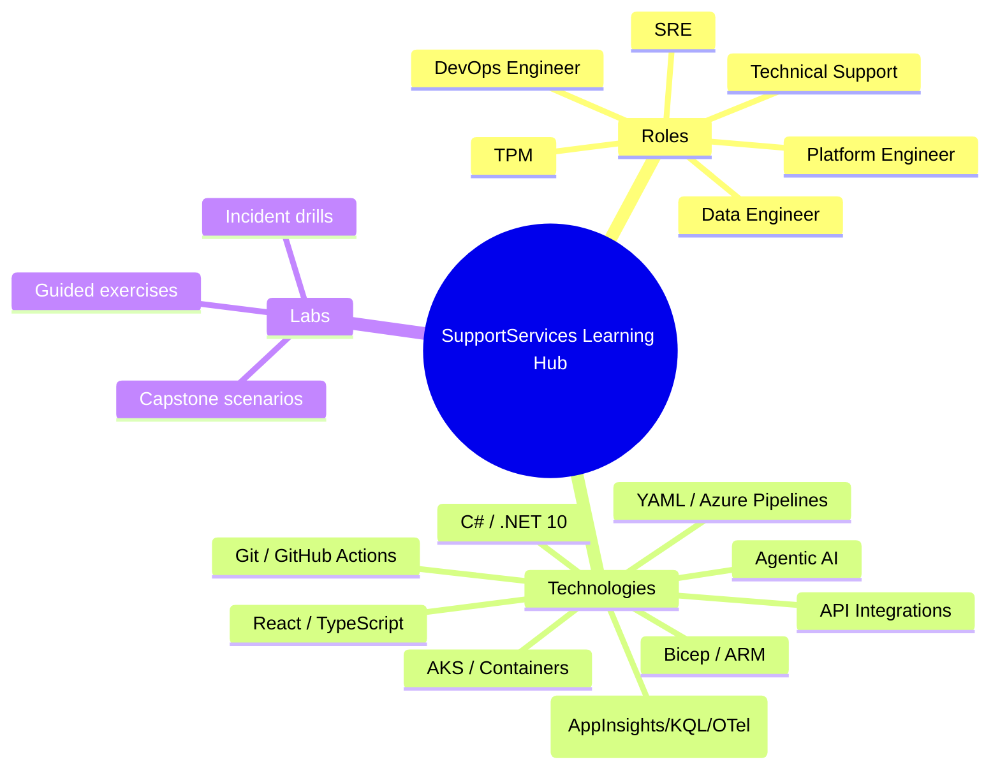
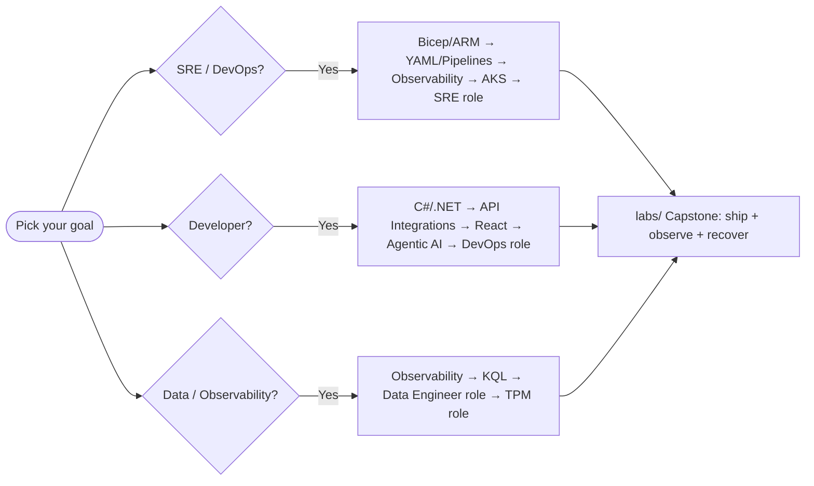

# SupportServices Learning Hub

> A practice-enabled, role-based and technology-based learning program built on the patterns of a **real production .NET 10 monorepo** (13 domains, 385+ projects). Microsoft-stack only. Every guide combines **architecture**, **hands-on labs**, **real repo-derived code/config**, **Mermaid diagrams**, **interview Q&A**, and **runbooks/checklists**.

**Last updated:** June 2026 · **Stack:** .NET 10 · React 19 · Azure · Bicep · Azure DevOps + GitHub Actions · App Insights / OpenTelemetry / KQL · AKS

**Live site:** https://rdammala.github.io/SupportServicesLearning/

---

## How to use this hub

This program is structured into three tracks. Pick a **role** to see the job through one lens, pick a **technology** to go deep on a skill, then do the **labs** to prove it.

---

## Track 1 — Role Perspectives (`roles/`)

Each role guide answers: *What do I own? What does the architecture look like through my eyes? What does my day look like? What do I practice?*

| Role | Guide | You learn to… |
|---|---|---|
| Site Reliability Engineer | [roles/SRE_PERSPECTIVE.md](roles/SRE_PERSPECTIVE.md) | Define SLOs/error budgets, run incidents, automate toil, slot-swap safely |
| DevOps Engineer | [roles/DEVOPS_ENGINEER_PERSPECTIVE.md](roles/DEVOPS_ENGINEER_PERSPECTIVE.md) | Build CI/CD, gate releases, manage IaC, ship safely |
| Data Engineer | [roles/DATA_ENGINEER_PERSPECTIVE.md](roles/DATA_ENGINEER_PERSPECTIVE.md) | Model Cosmos data, build telemetry pipelines, KQL analytics |
| Technical Support | [roles/TECHNICAL_SUPPORT_PERSPECTIVE.md](roles/TECHNICAL_SUPPORT_PERSPECTIVE.md) | Triage with correlation IDs, read telemetry, escalate cleanly |
| Technical Program Manager | [roles/TPM_PERSPECTIVE.md](roles/TPM_PERSPECTIVE.md) | Drive cross-domain delivery, manage risk, read the same dashboards |
| Platform Engineer | [roles/PLATFORM_ENGINEER_PERSPECTIVE.md](roles/PLATFORM_ENGINEER_PERSPECTIVE.md) | Build golden paths, shared libraries, self-service infra |

---

## Track 2 — Technology Deep-Dives (`technologies/`)

Each tech guide: **concept → how it's used here → hands-on lab → interview Q&A → checklist**.

| Technology | Guide |
|---|---|
| C# / .NET 10 (backend, Functions, DI, async) | [technologies/CSHARP_DOTNET.md](technologies/CSHARP_DOTNET.md) |
| React 19 + TypeScript (Loyalty Portal) | [technologies/REACT_TYPESCRIPT.md](technologies/REACT_TYPESCRIPT.md) |
| API Integrations (typed HTTP clients, REST, resilience) | [technologies/API_INTEGRATIONS.md](technologies/API_INTEGRATIONS.md) |
| Agentic AI (Conversations agents, tools, orchestration) | [technologies/AGENTIC_AI.md](technologies/AGENTIC_AI.md) |
| Bicep + ARM (IaC, modules, deployment stacks) | [technologies/BICEP_ARM.md](technologies/BICEP_ARM.md) |
| YAML + Azure Pipelines (OneBranch, templates) | [technologies/YAML_AZURE_PIPELINES.md](technologies/YAML_AZURE_PIPELINES.md) |
| Git + GitHub Actions | [technologies/GIT_GITHUB_ACTIONS.md](technologies/GIT_GITHUB_ACTIONS.md) |
| Observability: App Insights, KQL, OpenTelemetry, metrics, dashboards | [technologies/OBSERVABILITY_APPINSIGHTS_KQL_OTEL.md](technologies/OBSERVABILITY_APPINSIGHTS_KQL_OTEL.md) |
| AKS, container services, orchestration, deployments | [technologies/AKS_CONTAINERS.md](technologies/AKS_CONTAINERS.md) |

---

## Track 3 — Labs & Capstones (`labs/`)

Hands-on, self-graded exercises and end-to-end scenario drills.

| Lab set | Guide |
|---|---|
| Lab index, setup, and capstone scenarios | [labs/README.md](labs/README.md) |
| Runnable capstone playgrounds | [playgrounds/README.md](playgrounds/README.md) |
| Demo failure case study and remediation patterns | [playgrounds/PLAYGROUND_FAILURE_CASE_STUDY.md](playgrounds/PLAYGROUND_FAILURE_CASE_STUDY.md) |

---

## Foundational reference guides (root)

These existing deep-reference docs underpin the tracks above:

- [DevOps Architecture (commit → prod)](DEVOPS_ARCHITECTURE.md)
- [CI/CD Pipelines Educational Guide](CI_CD_PIPELINES_EDUCATIONAL_GUIDE.md)
- [DevOps / SRE Operations Guide](DEVOPS_SRE_OPERATIONS_GUIDE.md)
- [Technology Stack Guide](TECHNOLOGY_STACK_GUIDE.md)
- [.NET Project Structure Guide](.NET_PROJECT_STRUCTURE_GUIDE.md)
- [Troubleshooting & Interview Guide](TROUBLESHOOTING_AND_INTERVIEW_GUIDE.md)
- [Coding Interview Practice — DEV](CODING_INTERVIEW_PRACTICE_DEV.md)
- [Coding Interview Practice — SRE](CODING_INTERVIEW_PRACTICE_SRE.md)

---

## Suggested learning paths

| Goal | Path |
|---|---|
| **Become an SRE** | Bicep/ARM → YAML/Pipelines → Observability → AKS → SRE role → Labs |
| **Become a backend Developer** | C#/.NET → API Integrations → Agentic AI → DevOps role → Labs |
| **Become a Data/Observability Engineer** | Observability → Data Engineer role → TPM role → Labs |
| **Become a Platform Engineer** | C#/.NET → Bicep/ARM → YAML/Pipelines → Platform role → Labs |

---

## Conventions used across all guides

- 🧠 **Concept** — the idea and why it matters
- 🏗️ **In this repo** — how the production monorepo applies it
- 🧪 **Lab** — do-it-yourself exercise with acceptance criteria
- 💬 **Interview** — likely questions + crisp answers
- ✅ **Checklist / Runbook** — operational steps

> All examples are **Microsoft-stack only** and are simplified, sanitized teaching versions inspired by real repo patterns — not production secrets or live endpoints.
