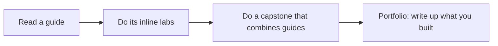
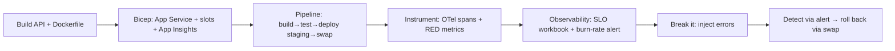

# Labs & Capstone Scenarios

> Hands-on, self-graded exercises that turn the guides into skill. Each lab states a **goal**, **steps**, and **acceptance criteria**. Capstones combine multiple technologies into realistic end-to-end drills.

[← Back to Learning Hub](../README.md)

---

## How labs work

- Every guide has inline 🧪 **Labs** (Lab 1, Lab 2…). This page **indexes** them and adds **capstones** that span guides.
- Use a personal Azure sandbox subscription. Never run against production.
- "Acceptance" = how you know you're done. Self-grade honestly.

---

## Lab index by guide

### Roles
| Guide | Labs |
|---|---|
| [SRE](../roles/SRE_PERSPECTIVE.md) | SLO dashboard · slot-swap+rollback · incident drill · kill-a-toil |
| [DevOps Engineer](../roles/DEVOPS_ENGINEER_PERSPECTIVE.md) | reproduce CI locally · add approval gate |
| [Data Engineer](../roles/DATA_ENGINEER_PERSPECTIVE.md) | partition-key design · idempotent change-feed rollup · metrics-quality KQL |
| [Technical Support](../roles/TECHNICAL_SUPPORT_PERSPECTIVE.md) | trace a failed request · write an escalation · status updates |
| [TPM](../roles/TPM_PERSPECTIVE.md) | dependency map · risk register · read a dashboard · status write-up |
| [Platform Engineer](../roles/PLATFORM_ENGINEER_PERSPECTIVE.md) | add a Common helper · extend paved road · encode a standard |

### Technologies
| Guide | Labs |
|---|---|
| [C#/.NET](../technologies/CSHARP_DOTNET.md) | wire a service · fix a blocking call · idempotent processor · add an error code |
| [React/TypeScript](../technologies/REACT_TYPESCRIPT.md) | model an API response · form with Actions · add a Redux slice |
| [API Integrations](../technologies/API_INTEGRATIONS.md) | redesign an endpoint · build a typed client · add a circuit breaker · idempotent POST |
| [Agentic AI](../technologies/AGENTIC_AI.md) | define a tool · mini-RAG · add a guardrail · eval harness |
| [Bicep/ARM](../technologies/BICEP_ARM.md) | author a module · stack lifecycle · read a what-if |
| [YAML/Pipelines](../technologies/YAML_AZURE_PIPELINES.md) | write a build stage · parameterize a template · add an approval |
| [Git/GitHub Actions](../technologies/GIT_GITHUB_ACTIONS.md) | clean PR flow · protect a branch · CI workflow · gated deploy |
| [Observability](../technologies/OBSERVABILITY_APPINSIGHTS_KQL_OTEL.md) | instrument an operation · define service metrics · KQL workout · ops workbook · alert+webhook |
| [AKS/Containers](../technologies/AKS_CONTAINERS.md) | containerize a service · pick compute · deploy to AKS · KEDA scale · canary |

---

## Capstone 1 — Ship, Observe, Recover (full DevOps + SRE loop)

**Goal:** Take a small .NET API from code to production-safe, observable, and recoverable.

**Steps:**
1. Build a minimal .NET 10 API with `/health` and one endpoint ([C#/.NET](../technologies/CSHARP_DOTNET.md)).
2. Author Bicep for App Service (staging slot) + App Insights ([Bicep/ARM](../technologies/BICEP_ARM.md)).
3. Create a pipeline/Action: build → test → deploy staging → health gate → slot swap ([YAML/Pipelines](../technologies/YAML_AZURE_PIPELINES.md) or [Git/GitHub Actions](../technologies/GIT_GITHUB_ACTIONS.md)).
4. Instrument with OTel spans + RED metrics ([Observability](../technologies/OBSERVABILITY_APPINSIGHTS_KQL_OTEL.md)).
5. Build an SLO workbook + burn-rate alert → webhook.
6. Inject failures; confirm the alert fires; **roll back via slot swap**.

**Acceptance:** A documented run where a bad deploy is auto-detected and you recover in one action, with before/after telemetry screenshots.

---

## Capstone 2 — Data + Observability pipeline

**Goal:** Turn operational data into analytics and alerts.

**Steps:**
1. Model a Cosmos container with a justified partition key ([Data Engineer](../roles/DATA_ENGINEER_PERSPECTIVE.md)).
2. Write an idempotent change-feed processor that maintains a rollup.
3. Emit custom events/metrics; query funnels + anomalies in KQL ([Observability](../technologies/OBSERVABILITY_APPINSIGHTS_KQL_OTEL.md)).
4. Build a workbook + a volume-drop alert that detects a broken pipeline.

**Acceptance:** Reprocessing is idempotent; the anomaly alert fires on a simulated data drop.

---

## Capstone 3 — Agentic support assistant

**Goal:** A grounded support agent that uses your APIs as tools.

**Steps:**
1. Expose a typed client method as an agent tool ([Agentic AI](../technologies/AGENTIC_AI.md)).
2. Add RAG grounding via Azure AI Search with citations.
3. Add guardrails (max iterations, confirmation for destructive tools, injection defense).
4. Trace every model/tool call with OTel; build an eval harness with a tracked score.

**Acceptance:** Agent answers from grounded context with citations, refuses off-topic, and you can show a pass-rate across prompt changes.

---

## Capstone 4 — Container platform slice

**Goal:** Run a service on AKS/Container Apps with autoscaling and safe rollout.

**Steps:**
1. Containerize a .NET API (multi-stage, non-root) ([AKS/Containers](../technologies/AKS_CONTAINERS.md)).
2. Provision ACR + AKS/ACA via Bicep.
3. Deploy with probes + requests/limits; add HPA or KEDA (Service Bus queue depth).
4. Do a canary rollout; roll back on bad metrics.
5. Wire Container Insights + OTel → App Insights.

**Acceptance:** Service autoscales under load, canary decision is metric-driven, rollback works.

---

## Incident drill (timed, repeatable)

Run this as a 30-minute solo or group exercise:

1. **Inject** a fault (Cosmos 429 storm / bad deploy / dependency 500s).
2. **Detect** via your alert; declare a severity.
3. **Triage** with the `union ... by operation_Id` query; scope blast radius.
4. **Mitigate** (rollback/scale/failover) — service first, root cause later.
5. **Communicate** 3 status updates.
6. **Postmortem**: timeline + 3 blameless action items.

**Acceptance:** MTTR recorded; a written blameless postmortem with tracked actions.

---

## Portfolio tip

For each capstone, write a short README: the architecture diagram, what you built, the failure you injected, and how you recovered — these become strong interview talking points and proof of skill.

[← Back to Learning Hub](../README.md)
