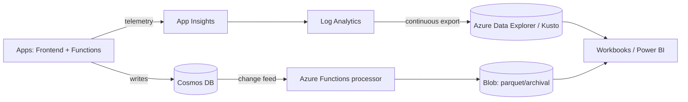
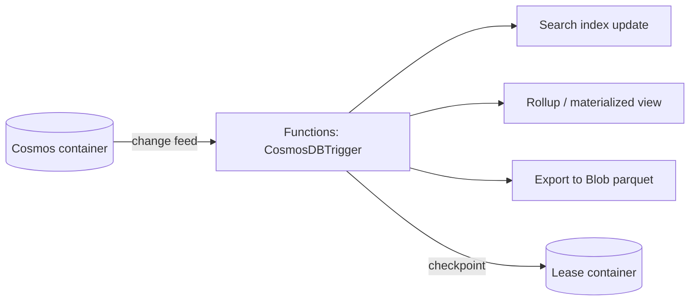

# The Data Engineer Perspective

> Modeling data, building telemetry/analytics pipelines, and turning Cosmos + App Insights into insight across a 13-domain Azure platform.

**Audience:** Data engineers, analytics engineers, observability-data specialists
**Companion guides:** [Observability/KQL](../technologies/OBSERVABILITY_APPINSIGHTS_KQL_OTEL.md) · [API Integrations](../technologies/API_INTEGRATIONS.md)

---

## 1. 🧠 What a data engineer owns here

This platform is operational-first (Cosmos NoSQL + telemetry), not a classic warehouse. The data engineer owns:

| Area | Ownership |
|---|---|
| **Operational data modeling** | Cosmos containers, partition keys, contract vs storage models |
| **Telemetry pipeline** | App Insights → Log Analytics → KQL → dashboards |
| **Analytics** | KQL aggregations, funnels, cohorts, anomaly detection |
| **Data movement** | Export to ADX/Storage, retention, archival |
| **Quality & lineage** | Schema/versioning, idempotency, dedup |



---

## 2. Cosmos DB data modeling

### 🧠 Core principles

- **Model for access patterns**, not normalization. Denormalize so a read = one query.
- **Partition key** is the most important decision: choose high-cardinality, evenly-distributed, query-aligned keys. Avoid hot partitions (>50% RU on one key).
- **Contract vs storage models**: API request/response models are separate from how data is stored. Map between them deliberately.
- **RU economics**: every read/write costs Request Units; batch and point-read where possible.

### 🏗️ Partition key patterns

| Pattern | Use when |
|---|---|
| `/tenantId` | Multi-tenant isolation, even tenant sizes |
| `/userId` | Per-user data, many users |
| Synthetic `/{type}_{date}` | Time-series with bounded hot range |
| Composite (hash of id) | Avoiding monotonically increasing hotspots |

### 🧪 Lab 1 — Pick a partition key

For a "support conversation messages" container with queries *(by conversationId, recent-first)*:
1. List the top 3 access patterns.
2. Choose a partition key and justify against hot-partition risk.
3. Write the point-read and the range query.
**Acceptance:** A partition key choice + the two queries + a one-line hot-partition justification.

```csharp
// Point read = cheapest (1 RU class): partition key + id
var msg = await container.ReadItemAsync<Message>(
    id: messageId, partitionKey: new PartitionKey(conversationId));

// Query within a partition (recent first)
var query = new QueryDefinition(
    "SELECT * FROM c WHERE c.conversationId = @cid ORDER BY c.timestamp DESC")
    .WithParameter("@cid", conversationId);
```

---

## 3. The change feed pipeline

Cosmos **change feed** gives an ordered, durable stream of inserts/updates — the backbone for materialized views, search indexing, and exports.



```csharp
[Function("ProjectMessages")]
public async Task Run(
    [CosmosDBTrigger(
        databaseName: "support",
        containerName: "messages",
        Connection = "Cosmos",
        LeaseContainerName = "leases",
        CreateLeaseContainerIfNotExists = true)]
    IReadOnlyList<Message> changes)
{
    foreach (var m in changes)
        await _projection.UpsertAsync(m);  // idempotent upsert
}
```

> **Idempotency matters**: change feed delivers at-least-once. Use upserts keyed by id so reprocessing is safe.

### 🧪 Lab 2 — Build a rollup

Write a change-feed processor that maintains a daily message-count-per-tenant rollup document. **Acceptance:** Reprocessing the same batch twice yields the same counts (idempotent).

---

## 4. Telemetry → analytics with KQL

App Insights writes `requests`, `dependencies`, `exceptions`, `traces`, `customEvents`, `customMetrics` to Log Analytics. KQL is your query engine.

### 🏗️ Funnel / cohort example

```kusto
// Refund request funnel: started → submitted → approved
customEvents
| where timestamp > ago(7d)
| where name in ("RefundStarted","RefundSubmitted","RefundApproved")
| summarize users = dcount(tostring(customDimensions.userId)) by name
| order by users desc
```

### 🏗️ Anomaly detection

```kusto
requests
| where timestamp > ago(14d)
| where cloud_RoleName == "Search.Frontend"
| make-series cnt=count() default=0 on timestamp step 1h
| extend anomalies = series_decompose_anomalies(cnt, 2.5)
```

### 🧪 Lab 3 — Build a metrics-quality query

Write KQL that flags any 1h window where event volume drops >60% vs the same hour last week (possible pipeline break). **Acceptance:** query + screenshot of a detected dip.

---

## 5. Export, retention & lineage

| Concern | Approach |
|---|---|
| **Long-term analytics** | Continuous export App Insights → ADX (Kusto) or Storage |
| **Cost/retention** | Tier hot→cool→archive in Blob; set Log Analytics retention per table |
| **Format** | Parquet in Blob for columnar analytics |
| **Lineage** | Version contract models; stamp schemaVersion on stored docs |
| **Dedup** | Idempotency keys; upsert-by-id |

### ✅ Data-pipeline checklist

- [ ] Partition key validated against real access patterns
- [ ] Change-feed processors are idempotent (upsert-by-id)
- [ ] Leases container monitored for lag
- [ ] Schema/version stamped on every stored document
- [ ] Retention + archival tiers configured (cost)
- [ ] Backfill/replay procedure documented

---

## 6. 💬 Interview Q&A

**Q: How do you choose a Cosmos partition key?**
Align with the dominant query, maximize cardinality, distribute evenly, keep related items together, and avoid monotonically increasing keys that create write hot-spots.

**Q: Change feed delivery guarantee?**
At-least-once, in order per partition. Design consumers to be idempotent (upserts keyed by id) and to checkpoint via the leases container.

**Q: Why denormalize in Cosmos?**
RU and latency: a read should hit one partition/one query. Joins are expensive/limited, so you store data shaped for reads.

**Q: requests vs customEvents vs customMetrics?**
`requests` = inbound HTTP; `dependencies` = outbound calls; `customEvents` = business events (named, with dimensions); `customMetrics` = pre-aggregated numeric series.

**Q: How do you detect a broken telemetry pipeline?**
Volume-drop anomaly detection comparing current windows to historical baselines; alert when counts fall outside expected bands.

---

## 7. ✅ Readiness checklist

- [ ] Can model a container for given access patterns
- [ ] Can build an idempotent change-feed processor
- [ ] Can write funnel, cohort, and anomaly KQL
- [ ] Can configure export + retention for cost
- [ ] Understands contract vs storage model separation

---

### Next steps
→ [Observability/KQL deep-dive](../technologies/OBSERVABILITY_APPINSIGHTS_KQL_OTEL.md) then the analytics [labs/](../labs/README.md).
