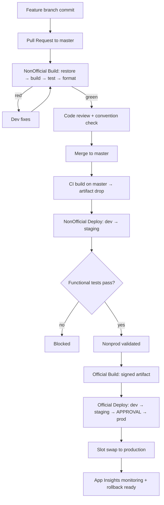
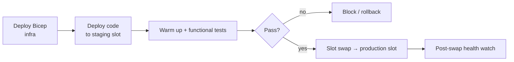

# The DevOps Engineer Perspective

> Shipping change safely and repeatably across a 13-domain .NET 10 monorepo on Azure DevOps (OneBranch) + GitHub Actions.

**Audience:** DevOps/build/release engineers
**Companion tech guides:** [YAML/Azure Pipelines](../technologies/YAML_AZURE_PIPELINES.md) · [Git/GitHub Actions](../technologies/GIT_GITHUB_ACTIONS.md) · [Bicep/ARM](../technologies/BICEP_ARM.md)

---

## 1. 🧠 What a DevOps engineer owns

DevOps = the system that turns a commit into safe, observable production change. You own the **paths and the guardrails**, not the features.

| Area | Ownership |
|---|---|
| CI | Build, test, format, sign on every PR |
| CD | Gated, staged deploys (dev → staging → prod) |
| IaC | Bicep modules, deployment stacks, drift control |
| Release safety | Slot swaps, approvals, rollback |
| Developer experience | Fast feedback, golden-path templates |
| Secrets & supply chain | Key Vault, signed artifacts, provenance |

---

## 2. 🏗️ The commit-to-production flow



### Official vs NonOfficial

| | NonOfficial | Official |
|---|---|---|
| Trigger | PR + master CI | Manual / release |
| Signing | No | Yes (code signing) |
| Targets | dev, staging | dev, staging, **prod** |
| Approval gate | No | Yes (release manager) |

---

## 3. CI: the build pipeline

### 🏗️ Stages

1. **Restore** (central package management via `Directory.Packages.props`)
2. **Build** with `/warnaserror`
3. **Test** (MSTest SDK, parallel) — Unit/BVT/Functional
4. **Format** check (`dotnet format --verify-no-changes`)
5. **Publish + sign** artifacts (Frontend + Backend + Bicep)

```yaml
# Thin per-domain build delegates to a shared template
extends:
  template: /.pipelines/templates/Build.Common.yml
  parameters:
    solution: 'Chat/Chat.slnx'
    runTests: true
    treatWarningsAsErrors: true
    publishArtifacts:
      - frontend
      - backend
      - bicep
```

### ✅ Green-PR checklist

- [ ] `dotnet build <solution> /warnaserror -v q` clean
- [ ] `dotnet test <solution>` green (Unit + BVT)
- [ ] `dotnet format <solution> --verify-no-changes` clean
- [ ] Solution validation passed if any `.csproj`/`.slnx` changed

### 🧪 Lab 1 — Reproduce CI locally

For one domain:
```powershell
dotnet build Chat\Chat.slnx /warnaserror -v q
dotnet test Chat\Chat.slnx --filter "TestCategory=Unit"
dotnet format Chat\Chat.slnx --verify-no-changes
```
**Acceptance:** All three pass locally before you'd ever push.

---

## 4. CD: the deploy pipeline

### 🏗️ Per-environment stage (repeated for dev/staging/prod)



Each environment stage: **Bicep → Code → Test → Swap**. Prod adds a manual **approval gate** before the stage runs.

### 🧪 Lab 2 — Add an approval gate

In a sandbox pipeline, add an Azure DevOps **environment** with a required approver before the prod stage. **Acceptance:** Deploy halts and waits for approval; rejection stops the run.

---

## 5. Infrastructure as Code

- **Bicep modules** are version-controlled with the code and deployed by the pipeline.
- **Two-level deployments**: a subscription/resource-group level + a resource level.
- **Deployment stacks** manage lifecycle (create/update/delete) of a resource set atomically.
- **What-if** before apply to preview changes.

```bash
az deployment group what-if -g $RG -f main.bicep -p main.bicepparam
az stack group create --name chat-stack -g $RG --template-file main.bicep \
  --parameters main.bicepparam --action-on-unmanage deleteResources --deny-settings-mode none
```

See the full [Bicep/ARM guide](../technologies/BICEP_ARM.md).

### ✅ IaC change checklist

- [ ] `bicep build`/lint clean
- [ ] `what-if` reviewed — no unexpected deletes
- [ ] Params per environment (`*.bicepparam`)
- [ ] Secrets come from Key Vault references, never literals
- [ ] Resource names follow the naming convention

---

## 6. Secrets & supply chain

| Concern | Practice |
|---|---|
| Secrets | Key Vault references in app settings; managed identity, no connection strings in code |
| Artifact integrity | Official builds **sign** binaries |
| Provenance | Build from `master`, immutable artifact drop |
| Least privilege | Pipeline service connections scoped per RG/env |

---

## 7. GitHub Actions (where used)

For lighter repos / personal projects, the same ideas map to Actions:

```yaml
name: ci
on: [push, pull_request]
jobs:
  build-test:
    runs-on: ubuntu-latest
    steps:
      - uses: actions/checkout@v4
      - uses: actions/setup-dotnet@v4
        with: { dotnet-version: '10.0.x' }
      - run: dotnet build --configuration Release -warnaserror
      - run: dotnet test --configuration Release --filter TestCategory=Unit
      - run: dotnet format --verify-no-changes
```

See [Git/GitHub Actions guide](../technologies/GIT_GITHUB_ACTIONS.md).

---

## 8. 💬 Interview Q&A

**Q: Why separate Official and NonOfficial pipelines?**
Isolation of trust: NonOfficial gives fast feedback to non-prod; Official adds signing + approval gates for prod, so production artifacts are provably built and reviewed.

**Q: How do you make deploys reversible?**
Slot swaps (swap back), immutable artifacts (redeploy previous), and backward-compatible data migrations so old and new versions coexist during the swap.

**Q: What's `what-if` and why run it?**
A dry run of a Bicep/ARM deployment showing create/modify/**delete** actions before applying — catches accidental resource deletion.

**Q: How do you keep build times reasonable in a 385-project monorepo?**
Per-domain solutions (`.slnx`) so a change builds/tests only its domain; central package management; parallel tests; cached restores.

**Q: Where do secrets live?**
Key Vault, referenced via managed identity. Never in YAML, code, or app settings literals.

---

## 9. ✅ DevOps readiness checklist

- [ ] Every PR runs build + test + format + solution validation
- [ ] Deploys are staged dev → staging → prod with gates
- [ ] Prod requires manual approval
- [ ] IaC is reviewed with `what-if`
- [ ] Artifacts are immutable and signed for prod
- [ ] Rollback is one action and rehearsed
- [ ] Secrets are Key Vault-only

---

### Next steps
→ [YAML/Azure Pipelines deep-dive](../technologies/YAML_AZURE_PIPELINES.md) and [labs/](../labs/README.md) capstone "ship + observe + recover".
