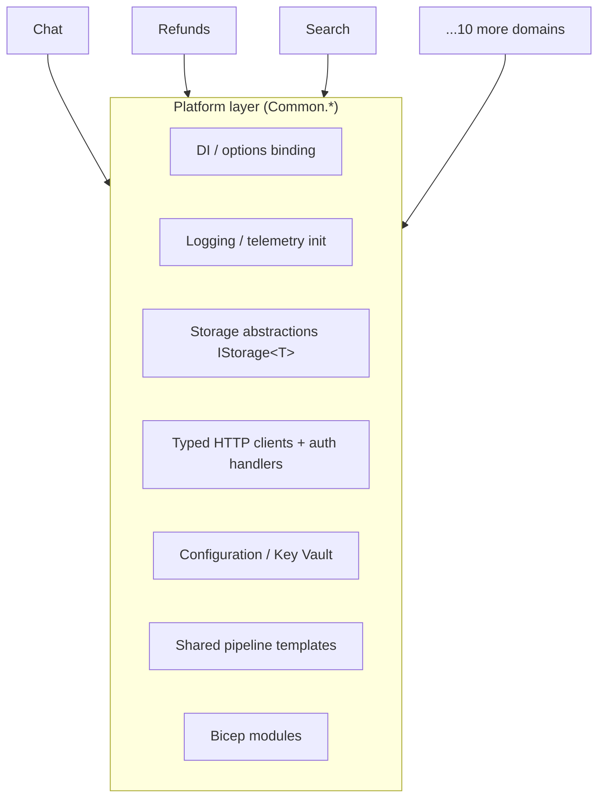

# The Platform Engineer Perspective

> Building the golden paths — shared libraries, self-service infrastructure, and paved roads — that let 13 domains move fast safely.

**Audience:** Platform / internal-developer-platform (IDP) engineers
**Companion guides:** [C#/.NET](../technologies/CSHARP_DOTNET.md) · [Bicep/ARM](../technologies/BICEP_ARM.md) · [YAML/Pipelines](../technologies/YAML_AZURE_PIPELINES.md)

---

## 1. 🧠 What a platform engineer owns

Platform engineering builds the **product that developers use to ship products**. Your customers are the other engineers. You own **leverage**: do something once so 13 domains benefit.

| Area | Ownership |
|---|---|
| Shared libraries | `Common.*` — DI, config, logging, storage, clients |
| Golden-path templates | Project scaffolds, pipeline templates, Bicep modules |
| Self-service infra | Repeatable, parameterized environments |
| Standards | Conventions, code style, security defaults |
| Developer experience | Fast builds, clear errors, good docs |



---

## 2. 🏗️ The shared-library architecture

Domains depend **only** on `Common.*`, never on each other. Inter-domain calls go through typed clients. This keeps coupling low and lets the platform team standardize cross-cutting concerns.

| Common library | Provides |
|---|---|
| `Common.AspNetCore` | Startup, middleware, health checks, error-code result factory |
| `Common.AzureFunctions.Isolated` | Function host defaults, middleware |
| `Common.Azure.CosmosDb` | `IStorage<T>`, batch ops, partition helpers |
| `Common.Azure.ServiceBus` | Sender/receiver, lock renewal, dead-letter |
| `Common.Configuration` | `AddOptionsWithBinding<T>()`, section-name derivation |
| `Common.Logging` | Structured logging, activity tagging |
| `Common.Clients.*` | Typed S2S HTTP clients with resilience |

### 🧠 The golden-path DI pattern

Each layer self-registers with one extension method, so a new domain wires up in a few lines:

```csharp
// A new domain frontend's Program.cs reads almost identically to every other one
builder.Services.AddCommonForAspNetCore();
builder.Services.AddErrorCodeResultFactory<RefundErrorCode>();
builder.Services.AddRefundsStorage();
builder.Services.AddRefundsClients();
```

```csharp
// Options binding with auto-derived section name (no magic strings)
services.AddOptionsWithBinding<CosmosOptions>();  // binds "Cosmos" section + validates
```

### 🧪 Lab 1 — Add a Common helper

Design a small `Common.*` extension method (e.g. a standardized retry policy registration) that any domain can call with one line. Define: signature, what it registers, how a domain consumes it. **Acceptance:** A one-line consumer call + the registration it produces.

---

## 3. Paved-road pipeline templates

Platform owns **thin per-domain YAML → shared templates** so every domain gets the same gates for free.

```yaml
# Domain owns 10 lines; platform owns the 500-line shared template
extends:
  template: /.pipelines/templates/Build.Common.yml
  parameters:
    solution: 'Refunds/Refunds.slnx'
    runTests: true
    treatWarningsAsErrors: true
```

Benefits: one place to add a new security scan, signing step, or test gate → all domains inherit it.

### 🧪 Lab 2 — Extend the paved road

Propose adding a new mandatory step (e.g. dependency vulnerability scan) to the shared build template. Describe the rollout so no domain breaks. **Acceptance:** A backward-compatible rollout (default-on with opt-out window, or staged enablement).

---

## 4. Self-service infrastructure (Bicep modules)

Platform publishes **parameterized Bicep modules** (App Service, Cosmos, Service Bus, Key Vault) so a domain stands up an environment by supplying params, not authoring infra from scratch.

```bicep
// Domain consumes a platform module
module api 'br/platform:app-service:1.0.0' = {
  name: 'refundsApi'
  params: {
    name: 'refunds-api'
    slotEnabled: true
    healthCheckPath: '/health'
    appInsightsConnectionString: appInsights.outputs.connectionString
  }
}
```

### ✅ Golden-module checklist

- [ ] Sensible secure defaults (HTTPS-only, managed identity, slots on)
- [ ] Health check + telemetry wired by default
- [ ] Parameterized per environment
- [ ] Versioned + documented
- [ ] `what-if`-clean and idempotent

See the [Bicep/ARM guide](../technologies/BICEP_ARM.md) for module authoring.

---

## 5. Standards & guardrails

Platform encodes standards so they're automatic, not aspirational:

- **Assembly/namespace naming** auto-derived from folder path (`Directory.Build.props`) — no manual `AssemblyName`.
- **Central package management** (`Directory.Packages.props`) — domains can't drift package versions.
- **Convention docs** + analyzers + `dotnet format` enforce style at build time.
- **Solution validation** catches layout/dependency violations before merge.

> **Principle:** make the right way the easy way. If the paved road is faster than going off-road, everyone stays on it.

### 🧪 Lab 3 — Encode a standard

Pick a convention (e.g. "all secrets via Key Vault reference") and describe how to enforce it automatically (analyzer, pipeline check, or module default) rather than by review. **Acceptance:** An automated enforcement mechanism, not a doc.

---

## 6. Measuring platform success

| Signal | Meaning |
|---|---|
| Time-to-first-deploy for a new service | Onboarding friction |
| % domains on latest shared template | Paved-road adoption |
| Build/test feedback time | Inner-loop speed |
| Recurrence of cross-cutting bugs | Whether fixes land centrally |
| Developer satisfaction (survey) | Is the platform loved or tolerated |

---

## 7. 💬 Interview Q&A

**Q: Why do domains depend only on `Common.*` and not each other?**
To keep coupling low and changes local. Cross-domain communication goes through versioned typed clients, so teams evolve independently and the platform standardizes cross-cutting concerns once.

**Q: How do you change a shared library without breaking 13 teams?**
Backward-compatible additions, semantic versioning, feature-flag or default-on-with-opt-out, staged rollout, and clear deprecation windows.

**Q: What's the value of thin-YAML + shared templates?**
One place to add a gate (scan, signing, test) benefits every domain instantly; domains stay tiny and consistent.

**Q: How do you auto-derive assembly names?**
`Directory.Build.props` converts the relative folder path to a deduplicated dotted namespace prefixed with the product name — no per-project config, no drift.

**Q: How do you measure if your platform is working?**
Adoption (% on paved road), inner-loop speed (build/test time), onboarding time, central-fix recurrence, and developer satisfaction.

---

## 8. ✅ Platform readiness checklist

- [ ] New service onboards via templates in minutes, not days
- [ ] Cross-cutting concerns live in `Common.*`, registered with one call
- [ ] Pipeline gates are shared and inheritable
- [ ] Bicep modules are secure-by-default and versioned
- [ ] Standards are enforced automatically, not by review
- [ ] Platform success is measured, not assumed

---

### Next steps
→ Author modules in [Bicep/ARM](../technologies/BICEP_ARM.md); study DI/config patterns in [C#/.NET](../technologies/CSHARP_DOTNET.md).
