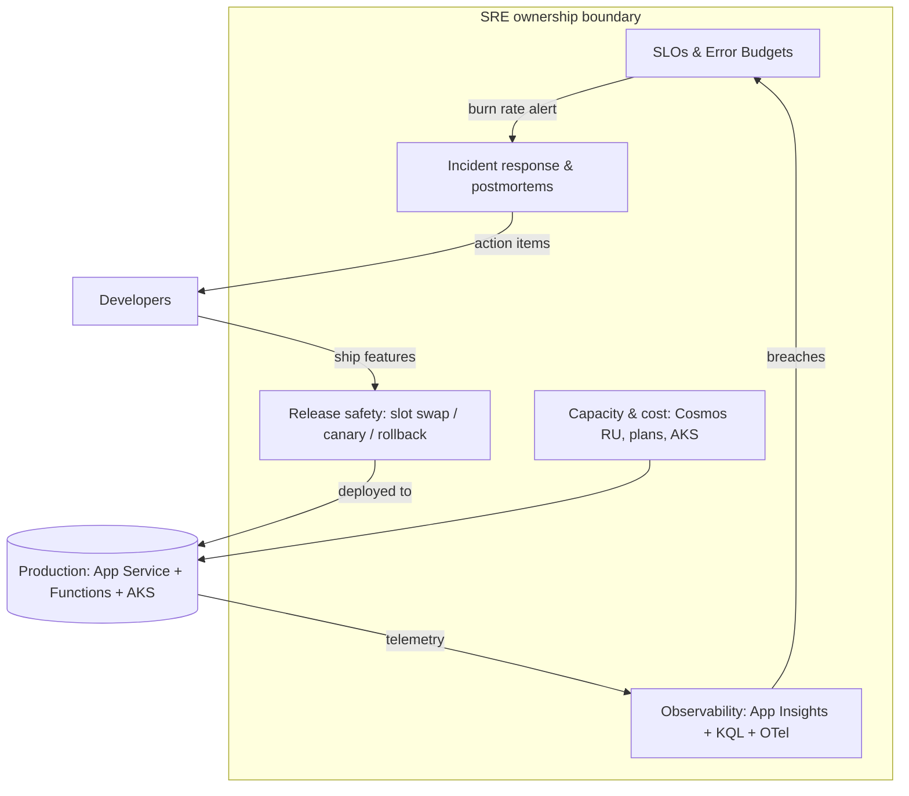
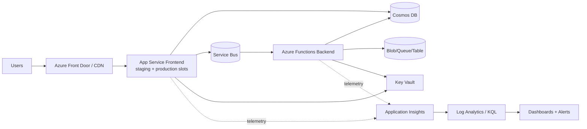
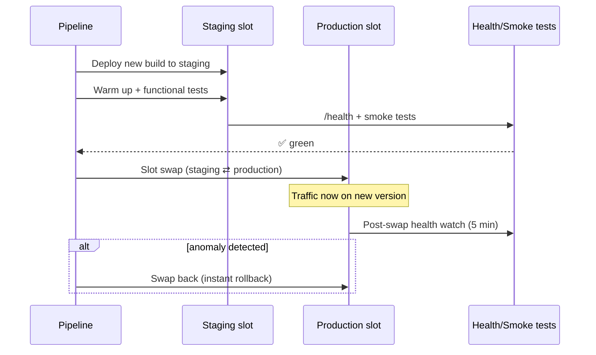
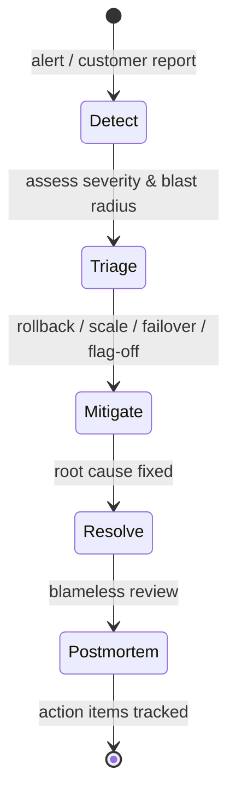

# The Site Reliability Engineer (SRE) Perspective

> How a production .NET 10 / Azure monorepo (13 domains, 385+ projects) looks through an SRE's eyes — and how to practice the craft.

**Audience:** Aspiring/practicing SREs, on-call engineers
**Companion tech guides:** [Observability](../technologies/OBSERVABILITY_APPINSIGHTS_KQL_OTEL.md) · [AKS/Containers](../technologies/AKS_CONTAINERS.md) · [Bicep/ARM](../technologies/BICEP_ARM.md) · [YAML/Pipelines](../technologies/YAML_AZURE_PIPELINES.md)

---

## 1. 🧠 What an SRE owns here

SRE is software engineering applied to operations. In this monorepo the SRE owns **reliability outcomes**, not features:

| Pillar | What it means in this repo |
|---|---|
| **SLIs/SLOs** | Latency, availability, error-rate per domain frontend (Chat, Refunds, Search…) |
| **Error budgets** | How much unreliability is allowed before features freeze |
| **Toil reduction** | Automate slot swaps, cert rotation, scaling, backups |
| **Incident response** | On-call, triage via correlation IDs, mitigation, postmortems |
| **Capacity & cost** | Cosmos RU/s, App Service plans, AKS node pools |
| **Release safety** | Blue-green slot swaps, canary, instant rollback |



---

## 2. 🏗️ The reliability architecture

The platform is multi-domain. Each domain has a **Frontend** (App Service, ASP.NET Core) and a **Backend** (Azure Functions, isolated worker), backed by **Cosmos DB**, **Blob/Queue/Table storage**, **Service Bus**, **Key Vault**, and **Application Insights**.



**SRE reliability levers per layer:**

- **Front Door** — health probes, WAF, failover routing between regions.
- **App Service** — staging/production slots, autoscale rules, health-check path `/health`.
- **Functions** — concurrency limits, retry policies, dead-letter handling.
- **Cosmos** — autoscale RU/s, partition-key hot-spot avoidance, PITR backup.
- **Service Bus** — lock renewal, max-delivery-count → dead-letter, prefetch tuning.
- **Key Vault** — secret/cert rotation, expiry alerts.

---

## 3. SLIs, SLOs & error budgets

### 🧠 Definitions

- **SLI** (Indicator): a measured number, e.g. *proportion of requests < 500 ms*.
- **SLO** (Objective): the target, e.g. *99.9% of requests succeed over 30 days*.
- **Error budget**: `1 - SLO`. At 99.9% you get **43m 12s** of downtime/month.

| SLO | Monthly error budget | Weekly |
|---|---|---|
| 99% | 7h 18m | 1h 41m |
| 99.9% | 43m 12s | 10m 5s |
| 99.95% | 21m 36s | 5m 2s |
| 99.99% | 4m 19s | 1m |

### 🏗️ Defining an availability SLI in KQL

```kusto
// Availability SLI: successful requests / total over 5m windows
requests
| where timestamp > ago(30d)
| where cloud_RoleName == "Chat.Frontend"
| summarize
    total = count(),
    good  = countif(success == true and duration < 1000)
    by bin(timestamp, 5m)
| extend sli = todouble(good) / total
| project timestamp, sli
```

### 🏗️ Multi-window burn-rate alert (the Google SRE pattern)

Fast burn (page now) + slow burn (ticket) avoids alert fatigue:

```kusto
// Fast-burn: 2% of 30d budget consumed in 1h => burn rate 14.4x
let slo = 0.999;
let budget = 1.0 - slo;
requests
| where timestamp > ago(1h)
| where cloud_RoleName == "Chat.Frontend"
| summarize total=count(), bad=countif(success==false)
| extend errorRate = todouble(bad)/total
| extend burnRate = errorRate / budget
| where burnRate > 14.4    // page
```

### 🧪 Lab 1 — Build an SLO dashboard

**Goal:** Produce an availability + latency SLO view for one domain.
1. Pick `cloud_RoleName` (e.g. `Refunds.Frontend`).
2. Write a KQL query for **availability SLI** (above) and **p95 latency**.
3. Add both to an Azure Workbook with a 30-day time range.
4. Add a burn-rate alert at 14.4x (1h) and 6x (6h).
**Acceptance:** Dashboard shows current SLO attainment % and remaining error budget; alert fires on a synthetic error spike.

---

## 4. Release safety: blue-green slot swaps

### 🏗️ How deploys reach production safely



**Why slot swap = near-zero downtime:** the staging slot is fully warmed; swap is a routing change, not a redeploy. Rollback = swap back.

### ✅ Pre-swap checklist (runbook)

- [ ] Staging slot health endpoint returns 200 for 60s
- [ ] Smoke/functional tests green
- [ ] No active Sev1/Sev2 incident in the domain
- [ ] Error budget for the domain is not exhausted
- [ ] Cosmos/Service Bus migrations are backward compatible
- [ ] Rollback plan confirmed (swap-back command ready)

### 🧪 Lab 2 — Slot-swap with rollback

Using Azure CLI against a sandbox App Service:
```bash
# Deploy to staging, validate, swap, then practice rollback
az webapp deployment slot create -g $RG -n $APP --slot staging
az webapp deploy -g $RG -n $APP --slot staging --src-path ./drop.zip --type zip
curl -f https://$APP-staging.azurewebsites.net/health
az webapp deployment slot swap -g $RG -n $APP --slot staging --target-slot production
# Simulate a bad deploy -> rollback
az webapp deployment slot swap -g $RG -n $APP --slot staging --target-slot production
```
**Acceptance:** You can swap forward and back, and explain why traffic never 500s during the swap.

---

## 5. Incident response

### 🧠 The lifecycle



### Severity model

| Sev | Meaning | Response |
|---|---|---|
| Sev1 | Full outage / data loss | Page now, bridge, exec comms |
| Sev2 | Major degradation | Page, mitigate fast |
| Sev3 | Partial / single-tenant | Business hours |
| Sev4 | Minor / cosmetic | Backlog |

### 🏗️ Triage with correlation IDs

Every request carries a correlation/operation ID propagated through App Service → Service Bus → Functions. Start triage from one customer-reported ID:

```kusto
union requests, dependencies, exceptions, traces
| where operation_Id == "<correlation-id-from-customer>"
| project timestamp, itemType, name, success, resultCode, duration, message
| order by timestamp asc
```

### ✅ First-15-minutes runbook

1. **Acknowledge** the page; declare severity.
2. **Scope**: which domain/`cloud_RoleName`? Region? % of traffic?
3. **Recent change?** Check last deploy/slot swap → if correlated, **roll back first**.
4. **Mitigate**, don't debug: scale out, fail over, disable feature flag, swap back.
5. **Comms**: post status + ETA every 15–30 min.
6. **Capture** timeline for the postmortem as you go.

### 🧪 Lab 3 — Incident drill

Given a synthetic alert "Refunds p95 latency 3s, error rate 8%":
1. Write the KQL to confirm and scope it.
2. Decide mitigation (rollback vs scale vs Cosmos throttling).
3. Draft a 3-line customer status update.
**Acceptance:** A written timeline + chosen mitigation + comms message.

---

## 6. Toil & automation

> **Toil** = manual, repetitive, automatable work that scales with load. SRE goal: cap toil at ~50% of time.

| Toil source | Automation |
|---|---|
| Cert/secret expiry | Key Vault auto-rotation + 30-day expiry alert |
| Slot swaps | Pipeline-driven swap with health gates |
| Scaling | App Service autoscale + Cosmos autoscale RU |
| Backup verification | Scheduled PITR restore test |
| Log triage | Saved KQL + workbooks + alert auto-tickets |

### 🧪 Lab 4 — Kill one toil item

Automate Key Vault expiry alerting: write a KQL/Azure Monitor alert that fires 30 days before any secret/cert expires. **Acceptance:** alert config + test with a near-expiry secret.

---

## 7. Capacity & cost

- **Cosmos**: prefer **autoscale RU/s**; watch for hot partitions (one key taking >50% RU). Right-size max RU to p99 + headroom.
- **App Service**: scale-out rules on CPU/queue depth; scale-in safely.
- **AKS**: cluster autoscaler + spot node pools for batch; VPA/HPA for pods (see [AKS guide](../technologies/AKS_CONTAINERS.md)).
- **Cost attribution**: tag resources by domain; build a per-domain cost KQL/Workbook.

---

## 8. 💬 Interview Q&A

**Q: Difference between SLI, SLO, SLA?**
SLI = measured signal; SLO = internal target on that signal; SLA = contractual promise to customers (usually looser than the SLO, with penalties).

**Q: What's an error budget and how do you use it?**
`1 - SLO`. If budget remains, ship faster; if exhausted, freeze risky changes and invest in reliability. It turns reliability into a shared, data-driven decision.

**Q: Why multi-window multi-burn-rate alerting?**
A single threshold either pages too much (noise) or too late. Fast burn (1h, 14.4x) pages for acute issues; slow burn (6h, 6x) tickets for chronic ones — high signal, low fatigue.

**Q: How do you achieve near-zero-downtime deploys?**
Blue-green slot swaps: warm the staging slot, validate via health + smoke tests, swap routing, watch post-swap, swap back to roll back.

**Q: First thing in an incident?**
Mitigate, not diagnose. Check if a recent change caused it and roll back; restore service, then root-cause.

**Q: How do you find one customer's failed request across services?**
Correlation/operation ID propagated through the stack; `union requests, dependencies, exceptions` filtered by `operation_Id`.

---

## 9. ✅ SRE readiness checklist

- [ ] Every prod service has an SLO + dashboard + burn-rate alert
- [ ] Health endpoints + smoke tests gate every swap
- [ ] Rollback is one command and rehearsed
- [ ] Correlation IDs propagate end-to-end
- [ ] Backups are restored on a schedule (not just taken)
- [ ] Toil is measured and trending down
- [ ] Every Sev1/2 gets a blameless postmortem with tracked actions

---

### Next steps
→ Go deep on signals in [Observability](../technologies/OBSERVABILITY_APPINSIGHTS_KQL_OTEL.md), then practice end-to-end in [labs/](../labs/README.md).
