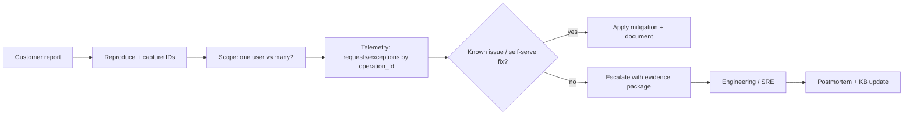

# The Technical Support Engineer Perspective

> Triaging, diagnosing, and escalating issues in a 13-domain Azure platform — using correlation IDs, telemetry, and clean handoffs.

**Audience:** Technical support / escalation engineers, support-adjacent SREs
**Companion guides:** [Observability/KQL](../technologies/OBSERVABILITY_APPINSIGHTS_KQL_OTEL.md) · [SRE](SRE_PERSPECTIVE.md)

---

## 1. 🧠 What technical support owns

Support is the human bridge between a customer symptom and an engineering fix. You own **accurate diagnosis, fast mitigation guidance, and clean escalation**.

| Skill | Why it matters |
|---|---|
| Reproduce & scope | Distinguish one-off vs widespread |
| Read telemetry | Confirm with data, not guesses |
| Correlation tracing | Follow one request across services |
| Escalation hygiene | Give engineering everything to act fast |
| Customer comms | Clear, honest, ETA-driven updates |



---

## 2. The diagnosis toolkit

### 🏗️ Correlation IDs are everything

Every request gets an operation/correlation ID that flows App Service → Service Bus → Functions. Ask the customer (or capture from the response header / support tool) and pivot:

```kusto
union requests, dependencies, exceptions, traces
| where operation_Id == "<correlation-id>"
| project timestamp, itemType, name, success, resultCode, duration, message
| order by timestamp asc
```

This single query reconstructs the full journey of one failed request across services.

### 🏗️ Scope: is it one customer or many?

```kusto
exceptions
| where timestamp > ago(1h)
| where cloud_RoleName == "Refunds.Frontend"
| summarize affected = dcount(tostring(customDimensions.userId)),
            occurrences = count()
  by type, outerMessage
| order by occurrences desc
```

If `affected` is large → likely incident, escalate fast. If 1 → user-specific, dig into their data.

### 🧪 Lab 1 — Trace a failed request

Given a correlation ID from a synthetic failure:
1. Run the union query and read the timeline.
2. Identify which dependency failed and the `resultCode`.
3. Decide: customer-specific or systemic?
**Acceptance:** A 3-bullet diagnosis: where it failed, why, blast radius.

---

## 3. Common symptom → cause playbook

| Symptom | Likely causes | First checks |
|---|---|---|
| "Page is slow" | Cosmos throttling (429), cold start, downstream latency | p95 `requests`, `dependencies` resultCode 429 |
| "I get an error submitting" | Validation, auth token expiry, dependency 5xx | `exceptions` by operation_Id |
| "I'm logged out" | Token/cert expiry, auth config | Auth dependency failures, Key Vault expiry |
| "Data is missing" | Eventual consistency, change-feed lag, soft delete | Lease lag, document `schemaVersion`/`isDeleted` |
| "Everything is down" | Bad deploy, region outage | Recent slot swap, Front Door health, Sev declaration |

### ✅ Triage runbook (first 10 minutes)

1. Capture **correlation ID**, timestamp, customer/tenant, exact action.
2. Reproduce if possible; note the **response code**.
3. Run the **union by operation_Id** query.
4. Scope with the **dcount affected** query.
5. Check **recent deploys** (did a swap just happen?).
6. Mitigate if known; else **escalate with the evidence package**.

---

## 4. The escalation evidence package

A good escalation = an engineer can act without asking you anything.

**Include:**
- Correlation/operation ID(s)
- Exact timestamp (with timezone) + region
- `cloud_RoleName` / domain
- Reproduction steps + expected vs actual
- The failing dependency + `resultCode`
- Blast radius (affected user count)
- Customer impact + severity suggestion
- Links to the KQL queries/screenshots

### 🧪 Lab 2 — Write an escalation

Using Lab 1's trace, write a complete escalation ticket. **Acceptance:** Another person could pick up and act with zero clarifying questions.

---

## 5. Customer communication

| Principle | Example |
|---|---|
| Acknowledge fast | "We're aware and investigating." |
| Be honest about uncertainty | "Root cause not yet confirmed." |
| Give an ETA cadence | "Update in 30 minutes." |
| Avoid jargon | "A backend service is responding slowly." |
| Close the loop | "Resolved at 14:05 UTC; cause was X." |

### 🧪 Lab 3 — Status updates

Write the 3 updates for an incident: initial ack, mid-investigation, resolution. **Acceptance:** Clear, jargon-free, ETA-driven.

---

## 6. Self-service & knowledge base

- Turn every repeated escalation into a **KB article** + a saved KQL query.
- Maintain a **symptom→cause→fix** index (table above) and grow it.
- Track **top escalation drivers** monthly → feed back to engineering as reliability work.

---

## 7. 💬 Interview Q&A

**Q: A customer reports an error but you can't reproduce it. What now?**
Get the correlation ID + timestamp, pivot in telemetry by `operation_Id`, scope blast radius with a dcount of affected users, and inspect their specific data path. Reproduction isn't required when telemetry shows the failure.

**Q: How do you decide to escalate vs handle it?**
If it's a known issue with a documented fix → handle and document. If it's novel, widespread, or needs code/infra change → escalate with a complete evidence package.

**Q: How do you tell user-specific from systemic?**
`dcount` of affected users and occurrence trend. One user = data/config specific; many users rising = incident.

**Q: What makes a good escalation?**
Everything an engineer needs to act immediately: IDs, timestamps, role, repro, failing dependency, blast radius, impact, severity, query links.

---

## 8. ✅ Support readiness checklist

- [ ] Can pull a full request trace from one correlation ID
- [ ] Can scope blast radius with a single KQL query
- [ ] Maintains a symptom→cause→fix playbook
- [ ] Writes escalations that need zero follow-up questions
- [ ] Communicates with clear, ETA-driven updates
- [ ] Converts repeat issues into KB + reliability asks

---

### Next steps
→ Build the query muscle in [Observability/KQL](../technologies/OBSERVABILITY_APPINSIGHTS_KQL_OTEL.md); practice the incident drill in [labs/](../labs/README.md).
