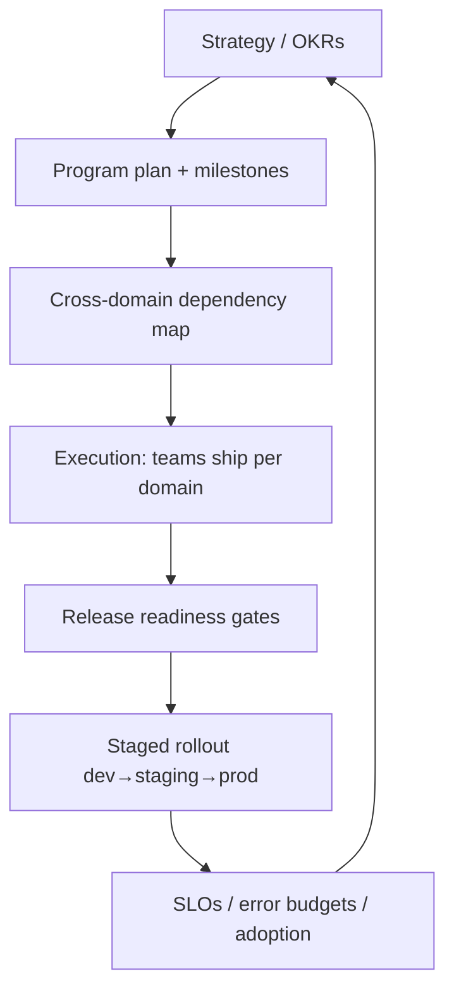
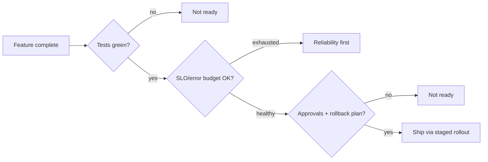

# The Technical Program Manager (TPM) Perspective

> Driving cross-domain delivery, risk, and quality across a 13-domain monorepo — reading the same architecture and dashboards engineers do.

**Audience:** TPMs, EMs, delivery leads who need technical fluency
**Companion guides:** [DevOps Engineer](DEVOPS_ENGINEER_PERSPECTIVE.md) · [SRE](SRE_PERSPECTIVE.md) · [Observability](../technologies/OBSERVABILITY_APPINSIGHTS_KQL_OTEL.md)

---

## 1. 🧠 What a TPM owns

A technical TPM turns strategy into shipped, reliable software across teams. You own **coordination, risk, and outcomes** — and you must be fluent enough to challenge estimates and read telemetry.

| Area | Ownership |
|---|---|
| Delivery | Roadmap, milestones, cross-domain dependencies |
| Risk | Identify, track, mitigate technical + schedule risk |
| Quality gates | Release readiness, error-budget posture |
| Communication | Status to leadership, alignment across teams |
| Process | Unblock, reduce friction, improve flow |

---

## 2. 🏗️ Reading the architecture as a TPM

You don't write the code, but you must understand the **shape** to plan well:

- **Domains are independent** (Chat, Refunds, Search…) → parallelizable workstreams, but **shared `Common.*` libraries** create coupling — a Common change can ripple across all domains.
- **Frontend + Backend + Storage layers** per domain → estimate work across all three, not just UI.
- **Inter-domain calls go through typed clients** → contract changes need coordinated rollout (provider before consumer).

### 🧪 Lab 1 — Dependency map

For a feature touching Chat + a `Common.*` change:
1. List affected domains (anything depending on the Common change).
2. Identify the rollout order (provider/contract first).
3. Mark the highest-risk dependency.
**Acceptance:** A dependency diagram + a sequenced rollout plan.

---

## 3. Release readiness gates

A TPM defines and enforces "ready to ship":

### ✅ Release-readiness checklist

- [ ] All tests green in CI (Unit/BVT/Functional)
- [ ] Feature flag / staged rollout plan defined
- [ ] Rollback plan documented and rehearsed
- [ ] SLO/error-budget healthy for affected domains
- [ ] Backward-compatible data/contract changes
- [ ] Monitoring + alerts in place for the new path
- [ ] Support/KB updated; on-call briefed

---

## 4. Risk management

| Risk type | Example | Mitigation |
|---|---|---|
| **Dependency** | Common library change blocks 5 teams | Sequence + feature-flag; provider-first rollout |
| **Schedule** | Functional tests flaky, slows merges | Stabilize tests as a tracked workstream |
| **Reliability** | Shipping while error budget exhausted | Freeze features; reliability sprint |
| **Scope** | Contract change breaks consumers | Versioned contracts, deprecation window |
| **Capacity** | Cosmos RU/cost spike at launch | Load test + autoscale headroom pre-launch |

### 🧪 Lab 2 — Risk register

Build a 5-row risk register for a cross-domain launch with probability, impact, owner, and mitigation. **Acceptance:** Each risk has a concrete, assigned mitigation.

---

## 5. Metrics a TPM actually watches

| Metric | Source | Why |
|---|---|---|
| SLO attainment / error budget | App Insights + KQL | Ship vs freeze decision |
| Deployment frequency & lead time | Pipelines | Flow health (DORA) |
| Change failure rate | Pipelines + incidents | Quality of releases |
| MTTR | Incident records | Operational maturity |
| Adoption / funnel | customEvents (KQL) | Did the feature land? |

> **DORA metrics**: Deployment Frequency, Lead Time for Changes, Change Failure Rate, MTTR — the industry standard for delivery performance. A TPM should track all four.

### 🧪 Lab 3 — Read a dashboard

Given an SLO workbook showing budget 80% consumed mid-month, decide: ship the planned risky feature or not? Justify using error-budget policy. **Acceptance:** A defensible go/no-go with the budget reasoning.

---

## 6. Communication patterns

- **Status = RAG + trend + ask.** Not just "Yellow" — "Yellow, slipping, need 1 engineer on test stabilization."
- **Escalate early** with options, not just problems.
- **Translate** between exec (outcomes, risk, dates) and engineers (scope, dependencies, tradeoffs).

### 🧪 Lab 4 — Status write-up

Write a 5-line program status: state, top risk, mitigation, decision needed, next milestone. **Acceptance:** An exec can act in under a minute.

---

## 7. 💬 Interview Q&A

**Q: How do you plan a feature that touches a shared library?**
Map every domain that depends on it, sequence the rollout provider/contract-first, feature-flag the change, and coordinate consumer updates with a deprecation window.

**Q: When do you say "no, we're not shipping"?**
When the readiness gate fails: tests red, no rollback plan, exhausted error budget, or breaking contract changes without a migration path.

**Q: What are DORA metrics and why track them?**
Deployment frequency, lead time, change failure rate, MTTR — they quantify delivery speed and stability, guiding where to invest (flow vs reliability).

**Q: How do you handle a cross-team dependency slipping?**
Surface early, quantify impact on the critical path, present options (rescope, resource, resequence), and drive a decision — don't just report the slip.

**Q: How do you stay technically credible?**
Read the same dashboards and architecture as the team; understand the layering and coupling so estimates and risks are challenged on substance.

---

## 8. ✅ TPM readiness checklist

- [ ] Can map cross-domain dependencies and sequence rollouts
- [ ] Owns and enforces a release-readiness gate
- [ ] Maintains a living risk register with mitigations
- [ ] Tracks DORA + SLO metrics, not vanity metrics
- [ ] Communicates RAG + trend + ask
- [ ] Makes data-driven go/no-go calls on error budgets

---

### Next steps
→ Understand the pipeline gates in [DevOps Engineer](DEVOPS_ENGINEER_PERSPECTIVE.md) and the signals in [Observability](../technologies/OBSERVABILITY_APPINSIGHTS_KQL_OTEL.md).
