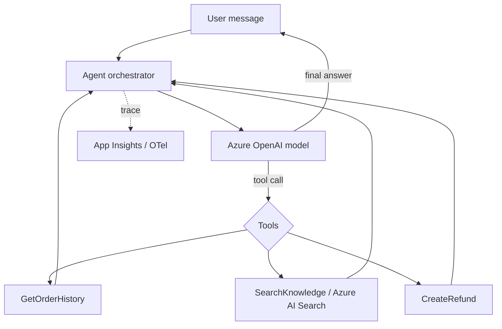
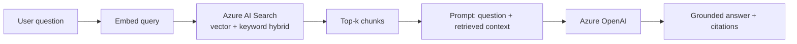

# Agentic AI Deep-Dive

> Building conversational agents on Microsoft AI (Azure OpenAI / Microsoft Foundry / Agent Framework) — tools, orchestration, grounding, and evaluation — as in the Conversations domain.

**Concept → In this repo → Lab → Interview → Checklist**

> Microsoft-stack only: Azure OpenAI, Microsoft Foundry, Microsoft Agent Framework, Azure AI Search (grounding), App Insights (tracing).

---

## 1. 🧠 What "agentic" means

An **agent** is an LLM given **instructions**, **tools** (functions it can call), and **memory/context**, that can plan and act over multiple steps to accomplish a goal — versus a single prompt→response call.



In the **Conversations** domain, product sub-domains (XboxSupport, MinecraftHelp…) host agents (e.g. ContactUs) that resolve customer intents by calling backend tools.

---

## 2. The anatomy of an agent

| Part | Role |
|---|---|
| **Instructions / system prompt** | Persona, guardrails, output format |
| **Tools (functions)** | Typed actions the model can invoke (often the typed HTTP clients!) |
| **Grounding** | Retrieval (Azure AI Search) to reduce hallucination — RAG |
| **Memory / context** | Conversation history, user context |
| **Orchestration** | Loop: model → tool → model until done |
| **Evaluation** | Offline + continuous quality checks |

### 🏗️ Tools are just typed functions

```csharp
[Description("Gets the customer's recent orders for grounding a support answer.")]
public async Task<IReadOnlyList<Order>> GetRecentOrdersAsync(
    [Description("The customer tenant id")] string tenantId,
    CancellationToken ct)
    => await _orderHistoryClient.GetRecentAsync(tenantId, ct);  // reuses the typed client
```

The agent framework exposes this method's signature + descriptions to the model; the model decides when to call it. **The API integration layer becomes the agent's hands.**

### 🧪 Lab 1 — Define a tool

Wrap an existing typed client method as an agent tool with clear `[Description]`s and a strict return type. **Acceptance:** Tool schema is unambiguous; descriptions tell the model exactly when to use it.

---

## 3. RAG grounding (reduce hallucination)



- Index knowledge into **Azure AI Search** (hybrid: vector + keyword + semantic ranking).
- Retrieve top-k, inject into the prompt, instruct the model to answer **only from context** and cite sources.

### 🧪 Lab 2 — Build a mini-RAG

Index 5 FAQ docs into Azure AI Search, retrieve top-3 for a question, and prompt the model to answer from context with citations. **Acceptance:** Answer cites the right doc; off-topic question returns "I don't know."

---

## 4. Orchestration loop

```csharp
// Simplified agent loop (Microsoft Agent Framework / Azure OpenAI tool-calling)
var messages = new List<ChatMessage> { System(instructions), User(input) };
while (true)
{
    var response = await _chat.CompleteAsync(messages, tools, ct);
    if (response.ToolCalls is { Count: > 0 } calls)
    {
        foreach (var call in calls)
        {
            var result = await _toolRegistry.InvokeAsync(call, ct); // run the function
            messages.Add(ToolResult(call.Id, result));
        }
        continue; // let the model use the tool results
    }
    return response.Text; // final answer
}
```

Guardrails: cap iterations, validate tool args, timeout each tool, and never let a tool perform an irreversible action without confirmation.

### 🧪 Lab 3 — Add a guardrail

Add a max-iteration cap and tool-arg validation to the loop; make `CreateRefund` require an explicit confirmation step. **Acceptance:** Loop can't run away; destructive tool needs confirmation.

---

## 5. Tracing & evaluation

- **Tracing**: emit OpenTelemetry spans per model call + tool call (latency, tokens, success) into App Insights — debug *why* an agent did something. See [Observability](OBSERVABILITY_APPINSIGHTS_KQL_OTEL.md).
- **Evaluation**: build a dataset of (input → expected behavior); score with metrics (groundedness, relevance, tool-selection accuracy). Run **offline** (pre-merge) and **continuous** (sampled prod traffic).

```kusto
// Agent tool-selection success from custom events
customEvents
| where name == "AgentToolCall"
| summarize calls=count(), failures=countif(customDimensions.success=="false")
  by tool=tostring(customDimensions.tool)
| extend failureRate = todouble(failures)/calls
| order by failureRate desc
```

### 🧪 Lab 4 — Eval harness

Create 10 test cases for an agent and a scorer for groundedness + correct tool choice; report a pass rate. **Acceptance:** A repeatable score you can track across prompt changes.

---

## 6. Safety, cost & latency

| Concern | Practice |
|---|---|
| Hallucination | RAG grounding + "answer from context only" |
| Prompt injection | Treat retrieved/tool content as untrusted; never let it override system rules |
| Cost | Smaller models for routing, larger for hard steps; cache; cap tokens |
| Latency | Stream tokens; parallelize independent tool calls; limit iterations |
| PII | Redact before logging traces |

> ⚠️ **Prompt injection** is the agentic OWASP risk: data the model reads (search results, tool output, user text) may contain instructions. Keep system instructions authoritative and sandbox tool effects.

---

## 7. 💬 Interview Q&A

**Q: Agent vs a single LLM call?**
An agent loops: it can call tools, observe results, and plan across steps toward a goal, rather than producing one response from one prompt.

**Q: How do you reduce hallucination?**
Ground with retrieval (RAG via Azure AI Search), constrain the model to answer only from provided context, require citations, and evaluate groundedness.

**Q: What's prompt injection and how do you defend?**
Malicious instructions embedded in untrusted content (web/search/tool output/user input). Defenses: keep system prompt authoritative, treat external content as data not commands, validate tool args, and sandbox/gate destructive actions.

**Q: How do tools relate to your existing APIs?**
Tools are typed functions — often thin wrappers over the same typed HTTP clients services already use — exposed to the model with descriptions so it knows when to call them.

**Q: How do you evaluate an agent?**
Curated datasets scored on groundedness/relevance/tool-selection, run offline pre-merge and continuously on sampled prod traffic, tracked over time.

**Q: How do you keep agents fast and cheap?**
Model tiering (route with small, solve with large), caching, token caps, streaming, parallel independent tool calls, and capped iterations.

---

## 8. ✅ Checklist

- [ ] Clear instructions with guardrails + output format
- [ ] Tools are typed, described, arg-validated, timeout-bounded
- [ ] Destructive tools require confirmation
- [ ] Grounding via Azure AI Search (hybrid) with citations
- [ ] Orchestration loop has a max-iteration cap
- [ ] OTel traces per model + tool call into App Insights
- [ ] Offline + continuous evaluation with tracked scores
- [ ] Untrusted content can't override system rules (injection defense)

---

### Next steps
→ [API Integrations](API_INTEGRATIONS.md) (tools = clients), [Observability](OBSERVABILITY_APPINSIGHTS_KQL_OTEL.md) (agent tracing).
