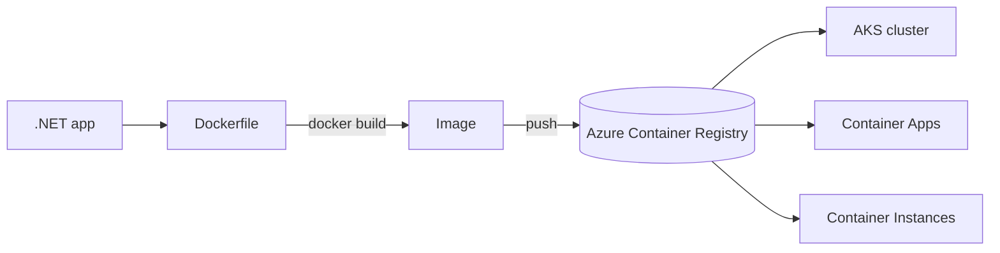
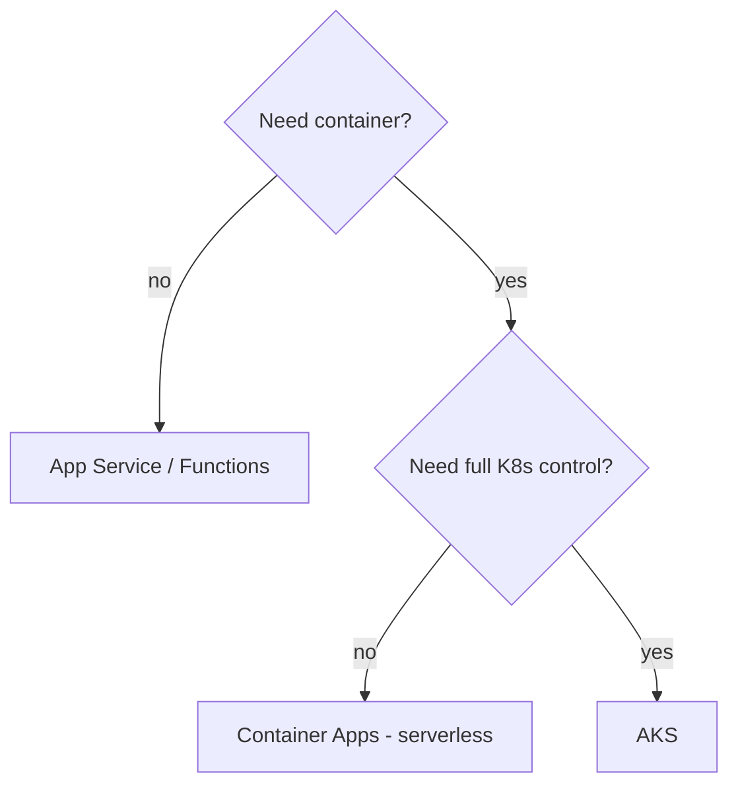
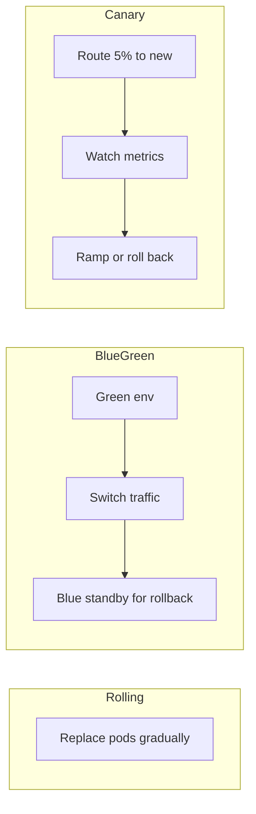

# AKS + Containers + Orchestration Deep-Dive

> Containerizing .NET services, Azure Kubernetes Service (AKS), Container Apps, orchestration, and deployment strategies — Microsoft-stack only.

**Concept → In this repo → Lab → Interview → Checklist**

> The platform runs primarily on App Service + Functions; this guide covers the **container path** (AKS / Container Apps / ACR) used for workloads that need it, plus the concepts every SRE/DevOps engineer must know.

---

## 1. 🧠 Containers 101

A **container** packages an app + its dependencies into an immutable image that runs identically anywhere. Azure runs them via **ACR** (registry), **AKS** (Kubernetes), **Container Apps** (serverless containers), and **Container Instances** (single-shot).



### 🏗️ Multi-stage Dockerfile for .NET 10

```dockerfile
# Build stage
FROM mcr.microsoft.com/dotnet/sdk:10.0 AS build
WORKDIR /src
COPY ["Refunds/Frontend/Frontend.csproj", "Refunds/Frontend/"]
RUN dotnet restore "Refunds/Frontend/Frontend.csproj"
COPY . .
RUN dotnet publish "Refunds/Frontend/Frontend.csproj" -c Release -o /app/publish

# Runtime stage (smaller, no SDK)
FROM mcr.microsoft.com/dotnet/aspnet:10.0 AS final
WORKDIR /app
COPY --from=build /app/publish .
USER $APP_UID                       # non-root
ENTRYPOINT ["dotnet", "Frontend.dll"]
```

> Multi-stage = small, secure runtime image (no build tools); run as **non-root**; pin base image tags.

### 🧪 Lab 1 — Containerize a service

Write a multi-stage Dockerfile for a .NET API, build it, run locally, hit `/health`. **Acceptance:** Image runs as non-root; health endpoint returns 200.

---

## 2. Choosing the right Azure compute

| Service | Use when |
|---|---|
| **App Service** | Standard web apps/APIs; slots; least ops |
| **Azure Functions** | Event-driven, bursty, pay-per-exec |
| **Container Apps (ACA)** | Serverless containers, KEDA autoscale, microservices without full K8s |
| **AKS** | Full control, complex orchestration, custom networking/operators |
| **Container Instances** | One-off/batch, no orchestration |



### 🧪 Lab 2 — Pick compute

For three workloads (a steady REST API, a bursty queue processor, a microservice mesh needing service discovery), choose the Azure compute and justify. **Acceptance:** Each choice has a one-line rationale tied to the table.

---

## 3. Kubernetes core objects

| Object | Role |
|---|---|
| **Pod** | Smallest unit; one+ containers |
| **Deployment** | Declarative pods + rollout/rollback + replicas |
| **Service** | Stable network endpoint / load balancing |
| **Ingress** | HTTP routing into the cluster |
| **ConfigMap / Secret** | Config + secrets (secrets via Key Vault CSI) |
| **HPA / VPA** | Horizontal/vertical autoscaling |
| **Namespace** | Isolation / multi-tenancy |

```yaml
apiVersion: apps/v1
kind: Deployment
metadata: { name: refunds-api }
spec:
  replicas: 3
  selector: { matchLabels: { app: refunds-api } }
  template:
    metadata: { labels: { app: refunds-api } }
    spec:
      containers:
      - name: api
        image: myacr.azurecr.io/refunds-api:1.4.0
        resources:
          requests: { cpu: "250m", memory: "256Mi" }   # scheduler guarantees
          limits:   { cpu: "500m", memory: "512Mi" }    # hard cap
        readinessProbe: { httpGet: { path: /health, port: 8080 }, initialDelaySeconds: 5 }
        livenessProbe:  { httpGet: { path: /health, port: 8080 }, periodSeconds: 10 }
---
apiVersion: v1
kind: Service
metadata: { name: refunds-api }
spec:
  selector: { app: refunds-api }
  ports: [ { port: 80, targetPort: 8080 } ]
```

> **requests vs limits**: requests = what the scheduler reserves (drives bin-packing & autoscaling); limits = hard ceiling (exceed memory → OOMKilled). **Probes**: readiness gates traffic; liveness restarts a hung pod.

### 🧪 Lab 3 — Deploy to AKS

Apply a Deployment + Service with probes and resource requests/limits; scale to 5 replicas; do a rolling update to a new image tag and a rollback. **Acceptance:** `kubectl rollout status` green; `kubectl rollout undo` restores prior version.

---

## 4. Autoscaling

| Scaler | Scales | Signal |
|---|---|---|
| **HPA** | Pod replicas | CPU/memory/custom metrics |
| **VPA** | Pod requests/limits | Historical usage (rightsizing) |
| **Cluster Autoscaler** | Nodes | Unschedulable pods |
| **KEDA** | Pods (incl. to zero) | Event sources (Service Bus, queues) |

```yaml
apiVersion: autoscaling/v2
kind: HorizontalPodAutoscaler
metadata: { name: refunds-api }
spec:
  scaleTargetRef: { apiVersion: apps/v1, kind: Deployment, name: refunds-api }
  minReplicas: 2
  maxReplicas: 20
  metrics:
  - type: Resource
    resource: { name: cpu, target: { type: Utilization, averageUtilization: 70 } }
```

> **KEDA** is key for event-driven scaling (e.g. scale on Service Bus queue depth, even to zero) — the container analog of Functions' elastic scale.

### 🧪 Lab 4 — KEDA scale on queue

Configure a KEDA `ScaledObject` to scale a consumer on Service Bus queue length (0→N). **Acceptance:** Pods scale up under load and back to zero when idle.

---

## 5. Deployment strategies



| Strategy | Trade-off |
|---|---|
| **Rolling** | Default; gradual, no extra env; slower rollback |
| **Blue-Green** | Instant switch + rollback; 2x resources briefly |
| **Canary** | Lowest risk; needs traffic-splitting + good metrics |

This maps to the App Service **slot-swap** (blue-green) used elsewhere in the platform.

### 🧪 Lab 5 — Canary

Split 10% of traffic to a new version (via Ingress/ACA revisions), watch error rate, then ramp to 100% or roll back. **Acceptance:** A decision driven by the canary's metrics.

---

## 6. Security & ops

| Concern | Practice |
|---|---|
| Secrets | Key Vault + CSI driver / Workload Identity (no in-cluster secrets) |
| Identity | **Workload Identity** (federated) instead of service-principal secrets |
| Images | Scan in ACR; pin digests; non-root; minimal base |
| Network | Network policies; private cluster; ingress WAF |
| Observability | Container Insights + OTel → App Insights/Managed Grafana |
| Cost | Spot node pools for batch; cluster autoscaler; VPA rightsizing |

---

## 7. 💬 Interview Q&A

**Q: Pod vs Deployment vs Service?**
Pod = running container(s); Deployment = declarative manager of pod replicas with rollout/rollback; Service = stable endpoint load-balancing across pods.

**Q: requests vs limits?**
Requests = reserved resources the scheduler guarantees (drives placement/autoscaling); limits = hard ceiling. Exceeding memory limit → OOMKilled; CPU is throttled.

**Q: readiness vs liveness probe?**
Readiness gates whether a pod receives traffic (not ready → removed from Service); liveness restarts a hung pod. A pod can be alive but not ready (warming up).

**Q: HPA vs VPA vs Cluster Autoscaler vs KEDA?**
HPA scales replica count on metrics; VPA rightsizes requests/limits; Cluster Autoscaler adds/removes nodes for unschedulable pods; KEDA scales on event sources (incl. to zero).

**Q: AKS vs Container Apps?**
ACA is serverless containers with KEDA built in — less ops, great for microservices. AKS gives full Kubernetes control for complex networking/operators/custom scheduling.

**Q: Rolling vs blue-green vs canary?**
Rolling = gradual replace (default); blue-green = instant switch with standby rollback; canary = small traffic slice validated by metrics before ramping. Slot-swap = blue-green.

---

## 8. ✅ Checklist

- [ ] Multi-stage Dockerfile, non-root, pinned base, small runtime
- [ ] Right compute chosen (App Service/Functions/ACA/AKS) per workload
- [ ] Deployments set requests+limits and readiness+liveness probes
- [ ] Autoscaling: HPA/KEDA configured; cluster autoscaler on
- [ ] Secrets via Key Vault CSI + Workload Identity (no in-cluster secrets)
- [ ] Images scanned in ACR; network policies applied
- [ ] Deployment strategy chosen + rollback rehearsed
- [ ] Container Insights + OTel telemetry flowing

---

### Next steps
→ [Observability](OBSERVABILITY_APPINSIGHTS_KQL_OTEL.md) for cluster telemetry; [Bicep/ARM](BICEP_ARM.md) to provision AKS/ACR as IaC; [SRE](../roles/SRE_PERSPECTIVE.md) for reliability.
