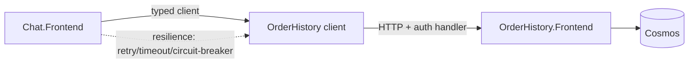
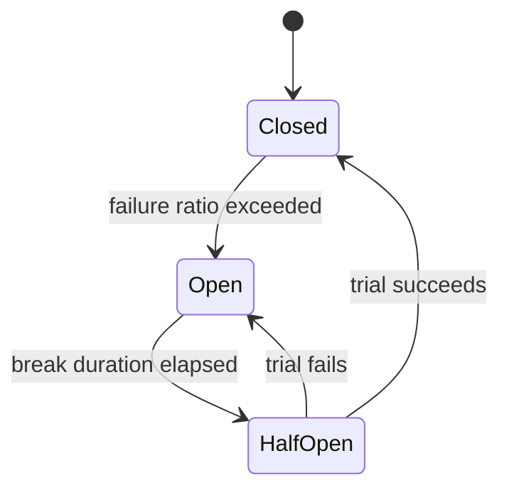

# API Integrations Deep-Dive

> Typed HTTP clients, RESTful design, authentication handlers, and resilience for service-to-service (S2S) and external integrations.

**Concept → In this repo → Lab → Interview → Checklist**

---

## 1. 🧠 How services talk

Domains never reference each other's code. Instead they call **typed HTTP clients** in `Common.Clients.*` / `<Domain>.Clients.*`. This keeps coupling at the contract level.



---

## 2. RESTful API design

### 🧠 Principles applied here

- **Nouns, not verbs**: `/tenants/{id}/refunds`, not `/getRefunds`.
- **HTTP semantics**: GET (safe), POST (create), PUT (replace/idempotent), PATCH (partial), DELETE.
- **Status codes**: 200/201/204, 400/401/403/404/409/422, 429, 5xx.
- **Parameter placement**: identity in path, filters in query, payload in body.
- **Errors as RFC-7807 ProblemDetails** for consistency.

| Anti-pattern | Fix |
|---|---|
| `POST /refund/approve?id=5` | `POST /refunds/5/approval` |
| Verbs in path | Resource + HTTP method |
| 200 for errors | Correct 4xx/5xx + ProblemDetails |
| Unbounded list | Pagination (cursor) |

### 🧪 Lab 1 — Redesign an endpoint

Given `GET /api/doRefundLookup?user=5&action=list`, redesign it RESTfully with correct method, path, params, and status codes. **Acceptance:** Resource-oriented path + documented status codes.

---

## 3. Typed HTTP clients

### 🏗️ The repo pattern

```csharp
// Registration: typed client + resilience + auth handler in one place
services.AddHttpClient<IOrderHistoryClient, OrderHistoryClient>(c =>
    {
        c.BaseAddress = new Uri(options.OrderHistoryBaseUrl);
        c.Timeout = TimeSpan.FromSeconds(10);
    })
    .AddHttpMessageHandler<XTokenAuthHandler>()   // S2S auth
    .AddStandardResilienceHandler();              // retry + circuit breaker + timeout
```

```csharp
public sealed class OrderHistoryClient(HttpClient http) : IOrderHistoryClient
{
    public async Task<Order?> GetOrderAsync(string orderId, CancellationToken ct)
    {
        using var res = await http.GetAsync($"orders/{Uri.EscapeDataString(orderId)}", ct);
        if (res.StatusCode == HttpStatusCode.NotFound) return null;
        res.EnsureSuccessStatusCode();
        return await res.Content.ReadFromJsonAsync<Order>(cancellationToken: ct);
    }
}
```

> A **typed client** binds a strongly-typed interface to an `HttpClient` configured once (base URL, timeout, auth, resilience). Callers depend on the interface, not HTTP details.

### 🧪 Lab 2 — Build a typed client

Create `ILoyaltyClient` with `GetBalanceAsync`, register it with a 5s timeout + resilience, and unit-test it against a fake `HttpMessageHandler`. **Acceptance:** Test verifies URL, 404→null, and 500→throws.

---

## 4. Authentication for S2S & external

| Scheme | Use |
|---|---|
| **XToken (XBL 3.0)** | Xbox Live customer + S2S calls |
| **Entra ID (AAD)** | App-to-app via app registrations / managed identity |
| **Managed identity** | No secrets; token from the platform |

A delegating **auth handler** acquires/attaches the token per request, transparently to the client code:

```csharp
public sealed class EntraTokenHandler(TokenCredential cred, TokenOptions o) : DelegatingHandler
{
    protected override async Task<HttpResponseMessage> SendAsync(
        HttpRequestMessage req, CancellationToken ct)
    {
        var token = await cred.GetTokenAsync(new(o.Scopes), ct);
        req.Headers.Authorization = new("Bearer", token.Token);
        return await base.SendAsync(req, ct);
    }
}
```

---

## 5. Resilience

### 🧠 The four pillars (Polly / `Microsoft.Extensions.Http.Resilience`)

| Pattern | Protects against |
|---|---|
| **Timeout** | Hung downstream |
| **Retry w/ backoff + jitter** | Transient blips (avoid thundering herd) |
| **Circuit breaker** | Cascading failure; fail fast when downstream is down |
| **Bulkhead / concurrency limit** | One dependency exhausting all threads |

```csharp
.AddResilienceHandler("orders", b => b
    .AddTimeout(TimeSpan.FromSeconds(10))
    .AddRetry(new HttpRetryStrategyOptions {
        MaxRetryAttempts = 3, BackoffType = DelayBackoffType.Exponential, UseJitter = true })
    .AddCircuitBreaker(new HttpCircuitBreakerStrategyOptions {
        FailureRatio = 0.5, MinimumThroughput = 10, BreakDuration = TimeSpan.FromSeconds(30) }));
```



### 🧪 Lab 3 — Add a circuit breaker

Wrap the Lab 2 client with retry + circuit breaker; simulate a downstream returning 500s and observe the breaker opening (fail fast). **Acceptance:** After N failures calls short-circuit without hitting the network.

---

## 6. Idempotency & safety

- **Idempotency keys** on POST so retries don't double-create.
- **PUT** is naturally idempotent (full replace).
- **429 handling**: respect `Retry-After`; back off.
- **Correlation propagation**: forward the operation ID header for end-to-end tracing.

### 🧪 Lab 4 — Idempotent POST

Design a `POST /payments` that accepts an `Idempotency-Key` header and returns the original result on retry. **Acceptance:** Same key twice → one charge, identical response.

---

## 7. Contracts & versioning

- **Contract models** are separate from storage models.
- Generate clients/types from the **OpenAPI spec** to prevent drift.
- Version with additive changes; deprecate with a window; never break consumers silently.

---

## 8. 💬 Interview Q&A

**Q: Why typed HTTP clients over `new HttpClient()`?**
Centralized config (base URL, timeout, auth, resilience), correct `HttpClient` lifetime via the factory (avoids socket exhaustion), and interface-based testability.

**Q: Retry without a circuit breaker — what goes wrong?**
Retries pile load onto an already-failing dependency, worsening the outage (retry storm). The breaker fails fast and gives it room to recover.

**Q: Why jitter on backoff?**
To desynchronize many clients retrying at once (thundering herd), spreading load instead of spiking it.

**Q: How do you make a POST safe to retry?**
Idempotency key persisted with the result; on duplicate key, return the original outcome instead of re-executing.

**Q: GET returns 404 — exception or null?**
For "not found is expected", return null; reserve exceptions for unexpected failures. The sample client maps 404→null, else `EnsureSuccessStatusCode`.

**Q: How do you keep clients in sync with servers?**
Generate from OpenAPI; treat contract drift as a build break.

---

## 9. ✅ Checklist

- [ ] Resources are nouns; correct HTTP verbs + status codes
- [ ] Typed clients registered via the HTTP client factory
- [ ] Auth via delegating handler (XToken/Entra/managed identity)
- [ ] Timeout + retry(jitter) + circuit breaker on every client
- [ ] POSTs idempotent where retried; 429 `Retry-After` honored
- [ ] Correlation ID propagated downstream
- [ ] Contract models separate; generated from OpenAPI

---

### Next steps
→ [C#/.NET](CSHARP_DOTNET.md) for the service layer; [Agentic AI](AGENTIC_AI.md) where clients become agent tools.
