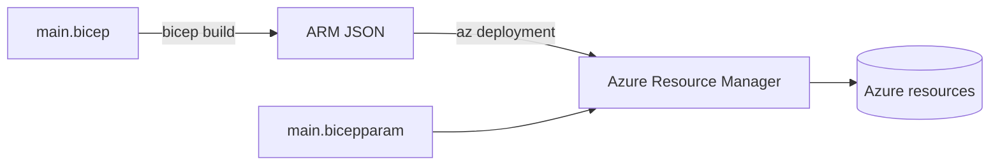
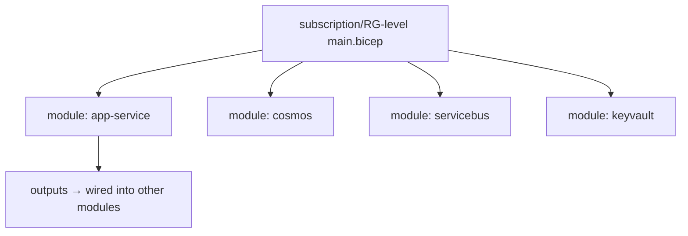
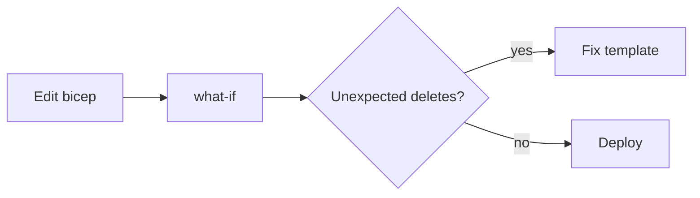

# Bicep + ARM Deep-Dive

> Infrastructure as Code on Azure: Bicep modules, two-level deployments, deployment stacks, `what-if`, and resource naming for a 13-domain platform (194+ Bicep files).

**Concept → In this repo → Lab → Interview → Checklist**

---

## 1. 🧠 Bicep vs ARM

**ARM templates** are JSON — verbose and hard to author. **Bicep** is a DSL that **transpiles to ARM JSON** — same engine, far better authoring (modules, types, loops, no JSON noise). Always author Bicep; ARM is the compiled output.



| | ARM JSON | Bicep |
|---|---|---|
| Syntax | Verbose JSON | Concise DSL |
| Modules | Linked templates | First-class `module` |
| Types/IntelliSense | Weak | Strong |
| Decompile/compile | — | `bicep build` / `decompile` |

---

## 2. Anatomy of a Bicep file

```bicep
@description('App Service for a domain frontend with staging slot.')
param name string
param location string = resourceGroup().location
@allowed(['dev','staging','prod'])
param environment string
param appInsightsConnectionString string

var planSku = environment == 'prod' ? 'P1v3' : 'B1'

resource plan 'Microsoft.Web/serverfarms@2023-12-01' = {
  name: '${name}-plan'
  location: location
  sku: { name: planSku }
}

resource app 'Microsoft.Web/sites@2023-12-01' = {
  name: name
  location: location
  properties: {
    serverFarmId: plan.id
    httpsOnly: true
    siteConfig: {
      healthCheckPath: '/health'
      appSettings: [
        { name: 'APPLICATIONINSIGHTS_CONNECTION_STRING', value: appInsightsConnectionString }
      ]
    }
  }
  identity: { type: 'SystemAssigned' }   // managed identity → no secrets
}

resource staging 'Microsoft.Web/sites/slots@2023-12-01' = {
  parent: app
  name: 'staging'
  location: location
  properties: { serverFarmId: plan.id, httpsOnly: true }
}

output appId string = app.id
output principalId string = app.identity.principalId
```

### 🧪 Lab 1 — Author a module

Write a `cosmos.bicep` module that creates an account + database + a container with a parameterized partition key and autoscale max RU. Output the account endpoint. **Acceptance:** `bicep build` clean; container partition key + autoscale are parameters.

---

## 3. Modules & two-level deployments

The repo uses **modules** for reuse and a **two-level** structure:



```bicep
module appInsights 'modules/appinsights.bicep' = {
  name: 'appInsights'
  params: { name: '${prefix}-ai', location: location }
}
module api 'modules/app-service.bicep' = {
  name: 'api'
  params: {
    name: '${prefix}-api'
    environment: environment
    appInsightsConnectionString: appInsights.outputs.connectionString  // module composition
  }
}
```

Parameters per environment live in `*.bicepparam`:
```bicep
// dev.bicepparam
using './main.bicep'
param environment = 'dev'
param prefix = 'refunds-dev'
```

---

## 4. Deployment stacks

A **deployment stack** manages a *set* of resources as one unit with lifecycle control (what happens to resources removed from the template).

```bash
az stack group create \
  --name refunds-stack -g $RG \
  --template-file main.bicep --parameters dev.bicepparam \
  --action-on-unmanage deleteResources \   # resources dropped from template get deleted
  --deny-settings-mode denyDelete           # protect managed resources from manual deletion
```

Benefits: atomic lifecycle, drift protection via deny-settings, clean teardown.

### 🧪 Lab 2 — Stack lifecycle

Deploy a stack with two resources, remove one from the template, redeploy, and observe it's deleted (action-on-unmanage). **Acceptance:** You can explain create/update/delete semantics of stacks.

---

## 5. `what-if`: preview before apply

```bash
az deployment group what-if -g $RG -f main.bicep -p dev.bicepparam
```

`what-if` shows **+ create / ~ modify / - delete / = no-change** before anything runs — your safety net against accidental deletes.



### 🧪 Lab 3 — Read a what-if

Make a change that would delete a resource (rename it) and run `what-if`; identify the destructive line and fix it (e.g. add the resource correctly). **Acceptance:** You spot the `-` delete and avoid it.

---

## 6. Naming, secrets & security

| Concern | Practice |
|---|---|
| Naming | Convention: `<domain>-<env>-<resourceType>`; consistent prefixes |
| Secrets | **Key Vault references**, never literals in params/templates |
| Identity | System/user-assigned **managed identity**, not connection strings |
| Least privilege | RBAC role assignments in Bicep, scoped tightly |
| TLS | `httpsOnly: true`, min TLS version |

```bicep
// Reference a secret without exposing its value
resource kv 'Microsoft.KeyVault/vaults@2023-07-01' existing = { name: kvName }
// App setting pulls from Key Vault at runtime via reference
{ name: 'Cosmos--Key', value: '@Microsoft.KeyVault(SecretUri=${kv.properties.vaultUri}secrets/cosmos-key)' }
```

---

## 7. Validation workflow

```powershell
# Lint + build (no ARM artifacts needed for validation)
bicep build main.bicep --stdout > $null
bicep lint main.bicep
az deployment group what-if -g $RG -f main.bicep -p dev.bicepparam
```

> This repo has a `bicep-validate` workflow — always validate after editing any `.bicep`/`.bicepparam`.

---

## 8. 💬 Interview Q&A

**Q: Bicep vs ARM?**
Bicep is a concise DSL that compiles to ARM JSON. Same deployment engine, better authoring (modules, types, loops). ARM JSON is the compiled artifact.

**Q: What does `what-if` do and why run it?**
Dry-run that previews create/modify/delete actions before applying — catches accidental deletions and unexpected changes.

**Q: What's a deployment stack?**
A managed grouping of resources with lifecycle control: resources removed from the template can be auto-deleted, and deny-settings protect against manual changes/deletes.

**Q: How do you avoid secrets in IaC?**
Key Vault references + managed identity; templates carry secret *URIs*, never values.

**Q: How do you parameterize per environment?**
`*.bicepparam` files (`using './main.bicep'`) supply env-specific values; templates stay environment-agnostic.

**Q: Module outputs — why?**
To compose modules: one module's output (e.g. App Insights connection string) feeds another's input, wiring infrastructure declaratively.

---

## 9. ✅ Checklist

- [ ] Author Bicep (modules), not raw ARM
- [ ] Params per env via `*.bicepparam`
- [ ] `bicep build` + `lint` clean
- [ ] `what-if` reviewed — no surprise deletes
- [ ] Secrets via Key Vault references; managed identity
- [ ] `httpsOnly` + min TLS; RBAC least privilege
- [ ] Deployment stacks for lifecycle where appropriate
- [ ] Names follow the convention

---

### Next steps
→ [YAML/Azure Pipelines](YAML_AZURE_PIPELINES.md) runs these deployments; [AKS/Containers](AKS_CONTAINERS.md) for cluster IaC.
