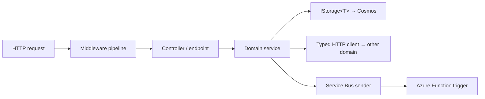

# C# / .NET 10 Deep-Dive

> Backend engineering on a 13-domain .NET 10 monorepo: ASP.NET Core frontends, isolated-worker Azure Functions, DI, async, and resilience.

**Concept → In this repo → Lab → Interview → Checklist**

---

## 1. 🧠 The .NET 10 backend model

Each domain has two runtime shapes:

| Shape | Project | Hosts |
|---|---|---|
| **Frontend** | `<Domain>.Frontend` | ASP.NET Core Web API on App Service |
| **Backend** | `<Domain>.Backend` | Azure Functions (isolated worker) |

Plus `Storage`, `Contracts`, and `Clients.*` layers. Domains reference `Common.*`, never each other.



---

## 2. Dependency Injection & options

### 🧠 Why DI

Constructor injection + interfaces = testable, swappable, single-responsibility services. The container owns lifetimes (singleton/scoped/transient).

### 🏗️ The repo pattern: one `AddXxx()` per layer

```csharp
// Program.cs (ASP.NET Core frontend) — isolated, isolated worker style
var builder = WebApplication.CreateBuilder(args);

builder.Services.AddCommonForAspNetCore();              // shared middleware, health, telemetry
builder.Services.AddErrorCodeResultFactory<RefundErrorCode>();
builder.Services.AddRefundsStorage();                    // registers IStorage<T> for Cosmos
builder.Services.AddRefundsClients();                    // typed HTTP clients

var app = builder.Build();
app.UseCommonPipeline();   // correlation, exception handling, auth
app.MapControllers();
app.Run();
```

```csharp
// Options binding without magic strings — section name derived from type
services.AddOptionsWithBinding<CosmosOptions>();   // binds "Cosmos", validates on start

public sealed class CosmosOptions
{
    public const string SectionName = "Cosmos";
    [Required] public string AccountEndpoint { get; init; } = "";
    [Range(400, 1_000_000)] public int MaxThroughput { get; init; } = 4000;
}
```

### Lifetimes cheat-sheet

| Lifetime | Use for | Danger |
|---|---|---|
| Singleton | Stateless services, clients, caches | Holding scoped deps (captive dependency) |
| Scoped | Per-request services, DbContext-like | Using in singleton/Functions wrong scope |
| Transient | Lightweight, stateless | Expensive-to-create types |

### 🧪 Lab 1 — Wire a service

Create an `IPricingService` with a concrete impl, register it scoped via an `AddPricing()` extension, and inject it into a controller. Write a unit test that mocks it. **Acceptance:** Test passes with a mocked `IPricingService`.

---

## 3. Async/await done right

### 🧠 Rules

- Async all the way; never `.Result` / `.Wait()` (deadlocks, thread starvation).
- Pass `CancellationToken` through the call chain.
- `ConfigureAwait(false)` in libraries (no sync context needed).
- Don't `async void` except event handlers.

```csharp
public async Task<Refund> GetRefundAsync(string id, string tenantId, CancellationToken ct)
{
    // Point read: cheapest Cosmos op
    var refund = await _storage.ReadAsync(id, new PartitionKey(tenantId), ct);
    return refund ?? throw new RefundNotFoundException(id);
}
```

### 🧪 Lab 2 — Fix a blocking call

Given `var x = GetAsync().Result;` in a hot path, refactor to async-all-the-way with a propagated `CancellationToken`. **Acceptance:** No `.Result`/`.Wait()`; token reaches the I/O call.

---

## 4. Azure Functions (isolated worker)

### 🏗️ Pattern

```csharp
// Program.cs for a Functions backend
var host = new HostBuilder()
    .ConfigureSupportCommonAzureFunctionsIsolatedDefaults<Program>()  // shared host setup
    .Build();
host.Run();
```

```csharp
[Function("ProcessRefund")]
public async Task Run(
    [ServiceBusTrigger("refund-requests", Connection = "ServiceBus")]
    ServiceBusReceivedMessage message,
    ServiceBusMessageActions actions,
    CancellationToken ct)
{
    var req = message.Body.ToObjectFromJson<RefundRequest>();
    try
    {
        await _processor.ProcessAsync(req, ct);   // idempotent
        await actions.CompleteMessageAsync(message, ct);
    }
    catch (TransientException)
    {
        await actions.AbandonMessageAsync(message, cancellationToken: ct); // retry
    }
    catch (Exception)
    {
        await actions.DeadLetterMessageAsync(message, cancellationToken: ct); // poison
    }
}
```

> **Isolated worker** runs your function code in a separate process from the host → full control of DI, middleware, and .NET version.

### 🧪 Lab 3 — Idempotent processor

Implement a Service Bus-triggered function that processes a payment exactly-once semantically using an idempotency key stored in Cosmos. **Acceptance:** Re-delivering the same message doesn't double-charge.

---

## 5. Error handling & result types

### 🏗️ Error-code enums → ProblemDetails

```csharp
public enum RefundErrorCode
{
    [ErrorCodeMapping(HttpStatusCode.NotFound, "Refund not found")]
    RefundNotFound,
    [ErrorCodeMapping(HttpStatusCode.Conflict, "Refund already processed")]
    AlreadyProcessed,
}
```

Controllers return a result that the registered `ErrorCodeResultFactory<RefundErrorCode>` maps to RFC-7807 `ProblemDetails` with the right status + title — consistent errors across all domains.

### 🧪 Lab 4 — Add an error code

Add a new `RefundErrorCode.AmountExceedsLimit` mapped to 422, return it from a validation path, and assert the HTTP status in a test. **Acceptance:** Endpoint returns 422 + ProblemDetails.

---

## 6. Testing (MSTest SDK)

```xml
<Project Sdk="MSTest.Sdk">  <!-- not the standard SDK -->
```

- Categories: `Unit`, `BVT`, `Functional`, `Developer` (live).
- Parallel at method level by default.
- Mock with interfaces; assert components, not internals.

```csharp
[TestClass]
public class RefundServiceTests
{
    [TestMethod]
    [TestCategory("Unit")]
    public async Task GetRefundAsync_NotFound_Throws()
    {
        var storage = Substitute.For<IStorage<Refund>>();
        storage.ReadAsync("x", Arg.Any<PartitionKey>(), Arg.Any<CancellationToken>())
               .Returns((Refund?)null);
        var sut = new RefundService(storage);
        await Assert.ThrowsExactlyAsync<RefundNotFoundException>(
            () => sut.GetRefundAsync("x", "t", CancellationToken.None));
    }
}
```

Run:
```powershell
dotnet test Refunds\Refunds.slnx --filter "TestCategory=Unit"
```

---

## 7. Performance patterns

| Pattern | Win |
|---|---|
| Cosmos **point reads** over queries | ~1 RU vs many |
| **Batch** writes (transactional batch) | ~85% RU savings |
| `IAsyncEnumerable` streaming | Lower memory on large reads |
| `System.Text.Json` source-gen | Faster, allocation-free serialization |
| Response caching / hybrid cache | Fewer downstream calls |
| Object pooling / `ArrayPool` | Less GC pressure on hot paths |

---

## 8. 💬 Interview Q&A

**Q: Why isolated-worker Functions over in-process?**
Process isolation gives full control of the DI container, middleware, and the .NET runtime version, decoupled from the Functions host — the modern, recommended model.

**Q: Singleton capturing a scoped service — what happens?**
Captive dependency: the scoped service is effectively promoted to singleton lifetime, causing stale state/threading bugs. The DI validation can catch it at startup.

**Q: Why never `.Result` on a Task?**
It blocks a thread and can deadlock when a sync context is present; under load it starves the thread pool. Always `await`.

**Q: How do you guarantee a message isn't processed twice?**
Idempotency: store a processed-key (e.g. messageId) transactionally with the side effect; on redelivery, detect and skip. Complete on success, abandon on transient, dead-letter on poison.

**Q: How does the repo keep error responses consistent?**
Error-code enums with `[ErrorCodeMapping]` + a registered result factory produce uniform RFC-7807 ProblemDetails across all domains.

**Q: How are assembly names set?**
Auto-derived from the folder path by `Directory.Build.props` — no per-project `AssemblyName`/`RootNamespace`.

---

## 9. ✅ Checklist

- [ ] Each layer registered via one `AddXxx()` extension
- [ ] Options bound via `AddOptionsWithBinding<T>()`, validated
- [ ] Async all the way; `CancellationToken` propagated
- [ ] Functions handlers are idempotent; complete/abandon/dead-letter correctly
- [ ] Errors flow through error-code enums → ProblemDetails
- [ ] Cosmos: point reads + batch writes on hot paths
- [ ] Tests categorized; Unit/BVT green before push

---

### Next steps
→ [API Integrations](API_INTEGRATIONS.md) for the client side, then [Observability](OBSERVABILITY_APPINSIGHTS_KQL_OTEL.md) to instrument it.
