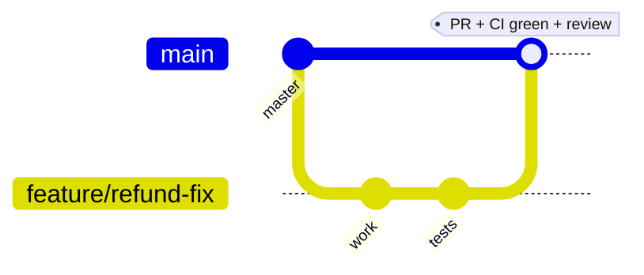
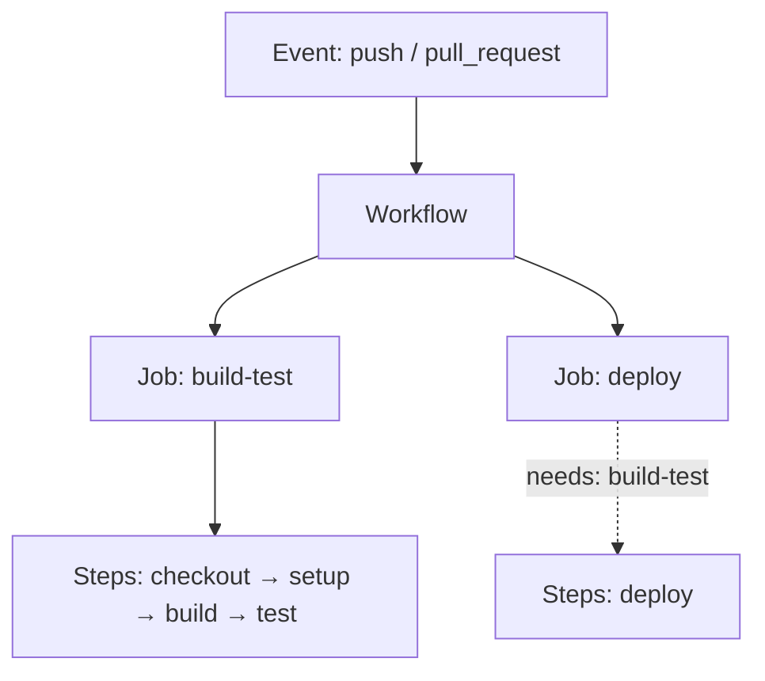

# Git + GitHub Actions Deep-Dive

> Branching, PR workflow, and CI/CD with GitHub Actions — mapped to the same safe-delivery principles the monorepo uses on Azure DevOps.

**Concept → In this repo → Lab → Interview → Checklist**

---

## 1. 🧠 Git workflow



| Practice | Why |
|---|---|
| Short-lived feature branches | Small, reviewable PRs; less merge pain |
| Trunk-based (`master` always shippable) | CI keeps main green; deployable anytime |
| PR + required checks + review | Quality gate before merge |
| Squash/clean history | Readable, revertable commits |
| Delete branch on merge | Tidy repo |

### Everyday commands

```bash
git checkout -b feature/refund-amount-validation
git add -p                       # stage hunks deliberately
git commit -m "Add amount-limit validation to refunds"
git push -u origin HEAD
# open PR; address review; then:
git rebase master                # keep branch current (linear history)
git push --force-with-lease      # safe force (won't clobber others' work)
```

> Prefer `--force-with-lease` over `--force`: it refuses to overwrite remote work you haven't seen.

### 🧪 Lab 1 — Clean PR flow

Branch, make a small change, commit, rebase on master, and open a PR. Then practice `git revert` of a merged commit. **Acceptance:** Linear history; revert produces an inverse commit without rewriting shared history.

---

## 2. Branch protection & PR gates

Mirror the monorepo gates on GitHub:

- Require PR before merge to `main`.
- Require **status checks** (build + test + format) to pass.
- Require **review approval**; dismiss stale approvals on new commits.
- Require linear history / signed commits (optional).

### 🧪 Lab 2 — Protect a branch

On a sandbox repo, enable branch protection requiring a passing CI check + 1 review. **Acceptance:** A failing-CI PR cannot be merged.

---

## 3. GitHub Actions fundamentals



| Concept | Azure Pipelines equivalent |
|---|---|
| Workflow | Pipeline |
| Job | Job |
| Step / `uses:` action | Step / task |
| `needs:` | `dependsOn` |
| Environment + required reviewers | Environment + approval |
| Secrets / OIDC | Variable group / service connection |

### CI workflow

```yaml
name: ci
on:
  push: { branches: [ main ] }
  pull_request:
jobs:
  build-test:
    runs-on: ubuntu-latest
    steps:
      - uses: actions/checkout@v4
      - uses: actions/setup-dotnet@v4
        with: { dotnet-version: '10.0.x' }
      - run: dotnet build -c Release -warnaserror
      - run: dotnet test --filter TestCategory=Unit --logger trx
      - run: dotnet format --verify-no-changes
      - uses: actions/upload-artifact@v4
        with: { name: drop, path: '**/bin/Release/**' }
```

### 🧪 Lab 3 — Build a CI workflow

Create `.github/workflows/ci.yml` that builds, tests, and checks formatting on every PR, and uploads a build artifact. **Acceptance:** Green check on a PR; artifact downloadable.

---

## 4. Deploy to Azure with OIDC (no secrets)

Use **federated credentials (OIDC)** so Actions gets a short-lived Azure token — no stored service-principal secret.

```yaml
  deploy:
    needs: build-test
    runs-on: ubuntu-latest
    environment: production          # gate with required reviewers
    permissions: { id-token: write, contents: read }
    steps:
      - uses: actions/checkout@v4
      - uses: azure/login@v2
        with:
          client-id: ${{ secrets.AZURE_CLIENT_ID }}
          tenant-id: ${{ secrets.AZURE_TENANT_ID }}
          subscription-id: ${{ secrets.AZURE_SUBSCRIPTION_ID }}
      - run: az deployment group what-if -g $RG -f main.bicep -p prod.bicepparam
      - run: az webapp deploy -g $RG -n myapp --slot staging --src-path drop.zip --type zip
      - run: az webapp deployment slot swap -g $RG -n myapp --slot staging --target-slot production
```

> **OIDC > stored secrets**: tokens are short-lived and scoped, eliminating long-lived credential leakage risk.

### 🧪 Lab 4 — Gated deploy

Add a `production` environment with a required reviewer to the deploy job; confirm the run pauses for approval. **Acceptance:** Deploy waits for approval; reuses build artifact.

---

## 5. Reusable workflows & composite actions

DRY, like shared pipeline templates:

```yaml
# .github/workflows/reusable-build.yml
on: { workflow_call: { inputs: { solution: { type: string, required: true } } } }
jobs:
  build:
    runs-on: ubuntu-latest
    steps:
      - uses: actions/checkout@v4
      - run: dotnet build ${{ inputs.solution }} -warnaserror
# caller:
jobs:
  chat: { uses: ./.github/workflows/reusable-build.yml, with: { solution: Chat/Chat.slnx } }
```

---

## 6. 💬 Interview Q&A

**Q: Why trunk-based with short branches?**
Keeps `main` always shippable, makes PRs small/reviewable, reduces merge conflicts, and pairs with CI to enable continuous delivery.

**Q: `--force` vs `--force-with-lease`?**
`--force-with-lease` only overwrites the remote if it matches what you last fetched — it won't clobber a teammate's pushed work. Prefer it always.

**Q: GitHub Actions vs Azure Pipelines — same concepts?**
Yes: workflow≈pipeline, job≈job, action≈task, `needs`≈`dependsOn`, environments+reviewers≈approvals. Differences are syntax and ecosystem.

**Q: Why OIDC for cloud deploys?**
Short-lived federated tokens instead of long-lived stored secrets — far smaller blast radius if leaked, nothing to rotate.

**Q: How do you stop bad code reaching main?**
Branch protection: required passing status checks + review approval + linear history before merge.

**Q: revert vs reset?**
`revert` creates an inverse commit (safe on shared history); `reset` rewrites history (only for local/unshared branches).

---

## 7. ✅ Checklist

- [ ] Short-lived feature branches; `main` always green
- [ ] Branch protection: required checks + review
- [ ] CI workflow: build `-warnaserror`, test, format, artifact
- [ ] Deploy via OIDC (no stored secrets)
- [ ] Prod deploys gated by environment reviewers
- [ ] Reusable workflows for shared logic
- [ ] `--force-with-lease`, `revert` on shared history

---

### Next steps
→ [YAML/Azure Pipelines](YAML_AZURE_PIPELINES.md) for the ADO/OneBranch equivalent; [Bicep/ARM](BICEP_ARM.md) for what the deploy applies.
