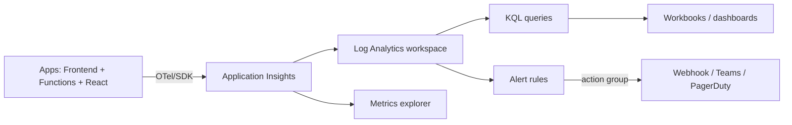
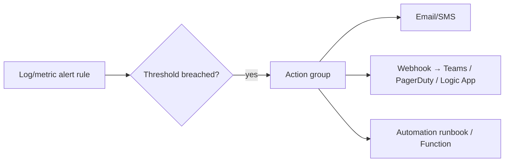
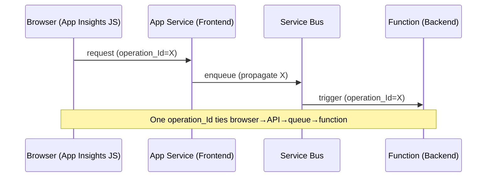

# Observability Deep-Dive — App Insights · KQL · OpenTelemetry · Metrics · Dashboards · Webhooks

> Turning a 13-domain platform into something you can see: instrumentation, querying, distributed tracing, defining metrics, visualizations, and alert-driven webhooks.

**Concept → In this repo → Lab → Interview → Checklist**

---

## 1. 🧠 The three pillars (+ correlation)

| Pillar | Question it answers | Azure home |
|---|---|---|
| **Logs/traces** | What happened? | App Insights `traces`, Log Analytics |
| **Metrics** | How much / how fast? | App Insights `customMetrics`, Azure Monitor metrics |
| **Distributed tracing** | Where in the call chain? | App Insights `requests`/`dependencies`, OTel spans |
| **Correlation** | Tie it all to one operation | `operation_Id` across services |



---

## 2. Instrumentation with OpenTelemetry

### 🧠 Why OTel

OpenTelemetry is the **vendor-neutral standard** for traces/metrics/logs. In .NET it's built on `System.Diagnostics.Activity`; the Azure Monitor exporter ships it to App Insights. Instrument once, export anywhere.

```csharp
// Program.cs — wire OpenTelemetry to Azure Monitor
builder.Services.AddOpenTelemetry()
    .UseAzureMonitor()  // exports traces + metrics + logs to App Insights
    .WithTracing(t => t.AddSource("Refunds"))
    .WithMetrics(m => m.AddMeter("Refunds"));
```

### 🏗️ Custom spans (activities) + tags

```csharp
private static readonly ActivitySource Source = new("Refunds");

public async Task<Refund> ApproveAsync(string id, string tenantId, CancellationToken ct)
{
    using var activity = Source.StartActivity("ApproveRefund");
    activity?.SetTag("refund.id", id);
    activity?.SetTag("tenant.id", tenantId);   // dimensions for filtering later
    var refund = await _storage.ReadAsync(id, new PartitionKey(tenantId), ct);
    activity?.SetTag("refund.amount", refund.Amount);
    // ... work ...
    activity?.SetStatus(ActivityStatusCode.Ok);
    return refund;
}
```

> Spans nest automatically (parent/child), giving a waterfall of the request across services — the basis of distributed tracing.

### 🧪 Lab 1 — Instrument an operation

Add an `ActivitySource`, wrap a service method in a span with 3 meaningful tags, and confirm it appears in App Insights end-to-end transaction view. **Acceptance:** A span with tags shows under the parent request.

---

## 3. Defining metrics

### 🧠 Metric types

| Type | Use | Example |
|---|---|---|
| **Counter** | Monotonic count | `refunds.approved.count` |
| **Histogram** | Distribution (p50/p95/p99) | `refund.duration.ms` |
| **Gauge / UpDownCounter** | Current value | `queue.depth` |

```csharp
private static readonly Meter Meter = new("Refunds");
private static readonly Counter<long> Approved =
    Meter.CreateCounter<long>("refunds.approved.count");
private static readonly Histogram<double> Duration =
    Meter.CreateHistogram<double>("refund.duration.ms");

// in code
Approved.Add(1, new KeyValuePair<string, object?>("tenant", tenantId));
Duration.Record(sw.Elapsed.TotalMilliseconds, new("status", "approved"));
```

### 🧠 RED & USE methods

- **RED** (services): **R**ate, **E**rrors, **D**uration — what to measure per endpoint.
- **USE** (resources): **U**tilization, **S**aturation, **E**rrors — for CPU/memory/disk/queues.

### 🧪 Lab 2 — Define service metrics

Add RED metrics (request rate, error count, duration histogram) to one endpoint with a `tenant` dimension. **Acceptance:** Three metrics queryable in App Insights with the dimension.

---

## 4. KQL — the query language

### 🏗️ Core operators

```kusto
requests
| where timestamp > ago(1h)                 // filter
| where cloud_RoleName == "Refunds.Frontend"
| summarize p50=percentile(duration,50),    // aggregate
            p95=percentile(duration,95),
            p99=percentile(duration,99),
            errorRate=todouble(countif(success==false))/count()
  by bin(timestamp, 5m), name               // group + time-bucket
| order by timestamp desc
```

| Operator | Does |
|---|---|
| `where` | Filter rows |
| `summarize ... by` | Aggregate + group |
| `bin()` | Time bucketing |
| `extend` | Computed columns |
| `project` | Select/rename columns |
| `join` / `union` | Combine tables |
| `make-series` | Time series for anomaly/forecast |
| `render` | Quick chart |

### 🏗️ Distributed trace by correlation ID

```kusto
union requests, dependencies, exceptions, traces
| where operation_Id == "<id>"
| project timestamp, itemType, name, success, resultCode, duration, message
| order by timestamp asc
```

### 🏗️ Top exceptions + blast radius

```kusto
exceptions
| where timestamp > ago(6h)
| summarize occurrences=count(), users=dcount(tostring(customDimensions.userId))
  by type, outerMessage, cloud_RoleName
| order by occurrences desc
```

### 🏗️ Dependency health (downstream)

```kusto
dependencies
| where timestamp > ago(1h)
| summarize calls=count(), failures=countif(success==false),
            p95=percentile(duration,95) by target, type
| extend failureRate = todouble(failures)/calls
| order by failureRate desc
```

### 🧪 Lab 3 — KQL workout

Write queries for: (a) p95 latency per endpoint, (b) error rate trend over 24h, (c) top 5 failing dependencies, (d) one operation's full trace. **Acceptance:** All four return results and render as charts.

---

## 5. Visualizations & dashboards

| Tool | Use |
|---|---|
| **Azure Workbooks** | Rich, parameterized, KQL-backed dashboards (SLOs, drill-downs) |
| **Metrics Explorer** | Quick metric charts + pinning |
| **Azure Dashboards** | Pinned tiles for at-a-glance ops |
| **Grafana (Azure Managed)** | Cross-source, alerting-friendly panels |
| **Power BI** | Business/exec reporting over exported data |

### 🧪 Lab 4 — Build an ops workbook

Create a Workbook with: availability SLI, p95 latency, error-rate trend, top exceptions — all parameterized by `cloud_RoleName` and time range. **Acceptance:** Switching the role parameter repaints every tile.

---

## 6. Alerts → action groups → webhooks

### 🏗️ Alert pipeline



- **Alert rule**: a saved KQL/metric query + threshold + frequency (e.g. burn-rate > 14.4x over 1h).
- **Action group**: who/what gets notified — email, SMS, **webhook**, Logic App, Automation runbook, Functions.
- **Webhook payload**: JSON with alert context; a receiving Function/Logic App can auto-remediate (scale, restart, open ticket).

```json
// Example webhook handler contract (consumed by an Azure Function)
{
  "alertRule": "Refunds-FastBurn",
  "severity": "Sev2",
  "cloudRoleName": "Refunds.Frontend",
  "metricValue": 0.08,
  "firedDateTime": "2026-06-16T14:00:00Z"
}
```

### 🧪 Lab 5 — Alert + webhook auto-remediation

Create a burn-rate alert → action group → webhook to an Azure Function that logs and (in a sandbox) scales out the App Service. **Acceptance:** Synthetic breach fires the alert and the Function receives the payload.

---

## 7. Correlation across the stack



W3C Trace Context (`traceparent`) propagation makes a single `operation_Id` follow a request across every hop — the core of debugging distributed systems.

---

## 8. 💬 Interview Q&A

**Q: Logs vs metrics vs traces?**
Logs/traces = discrete events (what happened, with context); metrics = aggregated numbers over time (how much/fast); distributed traces = the request's path across services. You need all three plus correlation.

**Q: What is OpenTelemetry and why use it?**
A vendor-neutral standard for telemetry. Instrument once with OTel, export to App Insights (or anywhere). In .NET it builds on `Activity`/`Meter`.

**Q: RED vs USE?**
RED (Rate, Errors, Duration) for request-driven services; USE (Utilization, Saturation, Errors) for resources like CPU/memory/queues.

**Q: How do you trace one customer's failed request across services?**
Pivot all tables by `operation_Id` (W3C trace context propagated end-to-end): `union requests, dependencies, exceptions`.

**Q: Counter vs histogram?**
Counter = monotonic total (counts); histogram = distribution enabling percentiles (latency p95/p99).

**Q: How does an alert trigger automated remediation?**
Alert rule → action group → webhook to a Function/Logic App that performs the remediation (scale, restart, ticket), closing the loop without a human.

**Q: Why percentiles over averages for latency?**
Averages hide tail pain; p95/p99 reveal the slow experiences real users hit. SLOs are set on percentiles.

---

## 9. ✅ Checklist

- [ ] OTel wired with Azure Monitor exporter
- [ ] Custom spans with meaningful tag dimensions
- [ ] RED metrics per service; USE for resources
- [ ] Correlation (`operation_Id`) propagates end-to-end (incl. browser + queues)
- [ ] KQL library: latency, error rate, dependencies, single-trace
- [ ] SLO Workbook parameterized by role + time
- [ ] Alerts use burn-rate + action groups + webhooks
- [ ] PII redacted before logging

---

### Next steps
→ [SRE role](../roles/SRE_PERSPECTIVE.md) for SLOs/burn-rate; [Data Engineer](../roles/DATA_ENGINEER_PERSPECTIVE.md) for analytics; [AKS/Containers](AKS_CONTAINERS.md) for cluster telemetry.
