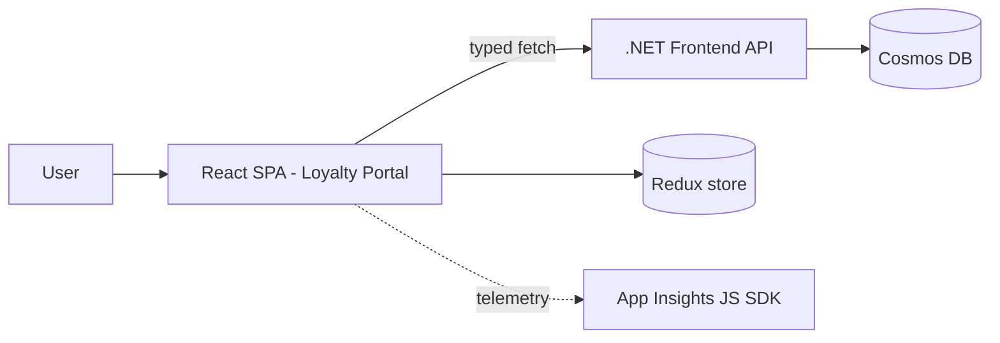

# React 19 + TypeScript Deep-Dive

> Front-end engineering for the Loyalty Portal (React 19.2 + TypeScript 5.6 + Redux) — the SPA layer over a 99% .NET backend.

**Concept → In this repo → Lab → Interview → Checklist**

---

## 1. 🧠 Where React lives here

The platform is backend-heavy; the **Loyalty Portal UI** is the primary SPA. Stack: **React 19**, **TypeScript** (strict), **Redux** for state, building to static assets served via App Service / Front Door.



---

## 2. TypeScript foundations

### 🧠 Why strict TS

Compile-time safety catches contract mismatches before runtime. Mirror backend contracts as TS types so API drift is a build error.

```ts
// Mirror the backend contract
export interface RefundSummary {
  id: string;
  status: 'Pending' | 'Approved' | 'Rejected';
  amount: number;
  createdUtc: string; // ISO 8601
}

// Discriminated union for request state — exhaustive handling
type RequestState<T> =
  | { kind: 'idle' }
  | { kind: 'loading' }
  | { kind: 'success'; data: T }
  | { kind: 'error'; message: string };
```

### 🧪 Lab 1 — Model an API response

Given a backend `LoyaltyAccount` JSON, write the TS interface + a `RequestState<LoyaltyAccount>` union and a `switch` that handles every `kind`. **Acceptance:** `tsc --noEmit` clean; no `any`.

---

## 3. React 19 components & hooks

### 🏗️ Functional components + hooks

```tsx
function RefundList({ tenantId }: { tenantId: string }) {
  const [state, setState] = useState<RequestState<RefundSummary[]>>({ kind: 'idle' });

  useEffect(() => {
    let cancelled = false;
    setState({ kind: 'loading' });
    getRefunds(tenantId)
      .then(data => { if (!cancelled) setState({ kind: 'success', data }); })
      .catch(e => { if (!cancelled) setState({ kind: 'error', message: String(e) }); });
    return () => { cancelled = true; }; // cleanup avoids setState-after-unmount
  }, [tenantId]);

  switch (state.kind) {
    case 'idle':
    case 'loading': return <Spinner />;
    case 'error':   return <ErrorBanner message={state.message} />;
    case 'success': return <ul>{state.data.map(r => <RefundRow key={r.id} refund={r} />)}</ul>;
  }
}
```

### React 19 highlights to know

- **Actions / `useActionState`** for form submission + pending state.
- **`use()`** to read promises/context in render.
- **Improved Suspense** for data + transitions (`useTransition`).
- **Automatic batching** of state updates.

### 🧪 Lab 2 — Build a form with Actions

Build a "redeem points" form using `useActionState` showing pending + error states without manual `isLoading` flags. **Acceptance:** Button disables while pending; server error renders inline.

---

## 4. State management with Redux

### 🧠 When Redux vs local state

Local `useState` for component-local UI; Redux for **shared, cross-route, server-cache-like** state (user, cart, feature flags). Use Redux Toolkit (`createSlice`, `createAsyncThunk`).

```ts
const refundsSlice = createSlice({
  name: 'refunds',
  initialState: { items: [] as RefundSummary[], status: 'idle' as const },
  reducers: {},
  extraReducers: (b) => {
    b.addCase(fetchRefunds.pending,   (s) => { s.status = 'loading'; })
     .addCase(fetchRefunds.fulfilled, (s, a) => { s.status = 'idle'; s.items = a.payload; })
     .addCase(fetchRefunds.rejected,  (s) => { s.status = 'error'; });
  },
});
```

### 🧪 Lab 3 — Add a slice

Create a `loyaltySlice` with a `createAsyncThunk` that fetches account balance, with loading/error handling and a selector. **Acceptance:** Component reads balance via `useSelector`; thunk handles all three states.

---

## 5. Calling the .NET API safely

```ts
// Centralized, typed fetch wrapper with error normalization
async function apiGet<T>(path: string): Promise<T> {
  const res = await fetch(`/api${path}`, { headers: { Accept: 'application/json' } });
  if (!res.ok) {
    // Backend returns RFC-7807 ProblemDetails
    const problem = await res.json().catch(() => ({}));
    throw new Error(problem.title ?? `HTTP ${res.status}`);
  }
  return res.json() as Promise<T>;
}
export const getRefunds = (tenantId: string) =>
  apiGet<RefundSummary[]>(`/tenants/${encodeURIComponent(tenantId)}/refunds`);
```

> Always `encodeURIComponent` path params (avoid injection/encoding bugs) and parse the backend's ProblemDetails for user-facing messages.

---

## 6. Front-end observability

Use the **Application Insights JS SDK** to capture page views, AJAX dependencies, and JS exceptions — correlated with backend telemetry via the same operation ID.

```ts
appInsights.trackEvent({ name: 'RefundSubmitted', properties: { tenantId } });
appInsights.trackException({ exception: err });
```

This makes a customer's browser action traceable into the backend (see [Observability](OBSERVABILITY_APPINSIGHTS_KQL_OTEL.md)).

---

## 7. Performance & quality

| Concern | Technique |
|---|---|
| Bundle size | Code-split routes (`React.lazy` + `Suspense`) |
| Re-renders | `memo`, stable keys, `useMemo`/`useCallback` where measured |
| Lists | Virtualize long lists |
| A11y | Semantic HTML, ARIA, keyboard nav |
| Testing | React Testing Library + Vitest/Jest |

```tsx
test('renders refund rows', async () => {
  render(<RefundList tenantId="t1" />);
  expect(await screen.findByText(/Approved/)).toBeInTheDocument();
});
```

---

## 8. 💬 Interview Q&A

**Q: Local state vs Redux?**
Local for component-only UI; Redux for shared/cross-route state. Don't put everything in Redux — it adds boilerplate and coupling.

**Q: Why the cleanup function in `useEffect`?**
To cancel in-flight work and avoid setting state after unmount (memory leaks/warnings), e.g. the `cancelled` flag or an `AbortController`.

**Q: What's new in React 19 you'd use?**
Actions + `useActionState` for forms, `use()` for promises/context, improved Suspense and transitions, automatic batching.

**Q: How do you keep front-end and back-end contracts in sync?**
Mirror backend contracts as strict TS types (ideally generated from the OpenAPI spec) so drift becomes a compile error.

**Q: How do you make a discriminated union exhaustive?**
A `switch` on the discriminant with a `never` default branch — TS errors if a case is unhandled.

---

## 9. ✅ Checklist

- [ ] Strict TS, no `any`; contracts mirrored from backend
- [ ] Request state modeled as a discriminated union
- [ ] Effects clean up in-flight work
- [ ] Redux only for shared state; RTK slices/thunks
- [ ] Typed fetch wrapper parses ProblemDetails
- [ ] App Insights JS SDK wired for events/exceptions
- [ ] Routes code-split; lists virtualized; tests with RTL

---

### Next steps
→ [API Integrations](API_INTEGRATIONS.md) for the contract/resilience layer; [Observability](OBSERVABILITY_APPINSIGHTS_KQL_OTEL.md) for end-to-end tracing.
