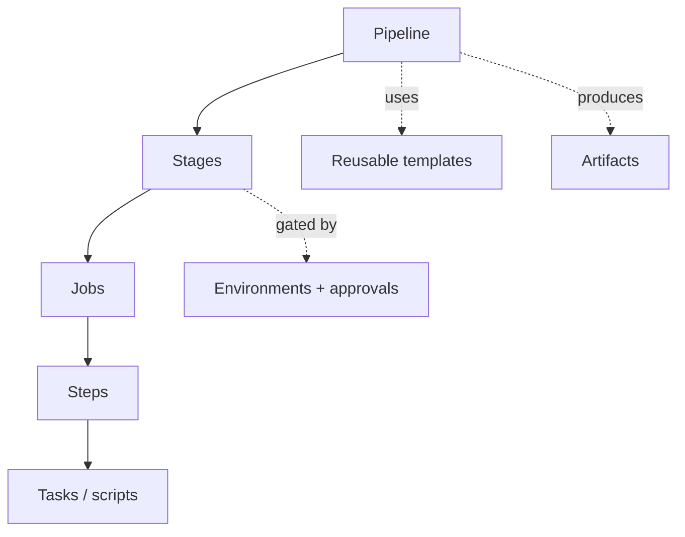
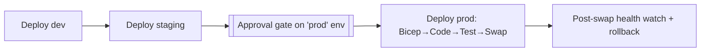

# YAML + Azure Pipelines Deep-Dive

> CI/CD with Azure Pipelines (OneBranch), YAML schema mastery, thin-per-domain → shared templates, stages/jobs/steps, gates, and artifacts.

**Concept → In this repo → Lab → Interview → Checklist**

---

## 1. 🧠 Pipeline hierarchy



| Concept | Meaning |
|---|---|
| **Stage** | Major phase (Build, Deploy-dev, Deploy-prod) |
| **Job** | Unit run on one agent; jobs can run in parallel |
| **Step/Task** | A command or packaged action |
| **Template** | Reusable YAML included/extended |
| **Environment** | Deploy target with approvals/checks |
| **Artifact** | Build output passed between stages |

---

## 2. YAML schema essentials

```yaml
trigger:
  branches: { include: [ master ] }
  paths: { include: [ 'Chat/**' ] }   # path filter: only build when Chat changes

variables:
  buildConfiguration: 'Release'

stages:
- stage: Build
  jobs:
  - job: BuildTest
    pool: { vmImage: 'windows-latest' }
    steps:
    - task: UseDotNet@2
      inputs: { packageType: 'sdk', version: '10.0.x' }
    - script: dotnet build Chat/Chat.slnx -c $(buildConfiguration) /warnaserror
      displayName: Build
    - script: dotnet test Chat/Chat.slnx --filter "TestCategory=Unit"
      displayName: Unit tests
    - publish: $(Build.ArtifactStagingDirectory)
      artifact: drop
```

### Key constructs

- **`trigger` / `pr`** — CI vs PR triggers; `paths` filters scope a monorepo.
- **`variables` / variable groups** — config + secrets (from Key Vault-linked groups).
- **`parameters`** — typed template inputs (compile-time).
- **`condition`** — `condition: succeeded()`, `eq(variables['x'],'y')`.
- **`dependsOn`** — stage/job ordering and fan-out.

### 🧪 Lab 1 — Write a build stage

Author a build stage for one domain: setup .NET 10, build with `/warnaserror`, run Unit tests, publish an artifact, gated by a `paths` filter. **Acceptance:** YAML validates; only triggers on that domain's path.

---

## 3. Templates: thin-per-domain → shared

The repo keeps per-domain YAML tiny and delegates to **shared templates** so all domains inherit the same gates.

```yaml
# Chat/.pipelines/Build.NonOfficial.Chat.yml  (thin)
extends:
  template: /.pipelines/templates/Build.Common.yml
  parameters:
    solution: 'Chat/Chat.slnx'
    runTests: true
    treatWarningsAsErrors: true
```

```yaml
# /.pipelines/templates/Build.Common.yml  (owns the real logic)
parameters:
- name: solution
  type: string
- name: runTests
  type: boolean
  default: true
- name: treatWarningsAsErrors
  type: boolean
  default: true
stages:
- stage: Build
  jobs:
  - job: Build
    steps:
    - script: dotnet build ${{ parameters.solution }} ${{ if eq(parameters.treatWarningsAsErrors, true) }}:/warnaserror${{ endif }}
    - ${{ if eq(parameters.runTests, true) }}:
      - script: dotnet test ${{ parameters.solution }}
```

> `extends` (whole-pipeline template) is the secured pattern OneBranch uses; `template:` includes can be at stage/job/step level. `${{ }}` = compile-time; `$( )` = runtime; `$[ ]` = runtime expression.

### 🧪 Lab 2 — Parameterize a template

Convert a duplicated 3-step block into a step template with parameters (`solution`, `runTests`) and call it from two domains. **Acceptance:** Zero duplication; both domains call the same template.

---

## 4. Deploy stages, environments & approvals

```yaml
- stage: DeployProd
  dependsOn: DeployStaging
  jobs:
  - deployment: Prod
    environment: 'refunds-prod'   # this environment requires an approver check
    strategy:
      runOnce:
        deploy:
          steps:
          - template: /.pipelines/templates/Deploy.Bicep.yml
          - template: /.pipelines/templates/Deploy.Code.yml
          - template: /.pipelines/templates/Deploy.SlotSwap.yml
            parameters: { sourceSlot: staging, targetSlot: production, healthCheckTimeout: 300 }
```



- **Environments** carry **checks**: manual approval, business hours, required reviewers.
- **`deployment` jobs** record deployment history per environment and enable strategies (`runOnce`, `canary`, `rolling`).

### 🧪 Lab 3 — Add an approval

Create a `prod` environment with a required-approver check and a `deployment` job that only runs after approval. **Acceptance:** Pipeline pauses at the gate; rejection halts.

---

## 5. Official vs NonOfficial (OneBranch)

| | NonOfficial | Official |
|---|---|---|
| Purpose | Fast feedback, non-prod | Production releases |
| Signing | No | Yes |
| Compliance | Lighter | Full (SDL, signing, provenance) |
| Targets | dev/staging | dev/staging/prod |

OneBranch provides compliant, governed templates; Official builds add code signing + supply-chain controls.

---

## 6. Variables, secrets & artifacts

```yaml
variables:
- group: refunds-secrets   # variable group linked to Key Vault
- name: env
  value: dev

steps:
- download: current
  artifact: drop
- script: echo "Deploying build $(Build.BuildId) to $(env)"
```

- Secrets: **variable groups linked to Key Vault**, never inline.
- Artifacts: `publish`/`download` move build output across stages immutably.

---

## 7. 💬 Interview Q&A

**Q: `${{ }}` vs `$( )` vs `$[ ]`?**
`${{ }}` compile-time template expression; `$( )` runtime macro (value at run); `$[ ]` runtime expression (evaluated by the agent). Compile-time decides structure; runtime decides values.

**Q: `template:` vs `extends:`?**
`template:` includes reusable YAML at stage/job/step scope; `extends:` applies a whole-pipeline template (used by OneBranch for governance — the pipeline can only do what the extended template allows).

**Q: How do you scope builds in a monorepo?**
`trigger.paths` filters so a domain change only runs that domain's pipeline; per-domain `.slnx` keeps build/test scoped.

**Q: How are prod deploys gated?**
Azure DevOps **environments** with approval checks; `deployment` jobs pause until approved, then run Bicep→Code→Test→Swap.

**Q: Where do pipeline secrets come from?**
Variable groups linked to Key Vault, surfaced as masked variables — never hard-coded.

**Q: Why thin-per-domain YAML + shared templates?**
One place to change gates (add a scan/test/signing step) → every domain inherits it; domains stay small and consistent.

---

## 8. ✅ Checklist

- [ ] Triggers + `paths` filters scope monorepo builds
- [ ] Per-domain YAML is thin; logic lives in shared templates
- [ ] Build: `/warnaserror`, tests, format, publish artifact
- [ ] Deploy staged dev→staging→prod with environment approvals
- [ ] Slot swap + health watch + rollback in deploy
- [ ] Secrets via Key Vault-linked variable groups
- [ ] Official builds signed; OneBranch compliance honored

---

### Next steps
→ [Bicep/ARM](BICEP_ARM.md) (what the deploy stage applies); [Git/GitHub Actions](GIT_GITHUB_ACTIONS.md) (same ideas, Actions syntax).
